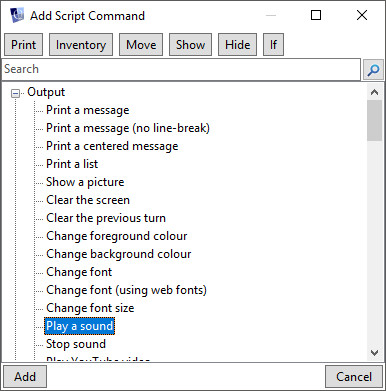
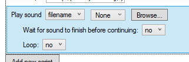
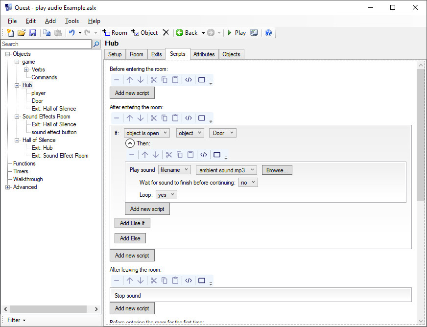
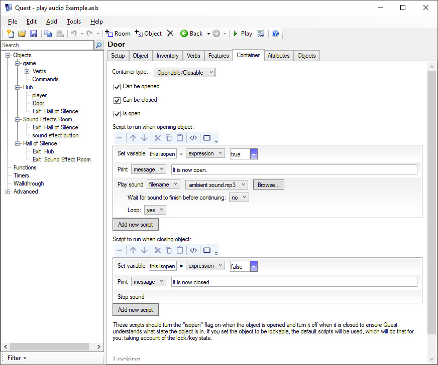
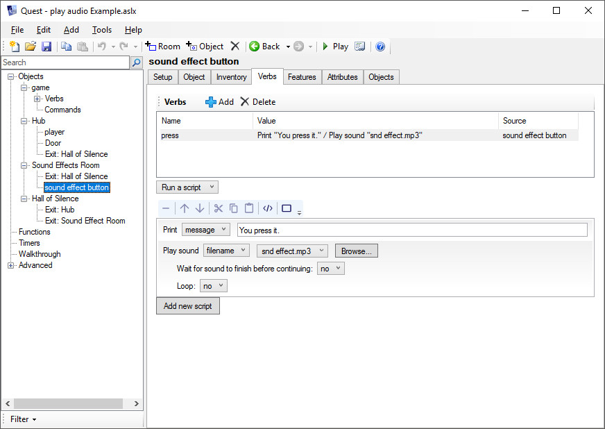

Using Quest's Built-in Script Commands to Add MP3 or WAV Files
--------------------------------------------------------------


### Adding Sounds

You can add sounds to your game using the [`play sound`](http://docs.textadventures.co.uk/quest/scripts/play_sound.html) script command. 




This script supports both WAV and MP3 files, but it is recommended that you use MP3 files because these are more widely supported by web browsers on different platforms.




You can choose “Wait for sound to finish before continuing” if you want to run the remaining script only after the sound has finished. This is useful for intro sequences, or letting some speech finish before moving the player to a different room, for example.

Note that Quest won’t let you use both the “wait” and “loop” options at the same time, as this would create an infinite loop.

Also note that Quest will only play one sound at a time when using the `play sound` script command.  If you have a sound set to loop for ambience, playing a new sound will stop the current one!

### Stopping Sounds

Sometimes, you need to stop a sound.  For instance the “loop” option will cause the sound to continue playing until the [```stop sound```](http://docs.textadventures.co.uk/quest/scripts/stop_sound.html) script command is run. 


Another sure-fire way to stop a sound from playing is to use `play sound` to play another sound!  Quest will only play one sound at a time when using the `play sound` script command.

Example Game
------------

Let's see this in action.

We have an example game with a starting room called "Hub".  If the door is open in the hub, we can hear an ambient sound.

### The Hub

We can set up an "After entering" script.  If the "Door" object is open, the sound "ambient sound.mp3" will play, and it will be set to loop.

Then, we set up an "After leaving" script, which stops the sound (because we can only hear that particular sound in the hub).




### The Door

We set the Door up as a container, making it "Openable/Closable".  Then we set up the open and close scripts to play and stop the sound.




### A Silent Room

We also have a room called "Hall of Silence". This one is easy.  We just add a 'stop sound' script command to the "Before entering" script on the room.


### A Sound Playing Between Rooms

We have a third room called "Sound Effects Room", and a message plays before entering. In this script, we're using the `sync` option to pause play until the sound has finished playing.


### A Noise-making Object

Just for fun, we have a button.  We've set up a "Press" verb on the button so it plays a sound when pressed.




Play the example game:

<a href="https://textadventures.co.uk/games/view/w1m_x18cmual0x11x098og/play-audio-example">Play "play audio Example" at textadventures.co.uk</a>

View the example game's code:

<a target="_blank" href="examples/PlayAudioExample.aslx">PlayAudioExample.aslx</a>


Using HTML Audio Elements
-------------------------


Playing .ogg files requires a bit more coding, but it can be done.

Using an HTML audio tag is the easiest way to handle this, and it will allow you to use whatever file format you like.


The most basic example of an audio tag:

```
<audio src='YOUR_URL_GOES_HERE' autoplay />
```

For more information:

https://www.w3schools.com/html/html5_audio.asp

When using a local audio file in Quest, we need to use [`GetFileURL()`](http://docs.textadventures.co.uk/quest/functions/getfileurl.html) to retrieve our local file's URL.

This will find the correct path to the file, whether we are using the desktop player or the web player.

```
src = GetFileURL("snd effect.ogg")
msg ("<audio src='" + src + "' autoplay/>")
```


**NOTES:**  

The file "snd effect.ogg" is in my game's main folder.

I also had to add ";*.ogg" to the end of the string attribute `game.publishfileextensions` so Quest would include the file when publishing the game.  Otherwise, it would not work because the file would not be present.

For more on the file extensions included in your game, see [A Note on The Publish Process](http://docs.textadventures.co.uk/quest/tutorial/releasing_your_game.html).

To simulate the “Wait for sound to finish before continuing” option when adding sounds to your game via HTML audio elements, follow the link at the end of this document.

We can also use an HTML audio tag to play audio from an external site, which will help keep your game under the site's maximum upload size. Everything works the same way, you just use the actual URL instead of ```GetFileURL()```.

Here's an example with an actual URL:

```
src = "http://media.textadventures.co.uk/games/1RurGHLuLUqrWdMJh53LTQ/bushcave-explicit-r9/sounds/bushcave.ogg"
msg ("<audio src='" + src + "' autoplay>")
```

For more on the maximum upload size, see the last section on [this page](http://docs.textadventures.co.uk/quest/publishing.html).


### Adding Controls

We can add `controls` to the tag, giving the player an option to play or pause the sound at will.

```
src = GetFileURL("snd effect.ogg")
msg ("<audio src='" + src + "' autoplay controls />")
```

This will look like so: 


 
**NOTE:**

If we were to add the `controls` option, we could remove `autoplay`, making it so the player would have to press 'Play'.


### Looping HTML Audio

We can also add a `loop` option, if we wish.  (Guess what this does!)

```
src = GetFileURL("snd effect.ogg")
msg ("<audio src='" + src + "' autoplay loop />")
```

If you choose to loop your audio, we will probably need a way to stop the sound.

Like everything else, there are numerous ways to handle this.


Controlling HTML Audio with JS (Stopping, Pausing, and Playing)
---------------------------------------------------------------

The easiest way to stop a sound would be removing ALL audio tags from the game.  This can be handled [using Javascript](http://docs.textadventures.co.uk/quest/using_javascript.html) via `JS.eval()` (NOTE: This will completely remove any HTML audio tags which have been added to the game!).

```
JS.eval("$('audio').remove();")
```


### Using an ID to Control a Specific Audio Element


An alternate approach would be assigning an ID to the audio element.

This can be done like so:

```
src = GetFileURL("snd effect.ogg")
msg ("<audio id='html-audio' src='" + src + "' autoplay loop />")
```

Once you have assigned an ID, you can actually pause the audio like this:

```
JS.eval("document.getElementById('html-audio').pause();")
```

After pausing, you could resume like this:

```
JS.eval("document.getElementById('html-audio').play();")
```


You could also remove just that audio element:

```
JS.eval("$('#html-audio').remove();")
```


### Browser Compatibility


Another thing to worry about is browser compatibility.  Some older browsers might not play the .ogg format, and others might not play .mp3.

The desktop version of Quest will not play an .mp3 from an HTML audio element (as of version 5.7.2), but it will play an .ogg. On the other hand, most modern browsers will play .ogg files, but Internet Explorer and Edge will not.  (I think Safari will play certain types of .ogg files, if you have the proper plugin, but I'm not certain.)

For more information concerning this, see [here](https://en.wikipedia.org/wiki/HTML5_Audio#Supported_audio_coding_formats).

As a "workaround", we can include both formats.

```
s = "<audio autoplay>"
s = s + "<source src='" + GetFileURL("snd effect.ogg") + "' type='audio/ogg' >"
s = s + "<source src='" + GetFileURL("snd effect.mp3") + "' type='audio/mp3' >"
s = s + "Your browser does not support the audio tag.</audio>"
msg (s)
```


### Mobile Browsers

For things to work in a mobile browser, we MUST include the `controls` option! The `autoplay` option will do nothing in a mobile browser, by the way.  The player must actually press 'play' on a mobile device.


There is a way to check for the mobile player using Javascript. Add this to the `game.inituserinterface` script:

```
js = "function isMobilePlayer(){"
js = js + "if (typeof(currentTab) === 'string'){return true;}return false;};"
JS.eval (js)
```

With that JS function now included, you can add the audio to your script like this:

```
src = GetFileURL("snd effect.ogg")
JS.eval ("var controlsOpt = '';if(isMobilePlayer()){controlsOpt = 'controls';}")
JS.eval ("addText (\"<audio autoplay \" + controlsOpt + \" src='" + src + "' />\");")
```

If the game is loaded in the mobile player, the JS variable `currentTab` will be a string, and the controls will be displayed.  If `currentTab` is not a string, the controls will not be displayed.

You can see this in action in the example game to which there is a link in the next section.

**IMPORTANT NOTE:  The sound will cease to exist if the screen is cleared when using HTML tags.**

An easy way to avoid this is using JS to add the sound:

```
src = GetFileURL("snd effect.ogg")
JS.eval("var songVar = new Audio();songVar.src = '"+src+"';songVar.load();songVar.play();")
```


### Playing Multiple Sounds at Once

Sometimes, you may want to play two (or more) sounds at once.

Here is an example game that does just that after adding some more advanced audio functions.

https://textadventures.co.uk/games/view/n08rpt4hjemo48i3zabgdg/audiolib-tester


### Additional Audio and Video Functions

There is a user-submitted guide which provides step-by-step instructions for any online (or offline) users who would like to add a few audio and video functions to a game - desktop users may prefer to download the library, which can be downloaded from the same page.

[Additional Audio and Video Functions](http://media.textadventures.co.uk/games/PHVys9dICUiMSSpr_m9WYQ/index.html)
