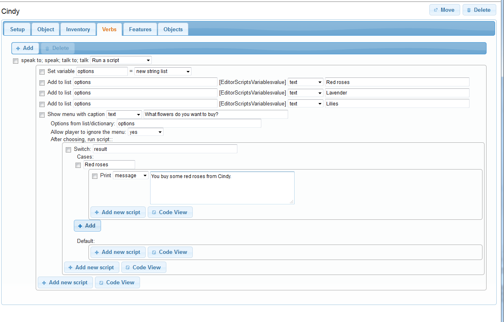
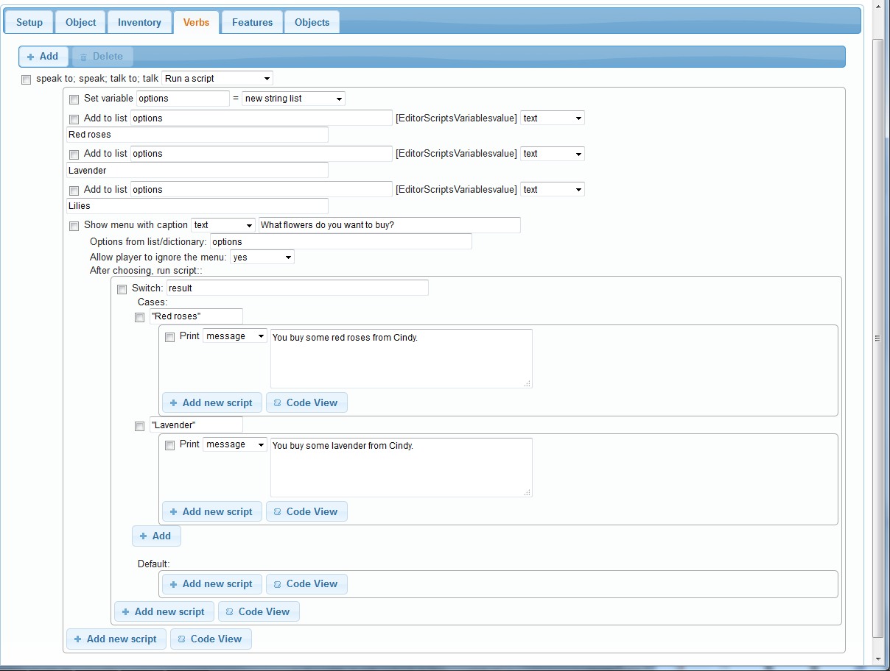
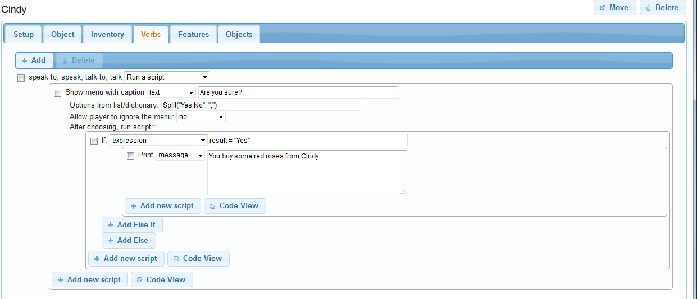

You will often find you want to ask the player a question. You might want to ask if the player wants to play as a man or a woman, or perhaps there is a point in the game where a character asks a question.

We will look at asking simple questions here, and by that I mean a question with a limited number of responses that are presented as a menu. Such questions are simple because we know how the player will respond. Handling a question where the player can type in anything is more complicated and discussed [elsewhere](asking_a_question.html).

There are four parts to the process. First we have to decide what will prompt the question, then we need to get the options for the menu, then we show the menu, and finally we need to handle the response.


What prompts the question?
--------------------------

There are all sorts of triggers, and we cannot address them all here, but here are some examples.

**Start of the game:** If you want ask if the player wants to play as a man or a woman, then you need to do it right at the start. Go to the game object at the top on the left, and the _Scripts_ tab on the right. At the top of the tab is the "Start script".

**Entering a room:** Perhaps a character asks a question as soon as the player enters a room. Go to the _Scripts_ tab of the room, and look for the "After entering the room for the first time" bit.

**When an item is taken or dropped:** Go to the _Inventory_ tab of the object, and look for the "After taking the object" or "After dropping the object" bit (ensure the box is ticked to allow it to be taken or dropped).

**Verbs:** A common use is when the player talks to a character. Talking can be done as a verb, so go to the _Verbs_ tab of the character, start typing in "speak", and select the option when it appears. Set it to run a script.

**Commands:** For a command, just go to the script of the command.

**Others:** For other triggers, you are on your own, but think about what item or room is involved, and go to that, and look at what tab seems most appropriate; what scripts are available?


Collecting the options
----------------------

Each option you give the player must go into a string list, so the first thing to do is create a new string list. Click "Add new script", and select "Set a variable or attribute". In the first text box, type "options" (no quotes), and from the drop-down, select "new string list".

Now we can add the options to the list. For each option, Click "Add new script", and select "Add a value to a list". In the first text box, type "options", in the drop-down select "text", and in the second text field type in your option.

Here is an example, setting up a character called Cindy as a flower seller. This is for when the player talks to her, so is set up as a verb. Three options have been added.


Show the menu
-------------

Click "Add new script", and select "Show a menu". In the first textbox, type in the question you want to ask the player. In the second, type in "options" to tell it to use the list of options we created before. You can also choose whether the player can ignore the menu. If this is asking the player whether to be a man or a woman, you would want to set this "no" to ensure the player makes a choice. For our flower seller, we can leave it as "yes"; if the player decides the flowers on offer are not that good, she can just ignore the menu and do something else.


At this point you should be able to go into the game and actually see the menu work - though it will not do anything.


Handle the response
-------------------

So now we need to handle the response. You will see you now have two "Add new script" buttons. You need to be using the upper one, indented to the right. This will ensure the scripts you add will be run after the choice is made.

When the player makes a choice, that option goes into a variable called "result", and we are going to check that to decide what to. The best way to do that is with a `switch`. Click "Add new script", and select "Switch". In the text box, type in "result".

Click "Add" and type in the first of your options (or copy-and-paste it in). You will see you have yet another "Add new script" - this one specifically for this option. Add scripts as appropriate - exactly what is up to you. In the example below, it just prints some text.



You need to do that for each option. Below you can see it has been done for two, I still need to do the third!




In code?!?
----------

It is worthwhile looking briefly at the code view:

```
options = NewStringList()
list add (options, "Red roses")
list add (options, "Lavender")
list add (options, "Lilies")
ShowMenu ("What flowers do you want to buy?", options, true) {
  switch (result) {
    case (Red roses) {
      msg ("You buy some red roses from Cindy.")
    }
    case (Lavender) {
      msg ("You buy some lavender from Cindy.")
    }
  }
}
```

If you look through it you should see each set that we added is there, in the same order. The code is just a different way of looking at the same thing.


Yes or no?
---------_

For simple questions, we can shortcut some of that. We can use the `Split` function to make the string list, and just check for one value for `result`. For example:



In code:

```
ShowMenu ("Are you sure?", Split("Yes;No", ";"), false) {
  if (result = "Yes") {
    msg ("You buy some red roses from Cindy.")
  }
}
