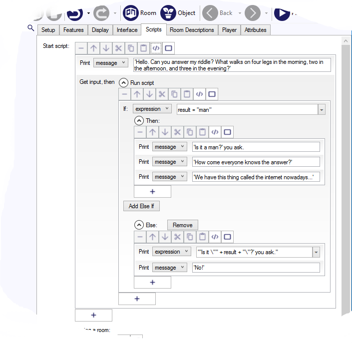

Open-Ended Question
-------------------

Often in a text adventure you want the game to ask an open-ended question of the player. A simple example would be to allow the player to name the character. The `get input` script command exists to handle just that. 


```
  msg ("What is your name?")
  get input {
    player.alias = CapFirst(result)
  }
```

The first line just asks the question. Then we see the `get input` command. The block after that gets run only once the player has typed a response. A magic variable called `result` has the text the player typed, so we just need to assign that.

Note that we are setting the "alias" attribute; the "name" attribute cannot be changed during play as Quest uses that to track each object. Note that it makes sure there is a capital at the start. You can then use the text processor to insert the character's nasme in text:

> 'Hi, {player.alias},' says the oddly-shaped doll.


Multiple Questions
-------------------

You might think that you can just have one question after another...


```
  msg ("What is your name?")
  get input {
    player.alias = CapFirst(result)
  }
  msg ("How old are you?")
  get input {
    player.alias = CapFirst(result)
  }
```

Unfortunately, Quest will complain, "Error running script: Only one 'get input' can be in progress at a time". Quest does not wait for the player to give her name, it just goes straight to the next bit of code, asks her age, and then complains that it is now waiting for two answers.

We need to _nest_ the question. This means putting the second inside the first.


```
  msg ("What is your name?")
  get input {
    player.alias = CapFirst(result)
    msg ("How old are you?")
    get input {
      player.age = result
    }
  }
```


Looking for a Specific Answer
-----------------------------

You might want the player to give a specific answer - the answer to a riddle, perhaps. Here is an example script:



```
  msg ("'Hello. Can you answer my riddle? What walks on four legs in the morning, two in the afternoon, and three in the evening?'")
  get input {
    if (result = "man") {
      msg ("'Is it a man?' you ask.")
      msg ("'How come everyone knows the answer?'")
      msg ("'We have this thing called the internet nowadays...'")
    }
    else {
      msg ("'Is it \"" + result + "\"?' you ask.")
      msg ("'No!'")
    }
  }
```
The first line just asks the riddle. This time we need to check it is the correct answer and react accordingly.

This will work, but has a couple of issues that we want to resolve.


Testing Input
-------------

The first problem is that the player has to type the exact string “man”. What if he types “Man” or “a man”? We might also like to handle “woman” and “human” so the riddle is more politically correct.

To do this, replace the third line with this:

```
  if (IsRegexMatch  ("man", LCase (result))) {
```

The LCase function will convert the player's text to all lower case, so “Man” will be handled as “man”. This text will then be matched against a Regex (a pattern) rather than a specific string. As long as the player has “man” somewhere in the answer, the pattern will match.

In this case, that will match human and woman too, which is great. Usually multiple answers are not so convenient, but you can do that too - just put them inside brackets and separate each with a vertical bar.

```
  if (IsRegexMatch  ("(man|lady)", LCase (result))) {
```

In fact, this will match anything with "man" in the word, so would also match "shaman". We could improve it by using `\b` to match against the word boundary, and then include all the options we will allow (note that you have to "escape" backslashes, so we use two here, `\\b`):

```
  if (IsRegexMatch  ("\\b(man|lady|woman|human|person)\\b", LCase (result))) {
```

We could optionally match "a" (the `?` indicates it is optional), and also match the start and end of the string with `^` and `$`:

```
  if (IsRegexMatch  ("^(a )?(man|lady|woman|human|person)$", LCase (result))) {
```

There is a section on Regex in the [pattern matching](pattern_matching.html) page.


Changing the Prompt
-------------------

This is worthwhile doing as it makes it clear to the player that he or she should not be typing a command. To get this to work, you need to use some JavaScript! 
```
  JS.eval("$('#txtCommand').attr('placeholder', 'Your answer');")
```
It might be worth also turning off the panes on the right, to stop the player messing with them when she should be answering the question:
```
  JS.panesVisible(false)
```
Remember to set them back to normal after.


Altogether Now...
-----------------

Here is the full the script, doing all we have discussed:


```
  msg ("'Hello. Can you answer my riddle? What walks on four legs in the morning, two in the afternoon, and three in the evening?'")
  JS.eval("$('#txtCommand').attr('placeholder', 'Your answer');")
  JS.panesVisible(false)
  get input {
    if (IsRegexMatch  ("^(a )?(man|lady|woman|human|person)$", LCase (result))) {
      msg ("'Is it a man?' you ask.")
      msg ("'How come everyone knows the answer?'")
      msg ("'We have this thing called the internet nowadays...'")
    }
    else {
      msg ("'Is it \"" + result + "\"?' you ask.")
      msg ("'No!'")
    }
    JS.eval("$('#txtCommand').attr('placeholder', 'Type here...');")
    JS.panesVisible(true)
  }
```


Dozens of questions
-------------------

For a complex RPG-style game you might have lots of questions to create the character. There are ways to do that using JavaScript and dialogue panels, but they are not straightforward. However, you can use recursion. Which is also not straightforward, but is not _so_ bad.

The objective here is to ask a series of questions, which we will say is in a string list, game.questions, and put the answers in a second list, game.answers. Recursion is when a function calls itself; what will happen is the function will do `get input`, and then inside the `get input` we will call the function to ask the next question.

It is vitally important that a recursive function has a way of stopping, otherwise it will be trapped in an infinite loop. We will remove the question from the list after asking it, and will terminate when the list is empty.

Here is the code for the function, which is called `AskAQuestion` (no parameters or return type):
```
if (ListCount(game.questions) > 0) {
  s = StringListItem(game.questions, 0)
  list remove (game.questions, s)
  msg (s)
  get input {
    list add (game.answers, result)
    msg (">" + result)
    msg ("Thanks")
    AskAQuestion
  }
}
else {
  msg (" ")
  msg ("Name: " + StringListItem(game.answers, 0))
  msg ("Age: " + StringListItem(game.answers, 1))
  msg ("Favourite colour: " + StringListItem(game.answers, 2))
  msg (" ")
}
```