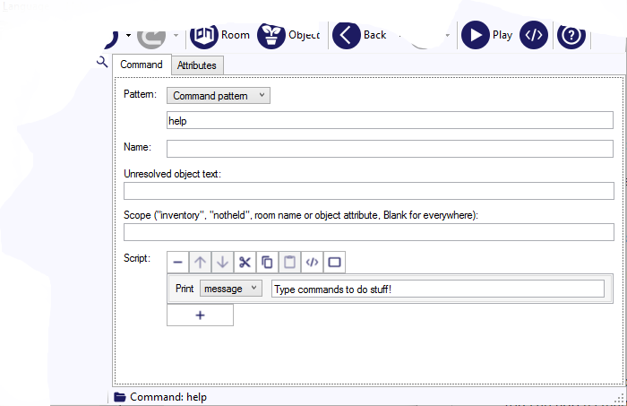
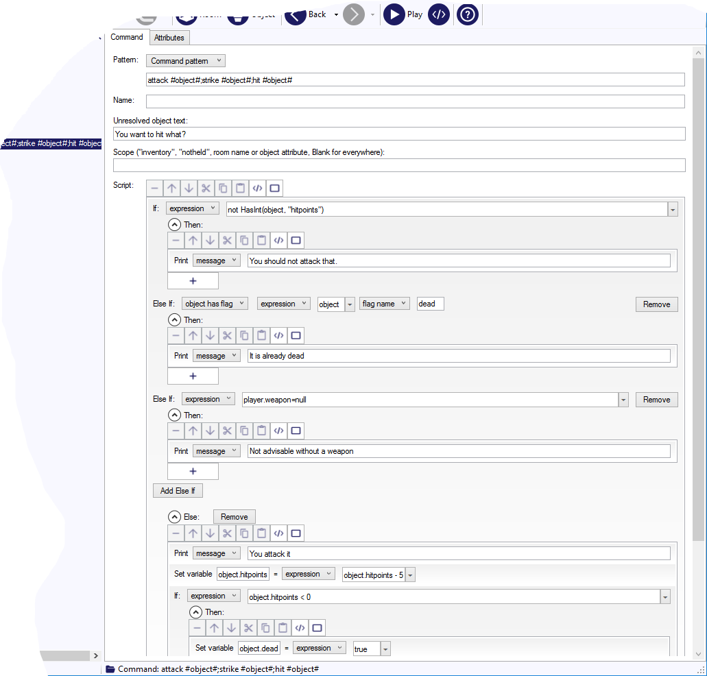

When the player types something (or clicks a link), Quest will try to match the command string against all the commands it knows. If it gets a match, then it will process that command.

Simple commands
---------------

Let us start with a HELP command. There is already a HELP command in Quest, but we will add our own (somewhat less helpful) version.

Quest searches the commands starting at the bottom, so any command we add in our game will be found first, before the built-in commands, so our new command will get a match and used, and the built-in one will not.

To add a command:

- In the Windows desktop version, select “game” in the tree. Now, you can right-click on the tree and choose “Add Command”, or use the Add menu and choose “Command”.

- In the web version, select “Commands” in the tree (underneath “game”). Then click the “Add” button.

The pattern we will match against is "help", and we just want to print something, so it will just look like this:

Now if you play the game and type HELP, you will see the new text.

There is a convention in interactive fiction that a question mark can be used as a synonym for HELP, so we better add that. You can add as many synonyms as you like (and should try to think of as many as possible), just separate them with semi-colons. So now the pattern Quest will use is:

> help;?

Commands and objects
--------------------

Often you will want a command to involve an object. To handle that, Quest has a special system (in fact it has two, but [using verbs](using_verbs.html) is a discussion for another time). Let us say we want to have a command for attacking a zombie. And we want to allow STRIKE and HIT.

We could use this as the pattern:

> attack zombie;strike zombie;hit zombie

That would work... but what if the player does ATTACK UNDEAD or ATTACK FOE? We could just add these synonyms too, but you can quickly get a dozen combinations. Also, we would have to check what zombie is present. Are we in the street with the ragged zombie or the back alley with the decrepit zombie or the cellar with the hat-wearing zombie?

A far better way is to use a place-holder, and to let Quest dynamically match that against any object present.

> attack #object#;strike #object#;hit #object#

Quest will match that against all the different words for "zombie" you give to the zombie (on the _Object_ tab), and that will be good for any command.

So now the player can type HIT UNDEAD, and Quest will match this command pattern, and then it will check the objects present, and see if it can find a match for the object. If we are in the cellar, it will match it to the hat-wearing zombie, for example.

### What if there is no matching object?

If Quest cannot match the object, then it will print the "Unresolved object text".

### What if there are several matching objects?

If there are two or more zombies here, Quest will ask the player which one she meant, and then will proceed with that one matched object.

### What if there is one matching object

So we have a single object matched to our command, so now Quest will run the script for the command.

Script
------

Note that your script now has access to a special local variable called "object", and you can use that as a handle for the actual zombie.

The recommended way to build the script for a command is as a series of fail conditions followed by the success. We will look at the attack command so you can se what that means.

Think of a checklist; what do we need to check before allowing the command to work?

1. The object has to be here

1. The object has to be a zombie or enemy of some kind

1. The object has to still be alive

1. The player needs a weapon

As Quest will only match an object if it is present, so we do not need to check if the hook is present, it must be if Quest found it (that may not be the case if you use a [scope](advanced_scope.html), but that is outside this discusson). We can ignore the first one. You may also choose to ignore the last depending on your game, but we will say that a weapon is required.

We then need to flip each item in the list, and add a response. I.e., instead of checking that it is an enemy, we check it is not, and add a response.

1. The object is not an enemy of some kind - "You should not attack that."

1. The object is not still be alive - "It is already dead"

1. The player has no weapon - "Not advisable without a weapon"

Then we convert that to a series of `if/else` steps, with the final one being successful completion of the action.

Note that it is all inside the one `if` block.

You may find that you want to adjust the order of the checks; if the zombie is both dead and not here, it would be better to say the player cannot attack it because it is not here, so you should check that first (this is just for illustration; we do not need to check if it is here at all).

See also
--------

If your command should only work in a specific room, see [here](commands_for_room.html) for the best way to handle it. For commands that need to have two objects, see the page on [complex commands](complex_commands.html). To make your responses grammatically correct for any object, use [neutral language](neutral_language.html).
