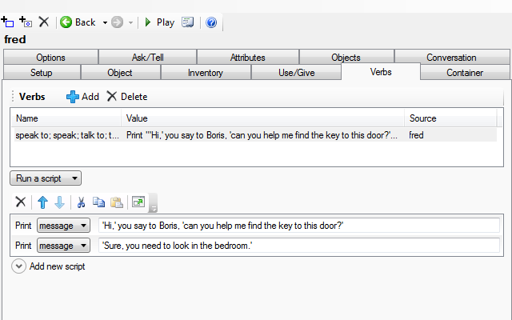

This page is a guide to the issues involved, and some of it is general to all interactive fiction. Conversations are a thorny subject in interactive fiction; there are several ways to present them to the player and none are accepted as "the" way to do it, or acknowledged as the best.

In the tutorial the "broadcast" method was introduced:

> SAY HELLO

The player says something to everyone present. This is actually very difficult to implement well, as you need to have each character response to anything the player might type.

The "speak to" method is directed to a specific character:

> SPEAK TO BORIS

This could than be handled with a stock response or by offering a list of options (Quest will accept TALK TO as a synonym of SPEAK TO).

Finally, the player can specify both the person to talk to and the subject:

> ASK BORIS ABOUT KEY

> TELL MARY ABOUT LOCK

You should also consider whether you want both sides of the conversation in the output. Which you chose is up to you, but it will look better if you are consistent, so I suggest decided now, before you start typing.

> \>TALK TO BORIS
>
> 'Hi,' you say to Boris, 'can you help me find the key to this door?'
>
> 'Sure, you need to look in the bedroom.'

> \>TALK TO BORIS
>
> 'Hi,' says Boris, 'do you need to find the key to this door? You need to look in the bedroom.'

SPEAK TO and stock responses
----------------------------

The examples above illustrate this in play.

To set this up in Quest, select the character, go to the verbs tab, and add a new verb, "speak" (Quest will match this up to the right command as you type). Then put in the response underneath. It could look like this:

SPEAK TO and a menu of responses
--------------------------------

In play this might look like this:

> \>TALK TO BORIS
>
> 1. Where is key
>
> 2. Who is the Queen
>
> 3. How do I defeat the troll
>
> \>1
>
> 'Hi,' you say to Boris, 'can you help me find the key to this door?'
>
> 'Sure, you need to look in the bedroom.'

Quest handles menus well, and it would actually look rather more slick than that.

As this is again using the "TALK TO" command, setting it up is like the first option. However, the script for that "SPEAK" verb is rather more complicated.

In code view, it looks like this:

      topics = Split ("Where is key;Who is the Queen;How do I defeat the troll", ";")
      ShowMenu ("Talk to Boris about...", topics, true) {
        switch (result) {
          case ("Where is key") {
            msg ("'You need to look in the bedroom.'")
          }
          case ("Who is the Queen") {
            msg ("'Just some girl.'")
          }
          case ("How do I defeat the troll") {
            msg ("'Use fire to stop it regenerating.'")
          }
        }
      }

The first line of the script sets up the topics. They need to be a string list, and the easiest way to create one is to use the Split function. Each topic is separated by a semi-colon, with no spaces.

A switch statement is used to decide which response will be seen. Note that the key for each case must be exactly the same as the topic you listed before. The script for each case is set up just as the script for the first option.

ASK ABOUT
---------

In play this might look like this:

> \>ASK BORIS ABOUT KEY
>
> 'Hi,' you say to Boris, 'can you help me find the key to this door?'
>
> 'Sure, you need to look in the bedroom.'

This is the most open-ended approach, though in reality that flexibility is an illusion - the player is limited to asking about only the topics you have included, he just does not know it. This is also the major downfall of this method - the player might not guess the subjects you have coded for, and just get frustrated as the character fails to respond to guess after guess. This system is probably best suited to when you have a large number of topics you will include for every character in the game, as a menu will soon get unwieldly, and thematically, it feels right for a mystery.

Quest has a tab just for Ask/Tell, making it easy to set up each response (but you need to activate in on the Features tab of the game object).

For each topic, click on add, then put in the topic name. You can put in several; try to guess what words the player will use. They should be separated by spaces, as shown above. Then you need to put in the script, just as before.

You should also put in a script to run for unknown topics.

The Quest Ask/About system is discussed in detail [here](ask_about.html)

Varying Responses
-----------------

In all the above examples, the character will respond the same every time. That is not ideal, people are not like that, they will get annoyed if you ask the same question fifteen times, and wonder why you are asking where the key is when you have just used it to open the door.

For all the methods above, the important part here is the lines that start "msg". We have gone through the three ways to arrive at them, now we are concentrating on just those lines.

If you have a counter in there, then you could have the response depend on how often the topic has been raised (but remember to set up an integer attribute for the counter). Or use a boolean to flag that the topic has been asked (the version below automatically sets the attribute for you).

Instead of:

        msg ("'Hi,' you say to Philippa, 'can you help me find the key to this door?'")
        msg ("'Sure, you need to look in the bedroom.'")

Try:

        if (not GetBoolean (philipa, "key_asked") {
          msg ("'Hi,' you say to Philippa, 'can you help me find the key to this door?'")
          msg ("'Sure, you need to look in the bedroom.'")
          philipa.key_asked = true
        }
        else {
          msg ("'Hi again,' you say to Philippa, 'can you help me find the key to this door?'")
          msg ("'Have you tried looking in the bedroom?'")
        }

Or it could respond to changes in the world. The code below will make Philippa respond differently if the door is unlocked, or you are carrying the key.

        if (not that_door.locked) {
          msg ("'I see you finally managed to unlock the door then,' said Philippa sarcastically.'")
        }
        else if (key.parent = player) {
          msg ("'You found the key then,' said Philippa sarcastically.'")
        }
        else if (not GetBoolean (philippa, "key_asked")) {
          msg ("'Hi,' you say to Philippa, 'can you help me find the key to this door?'")
          msg ("'Sure, you need to look in the bedroom.'")
          philippa.key_asked = true
        }
        else {
          msg ("'Hi again,' you say to Philippa, 'can you help me find the key to this door?'")
          msg ("'Have you tried looking in the bedroom yet?'")
        }

See also
--------

For a more comprehensive discussion on conversations in interactive fiction, you might like to read [this article](http://emshort.wordpress.com/how-to-play/writing-if/my-articles/conversation/)
