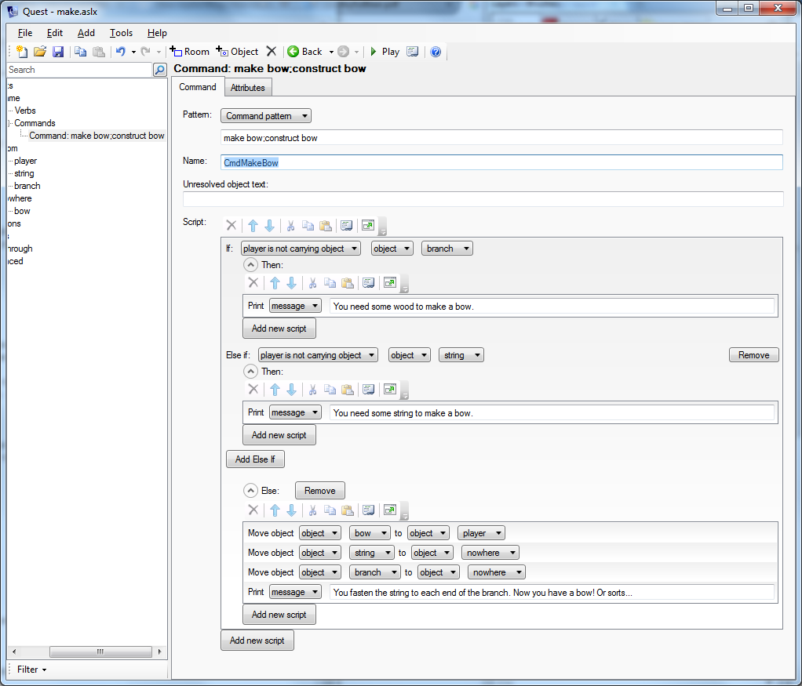

In your game, you might want to have the player use one or more things to make or otherwise convert into one or more other things. For example:

- Make a bow from some string and a branch

- Use machine to convert objects from one thing to another

The best way to do these transformations is to quietly move the original parts elsewhere and to bring the new objects (which you created earlier) here.

By the way, you might also want to do something like use a tap to fill cup. Transformations like that are better handled using attribute; in this case an attribute on the cup tracks how much water is in it. That sort of system is described in the section on [handling water](handling_water.html).


The Bow
-------

### MAKE BOW

So let's implement a command for making a bow.

First create three objects, the string, the branch and the bow. The bow should be put in a room the player cannot get to (no exits going to it); let's say it is called "nowhere". Remember to set them all so they can be taken.

Now the command. Generally when implementing a command, we would use `#object#` in the pattern, telling Quest to match any object present. We cannot do that here, as the bow is not present, so instead we will just use straight text:

> make bow;construct bow

Give the command a name. This is not required by Quest, but will be useful later.

> CmdMakeBow

The code for this has to check the player has the parts, and if so then it does four things. It has to move the string away, it has to move the branch elsewhere, it has to bring he bow here, and it has to tell the player that it worked.



This is the underlying code; these are two ways of looking at the same thing. It is the same script in both views:

```
if (not Got(branch)) {
  msg ("You need some wood to make a bow.")
}
else if (not Got(string)) {
  msg ("You need some string to make a bow.")
}
else {
  MoveObject(bow, player)
  MoveObject(string, nowhere)
  MoveObject(branch, nowhere)
  msg("You fasten the string to each end of the branch. Now you have a bow! Of sorts...")
}
```

For any toxophilites out there, I appreciate there is more to bows that tying string to a branch!


### USE STRING WITH BRANCH

A general problem with text adventures is that player can type all sorts of things and hope the game will understand. This is one instance where there are a lot of possibilities.

On the string object, turn on "Use/Give" on the _Features_ tab, and then on the _Use/Give_ tab go to the "Use (other object) on this" section. Set the action to handle objects individually, and then click "Add" and select the branch. For the script, we will just use the code on the command (this is why we gave the command a name):


In code it looks like this:

```
do (CmdMakeBow, "script")
```

Close the dialogue box, and do exactly the same in the "Use this on (other object)" section. It should now look like this:


### TIE STRING TO BOW

Can we handle other commands too? The difference with these commands is that they reference the objects that are present. The command pattern will be this (the string will be object1, the branch object2):

> tie #object1# to #object2;fasten #object1# to #object2

The command needs to check that object1 really is the string, and object2 really is the branch. If both are right, we can call the code on the first command again.

Here is what it looks like:


And the code:

```
if (not object1 = string) {
  msg ("That's not going to work.")
}
else if (not object2 = branch) {
  msg ("That's not going to work.")
}
else {
  do (CmdMakeBow, "script")
}
```


The Machine
-----------

Let's look at an entirely different system. There was, way back in the mists of time, a game called _Leather Goddesses of Phobos_, and this game featured a machine called the "T-remover". The player could put an item in a compartment, press a button, and the item would be changed into something else. If you put a tray into the machine, it would convert it to a guy called Ray. Put a rabbit it, you get a rabbi (it does have an actual point to it too). There are some gameplay issues here - you will have to design your game so that every item the player picks up with a T in its name can be changed, and the game can still be completed after doing so (something they did not always worry about back then).

I am going to change it around a bit so we create an item, rather than two people (though the item is an ape, but we will say it is a small, passive ape that can be picked up).

Note: _The scripts we will use are longer than before, and Quest will not display the whole of them on the screen at once (not on my PC anyway), so I am just giving the code. If you do not like code, just click on "Code view" for the script in your game, copy-and-paste the code into the text area, and exit "Code view". Now you can see it in the normal GUI view!_

First, on the _Features_ tab of the game object, turn on inventory limits. Then create four items; a tray, Ray, a tape and an ape. The ape and Ray need to go into the "nowhere" room. Make sure the tray, the tape and the ape can be picked up (_Inventory_ tab).

We now need to create the t-remover. We will need to call it "t_remover" and then give it an alias as Quest only allows numbers, letters, spaces and underscores in names.

The item to convert will be put inside the machine, so on the _Features_ tab, tick "Container", then on the _Container_ tab, set it to be a "Limited container". Take a look at the _Container_ tab, and see if you want to change anything (I suggest have it start closed and not transparent), but you can leave all the defaults (it is already limited to a single item, which we want).

Now to get it to do something. Turn on "Use/Give" on the _Features_ tab, and then go to the _Use/Give_ tab and in the "Use (on its own)" section, set the action to run a script, and paste in this code:


```
if (this.isopen) {
  msg ("You press the button, but nothing happens. Perhaps it needs to be closed?")
}
else {
  content = GetDirectChildren(this)
  if (ListCount(content) = 0) {
    msg ("You press the button, but nothing happens. Perhaps it needs something in the compartment?")
  }
  else {
    msg ("The machine starts to rattle and shaken, there is a loud pop, and then it is quiet again.")
    oldobj = ObjectListItem(content, 0)
    newname = Replace(oldobj.name, "t", "")
    newobj = GetObject(newname)
    if (newobj = null) {
      error ("Oh, dear. I did not think anyone would put that in it!")
    }
    else if (not newobj = oldobj) {
      newobj.parent = this
      oldobj.parent = nowhere
    }
  }
}
```

What does that do? Well first we check if the door is closed. If so, we check it anything is in the machine (`GetDirectChildren(this)` gets a list of the objects inside `this`, i.e., the owner of the script). The container is limited to one item, so if the list count is not zero, it must be one, so now the machine does something!

Now we get the new name, which is the name of the item in the compartment, `oldobj`, with every "t" replaced by "", i.e., each "t" stripped out. Once we have a name, we can use `GetObject` to get the object with that name, `newobj`. Hopefully we have implemented something for every object that can possibly go in the machine (and has a "t" in the name), but just in case we have not, we issue an error to acknowledge we made a mistake (it will make finding the bug in six months time much easier).

Now we have the new object, we put it inside the machine, and move the old one away.

### Description

Let's modify the description so the player can see the state of the machine. This is important, because we are requiring the player to open and close the compartment, and the player needs to be informed of its current state. Because we want to say what is in the device, this is a bit beyond the text processor, so instead we build up a string, `s`, with all the bits we want, before printing it at the end.

```
s = "This strange machine has a compartment in it, which is currently "
if (this.isopen) {
  s = s + "open."
}
else {
  s = s + "closed."
}
content = GetDirectChildren(this)
if (this.isopen and ListCount(content) > 0) {
  s = s + " You can see " + GetDisplayName(ObjectListItem(content, 0)) + " inside it."
}
s = s + " There is a big red button on the top."
msg (s)
```

Note that we are not adding any new attributes to the machine. Quest has a comprehensive world model that will track the state of objects in it very well. Let Quest do its job, and ask it what the current state is when we need to know.

So now we have a working t-removing machine! Go into the game and confirm it works.

### Also...

It is a good idea to think about other ways the player may try to use things in your game. For a start, she might refer to the t-remover as "machine" or "device", so these should be added to the list of alternative names on the _Object_ tab. She might also want to PUT TAPE IN COMPARTMENT or PRESS RED BUTTON. We could implement the compartment and button as items, but that will get messy as this is a limited container, so let's cheat, and just add "compartment" and "big red button" to the list of synonyms.

We still need to handle PRESS RED BUTTON. Go to the _Verbs_ tab, and add "press". Set it to run a script:

```
do (this, "use")
```

Now PRESS RED BUTTON will cause the "use" script to run.

The player might also want to SWITCH ON T-REMOVER. On the _Features_ tab, set it to be "Switchable", and on the _Switchable_ tab, set it so it can be switched on and off. We need to add a script, "After switching on the object":

```
do (this, "use")
this.switchedon = false
```

As with the "press" verb, we just need to run the "use" script, but here we also need to set the "switchedon" to false as the machine runs for a moment and then stops.

Finally, let's have Ray do something! Go to the _Container_ tab, and the "After opening the object" script.

```
if (ray.parent = this) {
  ray.parent = this.parent
  msg ("A boy leaps out of the device! Hey, it's Ray, that geeky kid from school.")
}
```

Now when the player opens the device, if Ray is inside, he will jump out!
