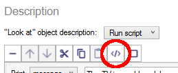
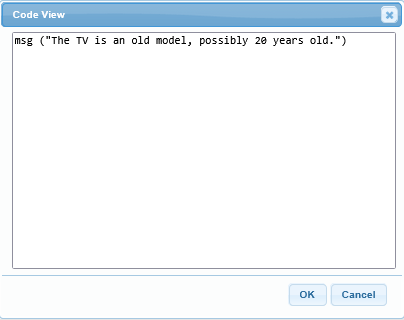

Behind the scenes, Quest handles things using it own programming language, or code. If you are asking about how to do something on the forums, chances are people will respond by posting the code, and if you have never seen code before you may be left wondering what you do with it.

Once you understand the basics, code is a lot easier to show on the forum, and far easier to copy from one place and paste into another.


Code View
---------

So how do you see code? Click the _Code View_ button. In the web version, this will be below the script area, and will bring up a dialogue box with the code in it. In the desktop version, it is rather less obvious; there is a button above the script area; it is circled in red below:



The desktop version also has a Code View option under the tools menu. This shows the entire game in code view, with all the XML that defines your game. It is very rare you will ever need to use it, and it does have the potential to mess up your game, so this is best ignored!

If you have been following the tutorial, you will already have some scripts in your game. Why not take a look at one in code view right now? Here is the "look" script for the TV (in the web version):



The important point here is that this is just text, so it can be copy-and-pasted from one place to another just like any other text - even if you never type a single line yourself.


### Create a new function (commands are similar)

Right click in the left pane, and select add function. Give it the right name (same capitalisation, etc.). Bottom of the stuff on the right is Script. Click on the seventh icon (_Code view_) if off-line. If you are working on-line, click the "Code view" button at the bottom. You should now get a text box below. Just paste the code into this box.

Click on _Code view_ again, and you should see the normal Quest view. If you see some red text, something has gone wrong. Check that you copy-and-pasted the whole code and nothing but the code (though it could even be a mistake in the code).

You may need to set the return type or add parameters - see what the forum post says. To add a parameter, just click on the plus by the word "Parameters". Make sure you give the exact names specified and in the same order.


### The start script

Go to the "game" object, and the Script tab. At the top is the Script section. As before, click on the _Code view_ icon. You should now get a text box below. Just paste the code into this box. If there is already some text there, paste the new text underneath it.


### Verb on an object

Go to the specific object, and the Verbs tab. Click "Add", and type in the verb. Make sure the verb is selected, under the box, click on "Print a message" and select instead "Run a script". As before, click on the _Code view_ icon. You should now get a text box below. Just paste the code into this box.


### Script as attribute

Go to the specific object, and the Attributes tab. Click "Add" in the lower section, and type in the name of the attribute. Make sure the attribute is selected, under the box, click on "String" and select instead "Script". As before, click on the _Code view_ button. You should now get a text box below. Just paste the code into this box.

_You cannot do this when editing on-line._


The GUI vs Code
---------------

Anything written in code can also be written using the GUI, and anything created using the GUI can also be written in code. They are just two ways of looking at the same thing.

That said, there are various helper functions that are designed to make the GUI easier, but are not much use when writing code. In the GUI there is an option "Move object to current room". If you look at the code, it looks like this:
```
  MoveObjectHere (hat)
```
If I was writing that if code, I would do this:
```
  hat.parent = player.parent
```
It looks completely different, but what the first does is call a function, `MoveObjectHere`, and the function then does the same thing. And both can be displayed in the GUI (though again they look quite different).

