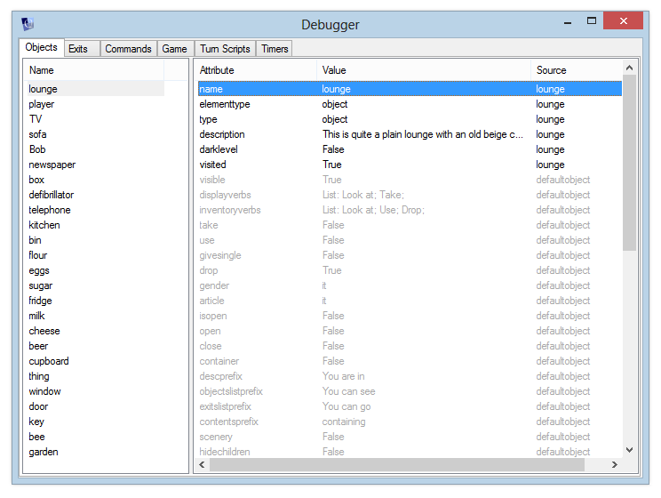

Note: The Debugger is currently only available in the Windows desktop version of Quest.

As you develop your games, there will be times when things happen which you didn't expect – usually because you’ve forgotten to set something up, or you've made a mistake in one of your script commands.

Fortunately, Quest provides you with the Debugger, which lets you keep an eye on what's going on inside your game while you're testing it. When a game is running, you can open the Debugger from the Tools menu, or "View Debugger" from the toolbar.

You can select any object in the game and view its current attributes. Any attributes inherited from a type are shown in grey - there will usually be quite a few of these, as every object implicitly inherits the "defaultobject" type, which includes many default attributes.
