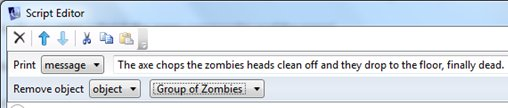

*What happens if you open a door and there is a baddy who wants to kill you but if you close the door you get out alive!*

1. I have a Uniform cupboard and behind it are a group of zombies hell bent to kill me!

     

2. I start my making the cupboard a container and writing the OPEN and CLOSE messages:

     

3. If I open the door then a script will start automatically and I will have 10seconds before I am killed.

4. To stop the script from working I need to make a flag when I close the door

5. I click on **After closing the object** and write in a message:

     

6. Next I set up a FLAG which is just a way of telling the computer that I have closed the door:
     
     

7. The FLAG is called stop

8. Now I go to the **After opening the object** section

9. I write an initial message:
     
     

10. I then click on **Add new script** and choose the from the *Timers* section, choose “**Run a script after a number of seconds**”.

     

11. I can choose how many seconds to wait before something else happens. In this case, 10 seconds.

12. After 10 seconds, if you have not closed the door then the zombies kill you.

13. The computer only knows if I have closed the door if it has got the FLAG.

14. I write an IF command telling it what to do if it gets the flag (ie the door has been closed)

     

15. The **IF** command says that If it has not got the flag then end the game with a message

16. I need to add a simple message in the **Else** part of the IF command:

     

  That section was for closing the door. We have still not worked out how the zombies are killed

17. To do this, we need to add in an *Else If* command.

18. We use the same scripts as before but this time we use an **object is visible** command
     
     

19. If the zombies are still visible (it has not been killed) then there is a message that says it eats us.

20. Finally we add in a **Finish the game** command to end the game!

21. Now we need to find a way to kill the zombies

22. Let’s add an axe object in the room so that when the player uses the axe on the zombie, it collapses and dies disappears)

23. We add an object called “axe” in the room:
     
     

24. We then go to the “**Use/Give**” tab scroll down to “**Use this on (other object)**”.

25. We choose Select “**Handle objects individually**”, add “**group of zombies**”, and then edit the script.

26. We choose Add a “**print a message**” command to say something to the player eg “The axe chops the zombies heads clean off and they drop to the floor, finally dead”

27. We then add a “*Remove object*” command to remove the group of zombies from play.

     

28. Here is what the script looks like this:

     

29. If we make the zombies disappear then nothing will happen after the 10 seconds!

30. So when the player opens the cupboard, if they use the axe on the zombies, the zombies will no longer be visible in the room. However, if the player has not used the axe and does not close the door then the zombies will still be visible, in which case the zombie enjoys a tasty meal.

*This helpsheet was written with the help and assistance of Ella Macri <http://www.textadventures.co.uk/blog/2012/02/27/time-limited-puzzles/>*
