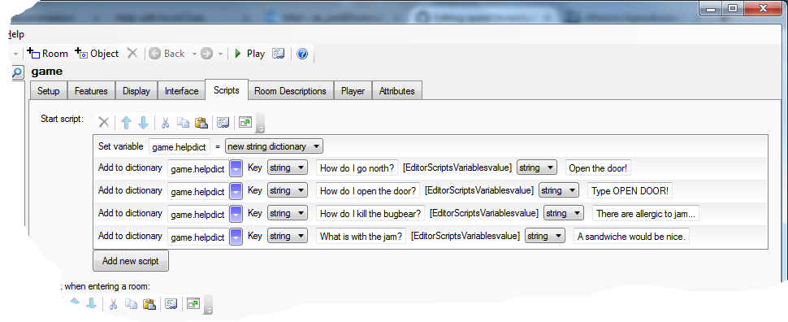

It can be helpful to the player if your game has a help system - something she can access in game to get past that puzzle that seemed so simple to you, but is fiendishly complicated for the player. But how to let the player see how to solve this puzzle, but not inadventently see the solution for the whole game?

Back at the dawn of time, Infocom came up with the idea of [InvisiClues](https://en.wikipedia.org/wiki/InvisiClues) - and now you can do that too, in a virtual way.


To get this to work, you need to create a new new HELP command. For the command pattern, just type in "help|?", and for the name, "help2" (no quotes for both), as Quest already has a HELP command, and will object if you give your command the same name.

For the script, paste in this:

    if (HasAttribute(game, "defaultbackground")) {
      bg = LCase (game.defaultbackground)
    }
    else {
      bg = "white"
    }
    msg ("Drag your mouse over the text to reveal only the clues you need.")
    foreach (key, game.helpdict) {
      msg ("<i>" + key + "</i> [<font color=\"" + bg + "\">" + StringDictionaryItem(game.helpdict, key) + "</font>]")
    }

The first 6 lines just get the background colour, the seven line is obvious just a message to the player. The important part is the loop at the end.

The foreach command loops over game.helpdict. This is a dictionary, which is kind of like a list, but with strings (conventionally called keys) instead of numbers. When you do foreach with a dictionary, you get the key, rather than the index.

The penultimate line prints the InvisiClue. The trick is that it changes the font colour to match the background, so first the key is printed in italics, then the value from the dictionary is printed in the background colour.

### The Hints

Once you have the command, you need to put in the data. Go to the _Attributes_ tab of the game object, and create a new attribute, helpdict. Set it to be a string dictionary, and then put in your questions and answers.

If using the web editor, you will not have an _Attributes_ tab, so we will have to do it differently. Go to the _Scripts_ tab of the game object, and modify the start script.

Click to add a new script, and select "Set a variable or attribute" from the list of scripts. in the first boxm type `helpdict`, then select "New string dictionary" from the drop down.

Click to add a new script again, and select "Add a value to a dictionary. In the first box, put in `helpdict`. The two dropdowns should be set to "String". In the second box put the question, and in the third the answer. You need to do this for every hint you wish to add to your game.



This is what the code looks like:

```
game.helpdict = NewStringDictionary()
dictionary add (game.helpdict, "How do I go north?", "Open the door!")
dictionary add (game.helpdict, "How do I open the door?", "Type OPEN DOOR!")
dictionary add (game.helpdict, "How do I kill the bugbear?", "There are allergic to jam...")
dictionary add (game.helpdict, "How do I kill the bugbear with jam?", "Perhaps you could give him a sandwiche?")
```
