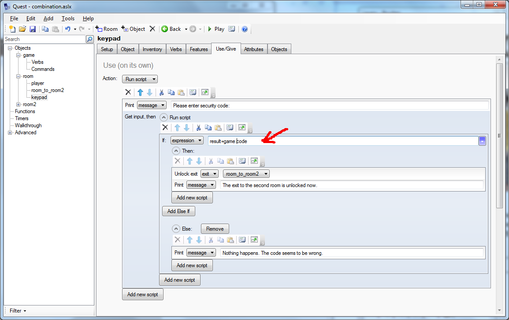

Here is an example of an exit that will be unlocked when the player inserts the right code.

After creating an exit set the "Locked" checkbox and type somthing in the "Print message when locked" box. To unlock the exit later you must enter a name for your exit!


Then add a keypad object to your room. Go to the _Features_ tab, and turn on "Use/Give", then go to the _Use/Give_ tab and add a script for when using the keypad on its own. This script is executed if the player types "use keypad". The player is asked to input the key and then the input is checked with an if-clause. If it is correct, the locked exit is unlocked.


Random Code
-----------

So now some wise guy has pasted the code on the internet, and everyone knows how to open the door already, without having to play part of your game. What we need is a code randomly generated each time the game is played.

So, firstly we need that random code. Click on the game object, then on the "Script" tab. The top half is for a script to run when the game starts, which is what we want. All it has to do is assign a random number to game.code (i.e., the code attribute of the game object). GetRandomInt is a function that creates random numbers, so here is the code:


There are a couple of tricks that are worth mentioning there. This is the expression used:

```
"" + GetRandomInt(1000, 9999)
```

We are getting a random number from 1000 to 9999. This ensures we have a four-figure number. This is then added to an empty string (that is the two double quotes). The end result, then is a string that contains exactly 4 digits.

The second part is to modify the exit to use the random code. There is just one change, highlighted below:



One last thing - you need a way to tell the player what the code is. Something somewhere has to do something like this:


This is going to print an expression, and in that expression the plain text is in double quotes, the code is game.code, as before, and it is all joined together with + signs. Alternatively, you can use the text processor:

> A note on the wall says the code is {game.code}.
