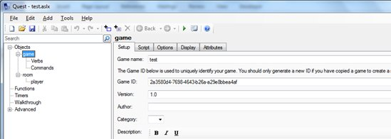
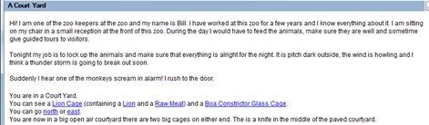

*Every game should have instructions or an introduction at the start. Here is how to do it*

1. Open your Game in design mode and click on the **Script** tab:

	

2. Click on **Script** and **Add a new script** to select **Print a message**:

	

3. Add in your script:

	

4. When the game plays your message appears at the start:

	