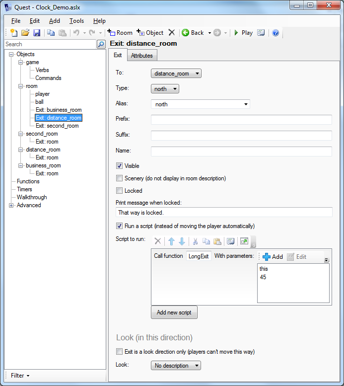

A relatively easy way to track and display time in a Quest adventure.

Contributed by: The Pixie

You are free to use this library in your own games, without crediting me, as long as the library is not modified. If you do want to modify the library, then you are free to do so, but please keep some attribution to me with it, at a minimum as a comment in the XML.

#### To use

Time is incremented whenever the player takes a turn, starting from midnight on day 1. By default, moving to another room will take 5 minutes, any other action will take 1 minute. If the player types CLOCK or TIME she will discover the time.

What you can also do:

### Set the start time  

In the game.start script, call IncTime to set the time in game starts in minutes past midnight.

### Have the time displayed as a status variable  

Add the attribute “clock” to the player, and set it to string. Then add it as a status variable. It will automatically track the time.

###Have long distance exits  

You can change the time that passes when a specific exit is used by calling the LongExit function. Call the function in a script on the exit, with the parameters, this, and the time to elapse.

###Have exits open at different times  

You can also have exits that can only be used at certain times (say for a shop only open during the day). There is not a lot of control over this. The day is divided into four slots, each six hours long, and you can specify which are open with the third parameter to the BusinessExit function. This should be a 4 character string, each character corresponding to a six hour slot, n indicates not open, y indicates yes it is.

[Download](http://textadventures.co.uk/attachment/115)
[Discussion](http://textadventures.co.uk/forum/samples/topic/2580/clock-library-for-handling-game-time)

#### Functions

BusinessExit (**object** *exit*, **integer** *time*, **string** *opening*)

Moves the player to the destination of the *exit*, incrementing time by *time*, if the exit is open, using the logic of IsBusinessClosed.

---

GetTime

*Returns:*Get the current time, in minutes, as an integer

---

IncTime (**integer** *increment*)

Adds the increment (in minutes) to the current time.

---

IsAfternoon

*Returns:*A boolean, true if the time is between 1200 and 1800.

---

IsBusinessClosed (**string** *opening*)

*Returns:*A boolean, true if the current time is when the business is open. The business opening times are determined by the string, which should be four characters long, and made up of "y" and "n", indicating whether the business is open during each quarter of the day.

---

IsDusk

*Returns:*A boolean, true if the time is between 1800 and 1900.

---

IsEvening

*Returns:*A boolean, true if the time is between 1800 and midnight.

---

IsMorning

*Returns:*A boolean, true if the time is between 0600 and 1200.

---

IsNight

*Returns:*A boolean, true if the time is between midnight and 0600.

---

LongExit (**object** *exit*, **integer** *time*)

Moves the player to the destination of the *exit*, incrementing time by *time*.

---

PartOfDay

*Returns:*An integer denoting the quarter of the day for the current time; night is 0, morning is 1, afternoon 2 and evening is 3.

---

TimeAsString

*Returns:*The time as a string, in the form: Day 3, 4:23 pm.

#### Player Commands

CLOCK or TIME

Displays the current time.
