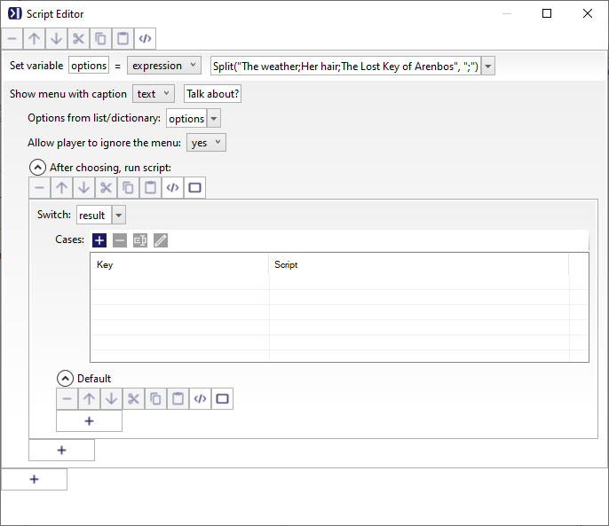
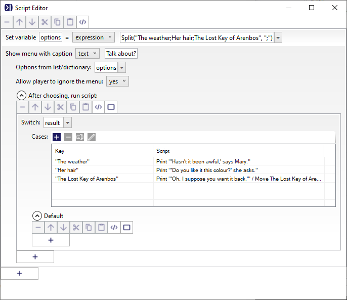
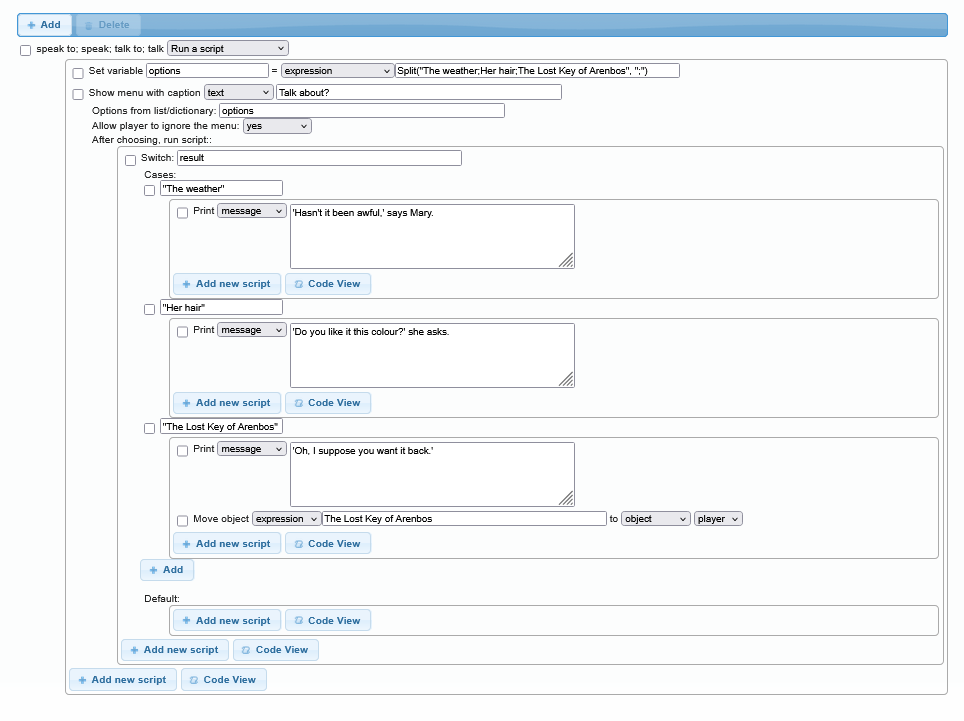
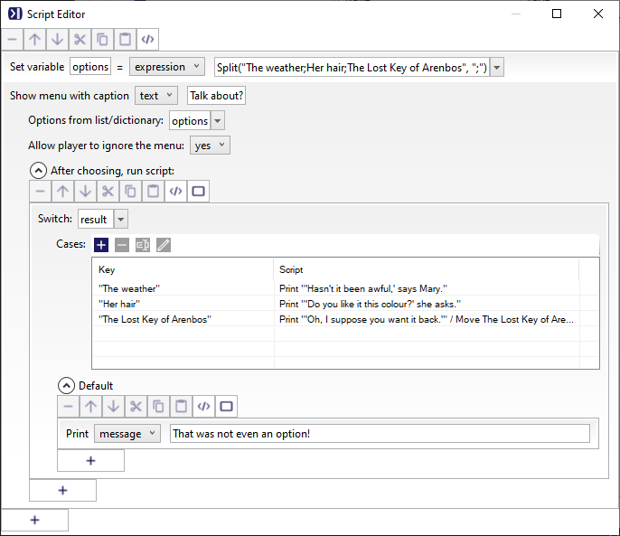

A `switch` is like an `if` script, but it caters for more options without you having to to add a load of `else if` entries.

The most common use of a `switch` is after asking the player a question, so we will have a go at that, using the `ShowMenu` function. Let us suppose we have a character the player can talk to, and we want to give the player a number of conversation options. So first, add a character, we can call her "Mary", make her a "Female character (named)" on the _Setup_ tab, then on the _Verbs_ tab add a new verb, "Speak to", and set it to run a script.


The `ShowMenu` bit
---------------------

The first step is to create some options the player can choose from. Do add script, and select "Set a variable or attribute". Call the variable `options`, and for the expression: `Split("The weather;Her hair;The Lost Key of Arenbos", ";")`

What that will do is create a variable, called "options", and will put a string list n to it. To create the list we are using the `Split` function, which breaks a string into a list, in the case at each semi-colon. We just have three options, but you can have any number.

Then do add a new script again, and this time pick "Show a menu". For the text, type is `Talk about?`.


The `switch` statement
----------------------

We need to add another script, but you now have two "Add new script" buttons. You need to pick the higher one that is indented, because this is happening inside the `ShowMenu`. Select `Switch...` and type in `result` for the switch.

`result` is a special variable that Quest will set, and will contain the choice the player made.

It should now look like this:



Now we need to add the choices. These need to match exactly, and it is a good idea to copy and paste. To add an option, click on the "Add" next to case. You will be asked "Please enter the case expression". Paste in the first option, inside double quotes. Click okay, and you will get a box to put a script. We will just have it print a message, but you can add as many steps as you need, perhaps changing attributes, moving objects, whatever.

So now it looks like this on the desktop version:



`switch` states are displayed differently on the web version; in that case it should look like this:



Launch the game and try the options to check that you see the correct response.


Default option
--------------

As we are controlling what the player can select, there is no chance that anything else will be encountered by the `switch` statement, but that is not always the case. To catch everything that would otherwise be missed, we can add a default. This just involves clicking the "Add new script" button - but now there are three! You want the highest, most indented one in this case.




Advanced
--------

In code view, the script above looks like this, and we will look at more code in this section:

```
options = Split("The weather;Her hair;The Lost Key of Arenbos", ";")
ShowMenu ("Talk about?", options, true) {
  switch (result) {
    case ("The weather") {
      msg ("'Hasn't it been awful,' says Mary.")
    }
    case ("Her hair") {
      msg ("'Do you like it this colour?' she asks.")
    }
    case ("The Lost Key of Arenbos") {
      msg ("'Oh, I suppose you want it back.'")
      MoveObject (The Lost Key of Arenbos, player)
    }
    default {
      msg ("That was not even an option!")
    }
  }
}
```

You can add multiple choices to a single `case` statement, just separate them with commas. For example, you might want to allow both 999 and 911 to be used as an emergency number:

```
  case (999, 911) {
    msg ("There’s no need to call the police now.")
  }
```

You can also match against strings, but they need to be in quotes. In fact, you can mix numbers and strings:

```
  case (999, 911, "police") {
    msg ("There’s no need to call the police now.")
  }
```

If you are matching against text the player has typed, it is a good idea to make it all lowercase in the `switch`:

```
switch (LCase(text)) {
  case (999, 911, "police") {
```

The switch/case statement requires an exact match, but there is a trick we can use if we want to see if a number is in a range. Look at this code:

```
switch (true) {
  case (player.strength > 20) {
    msg("You are strong!")
  }
  case (player.strength > 10) {
    msg("More training required!")
  }
  case (player.strength > 5) {
    msg("You should work out more!")
  }
  default {
    msg("Weakling!")
  }
}
``` 

What we are doing is looking for an exact match to `true`. Each `case` statement is evaluated, and if it is true, then that is a match. Suppose the player's strength is 15, the first case will evaluate to false, so is not used. The second, however, is true, so the message is printed. Note that Quest breaks out of the `switch` once it has a match, so the third `case` is skipped, even though it would be true.