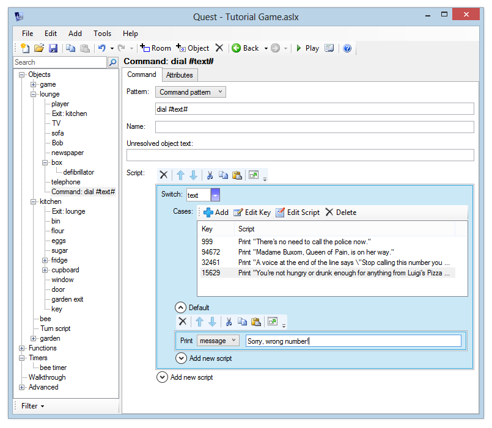

A "switch" is like an "if" script, but it caters for more options without you having to to add a load of "else if" entries.

In this example, we'll add a telephone to the lounge in the tutorial and set up a "dial" command. The player will be able to dial a variety of different numbers:

-   999 will print the message "There's no need to call the police now."
-   94672 will print the message "Madame Buxom, Queen of Pain, is on her way."
-   32461 will print the message "A voice at the end of the line says 'Stop calling this number you pervert!'"
-   15629 will print the message "You’re not hungry or drunk enough for anything from Luigi's Pizza Palace right now."
-   Otherwise "Sorry, wrong number!" will be printed

First, add a telephone to the lounge and give it a sensible description. You should also go to the _Object_ tab and give it an "Other name" of "phone". Next, add a command "dial \#text\#". Whenever the player types "dial", the text that follows will be put into the "text" string variable.

In the command script, add "switch". You can now enter a Switch expression, and any number of cases. Here, we want to compare the variable "text" against different values, so the Switch expression is "text". Each of the cases that we add will be compared against this.

Click Add to add the first case. Enter the expression "999".

     

Click OK. The Script Editor will now be displayed, ready for you to enter the script that should run if \#text\# is equal to "999". Print the message "There's no need to call the police now." and close the window.

Follow the same process to enter the responses for the other phone numbers. When you reach the bottom of the list, add script to the "Default" section to print "Sorry, wrong number!". This will handle any other input that wasn't matched by our cases.

When you have finished, the Script Editor should look like this:



In the web version, it looks a little different:


This is much easier to read, edit and add to than if we had used lots of "if" and "else if" scripts.

Launch the game and dial a few numbers to check that you see the correct response.


Advanced
--------

In code view, the switch above looks like this, and we will look at more code in this section:

```
switch (text) {
  case (999) {
    msg ("There’s no need to call the police now.")
  }
  case (94672) {
    msg ("Madame Buxom, Queen of Pain, is on her way.")
  }
  case (32461) {
    msg ("A voice at the end of the line says ‘Stop calling this number you pervert!’")
  }
  case (15629) {
    msg ("You’re not hungry or drunk enough for anything from Luigi’s Pizza Palace right now.")
  }
  default {
    msg ("Sorry, wrong number!")
  }
}
```

You can add multiple choices to a single `case` statement, just separate them with commas. For example, you might want to allow 911 to be used as an emergency number:

```
  case (999, 911) {
    msg ("There’s no need to call the police now.")
  }
```

You can also match against strings, but they need to be in quotes. In fact, you can mix numbers and strings:

```
  case (999, 911, "police") {
    msg ("There’s no need to call the police now.")
  }
```

If you are matching against text the player has typed, it is a good idea to make it all lowercase in the `switch`:

```
switch (LCase(text)) {
  case (999, 911, "police") {
```

The switch/case statement requires an exact match, but there is a trick we can use if we want to see if a number is in a range. Look at this code:

```
switch (true) {
  case (player.strength > 20) {
    msg("You are strong!")
  }
  case (player.strength > 10) {
    msg("More trainging required!")
  }
  case (player.strength > 5) {
    msg("You should work out more!")
  }
  default {
    msg("Weakling!")
  }
}
``` 

What we are doing is looking for an exact match to `true`. Each `case` statement is evaluated, and if it is true, then that is a match. Suppose the player's strength is 15, the first case will evaluate to false, so is not used. The second, however, is true, so the message is printed. Note that Quest breaks out of the `switch` once it has a match, so the third `case` is skipped, even though it would be true.