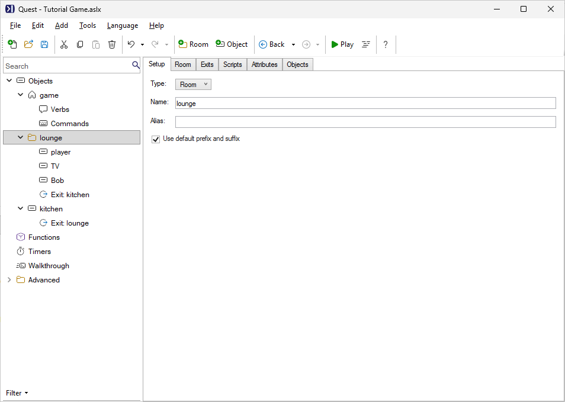
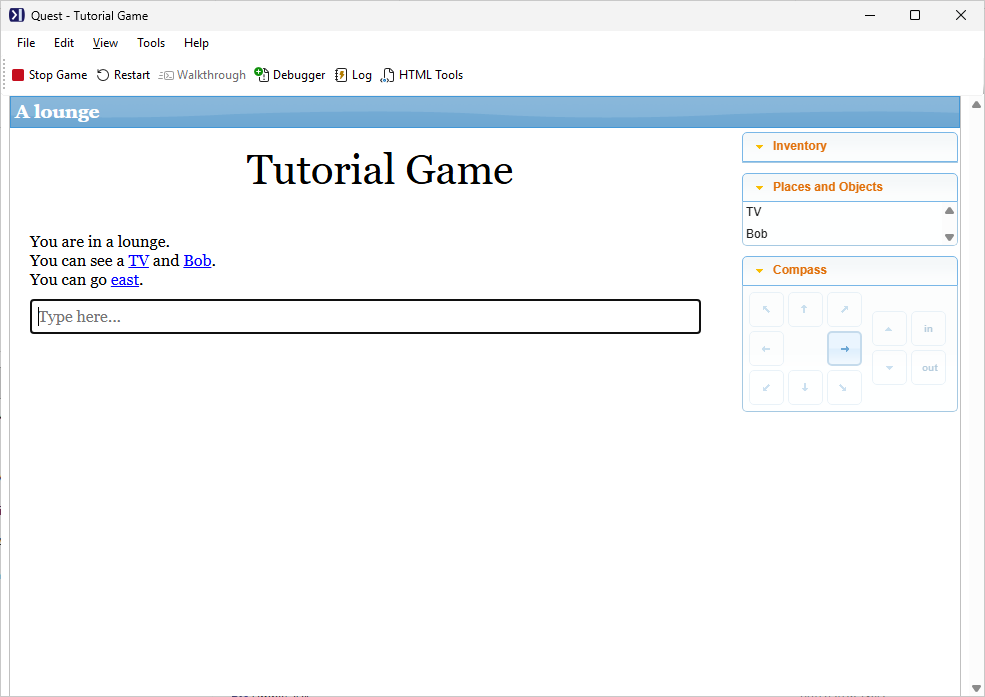
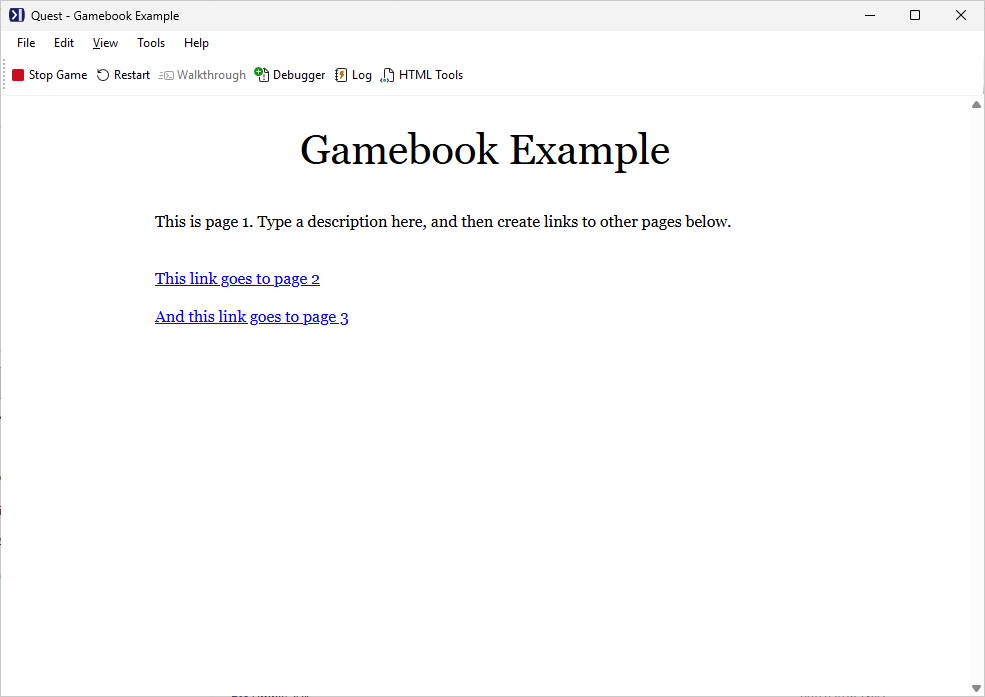
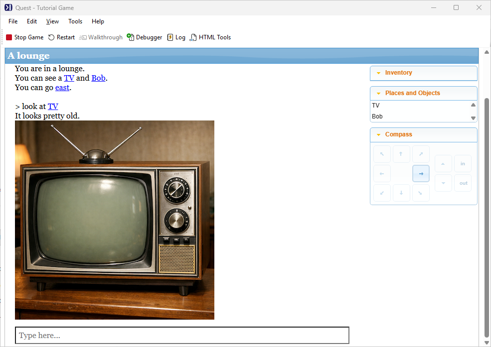
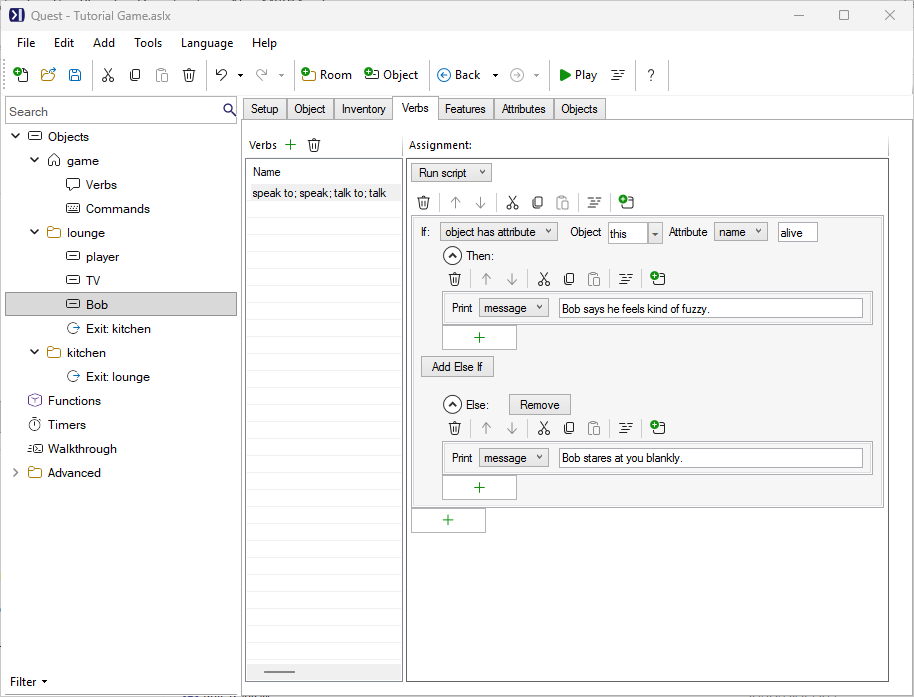
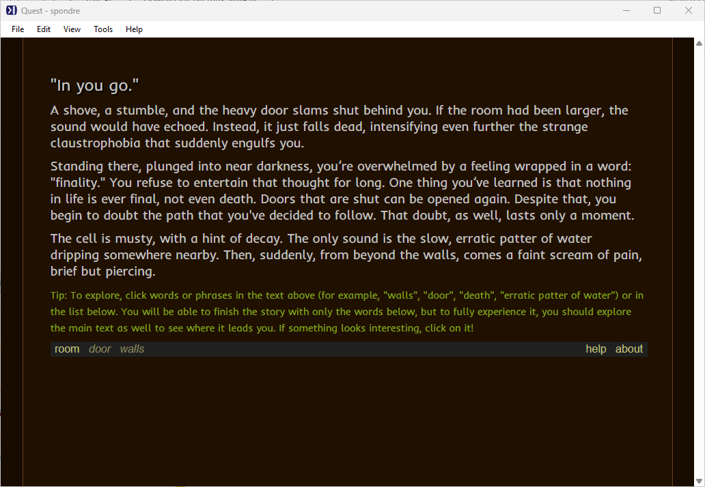

Quest lets you create text adventure games, gamebooks, and other interactive fiction - no programming experience required. This page gives a quick tour of what Quest can do.

## The editor

Quest's point-and-click editor lets you build a game by describing rooms, adding objects and characters, and setting up interactions - all without writing any code. Everything is displayed in plain English. When you're ready to go further, a full scripting language is available underneath, but you can make a complete game without ever using it.

## Text adventures and gamebooks

Quest supports two styles of interactive fiction:

**Text adventures** are location-based games where the player explores rooms, picks up objects, solves puzzles, and interacts with characters. This is the classic style, similar to _Zork_ or _Hitchhiker's Guide to the Galaxy_.

**Gamebooks** are linear narrative experiences with branching choices - closer to a _Choose Your Own Adventure_ book. The player reads passages and picks from a set of options at the end of each one.

## Multimedia

Quest games are more than just text. You can add:

- **Images** - displayed in the game pane, or alongside room and object descriptions
- **Sounds and music** - background audio or triggered sound effects
- **Video** - embedded from YouTube

## Scripting

Quest's scripting system gives you precise control over your game's behaviour. You can write scripts in the editor using a visual block interface, or switch to Code View to write Quest's scripting language directly. Scripts can use variables, conditionals, loops, and functions, and you can encapsulate reusable behaviour in object types and libraries.

## Customising the interface

The default player interface is clean and functional, but Quest gives you full control over it. You can add custom panes, change fonts and colours, rearrange the layout, and inject your own HTML, CSS and JavaScript to make the game look exactly how you want.

## Publishing and sharing

When your game is ready, you can publish it to [textadventures.co.uk](https://textadventures.co.uk), where players can find and play it directly in their browser without downloading anything. Games work on any device. You can also keep a game private and share just a direct link with friends.

See the [Publishing](publishing.html) section for full details on how to publish, file size limits, and competition entries.

## What next?

The **[Tutorial](tutorial/index.html)** is the best way to get started - it walks you through building your first game from scratch.
