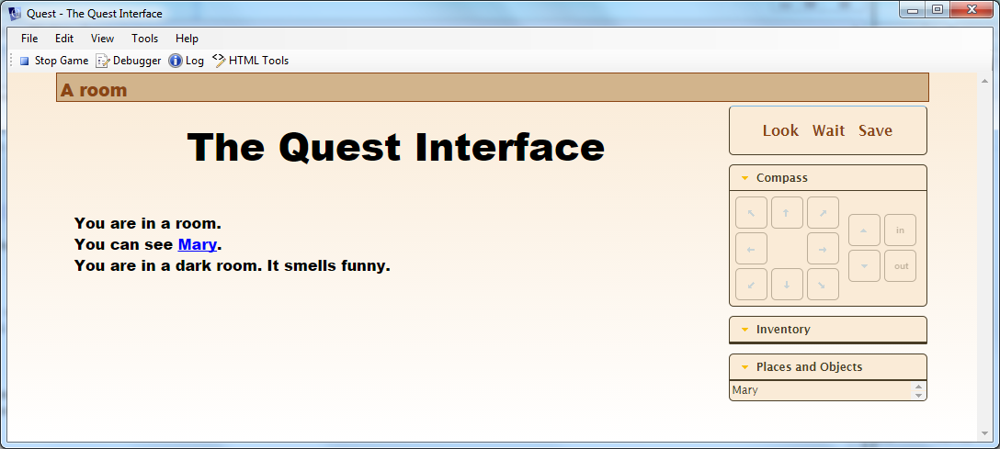
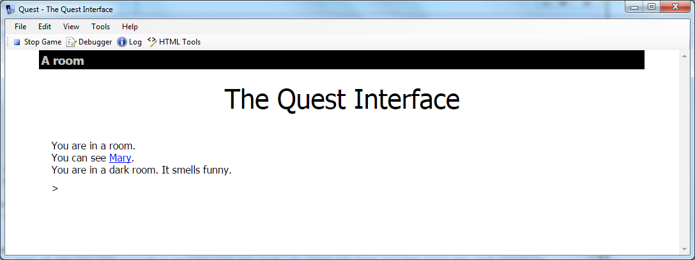

This file documents changes to Quest as of version 5.7.


Preamble
--------

This is my first update in charge of Quest, and makes a lot of changes that I have felt would be useful both from my own use of Quest and from seeing what people want and struggle with on the forum. I hope all but the most basic users will find at least some of these changes useful (but I doubt any one person will find it all useful).

The changes are virtually all restricted to the .aslx files in WorldModel/Worldmodel/Core; I have made very limited changes to the C# code as this is not an area I am competent in (perhaps for 5.8!). There are some changes to playercore.htm and playercore.js (and these will not be present in the web player until that is updated to Quest 5.7).

Games created in Quest 5.6 should be able to run in Quest 5.7 without any issue (if you do have a problem, let me know - that is a bug). You should also be able to run games created in Quest 5.7 on the 5.6 web player, however some of the new user interface options will not work, so these are best avoided until the web player is updated.

Thanks to beta-testers: Anony NN, chaosdagger, Dcoder, Doctor Agon, Pertex, Richard Headkid


New UI Options
--------------

Customisation of the user interface (UI) is now much easier. There are a number of new JavaScript functions, but more importantly a lot of options can be set from the tabs of the game object, so you should not have to do any JavaScript.

This is our starting point


### Game panes

You can now select different colour schemes for the panes on the right (or invent your own with a JavaScript function, JS.setPanes)

You can turn off individual panes, and add a new command pane and a new status pane. The command pane makes it easier to create a game with no command bar, as commands like LOOK and WAIT can be put here (with JS.setCommands). The status pane can have any HTML put in it (with JS.setCustomStatus), so could display indicators bars as well as text.
https://github.com/textadventures/quest/issues/752



[Custom panes](custom_panes.html)

### Command bar

New options for the command bar; borderless cursor or shadow box.



### Colours

You can now set the background to blend from one colour at the top to another at the bottom, as in the middle image above (but it does not look so good with a borderless command bar). You can set both the margins and the page background colour, as well as the status bar and game border.

Use the new `JS.setPanes` function to create your own colour scheme for the game panes. This can be used with two, four or five parameters, the text colour, the background, the secondary text colour, the secondary background and the highlight colour. Experiment to see exactly what each does.

```
JS.setPanes("black", "orange")
```


### Other changes

The body element is now given the default font, colour and background-color. This means the save confirmation text will be in the standard style for your game. This has the potential to have far-reaching effects, given the body element is the fundamental HTML element of your game, but it seems to have no side effects, and if there are some I would expect them to be improvements anyway.

Note that this means the text in the status bar at the top is now in the default font (in 5.6 it is Arial/Helvetica), as seen above (no effect on its colour).

The gamePanes div is now transparent. Again, this could affect many games, but I cannot imagine why anyone would want it a different colour to #gameBorder.

The Features, Display and Interface tabs of the game object have been rearranged and extended to support these features, and to make their placement (hopefully) more logical.

There is now a JS.setCss function that takes an element name and a set of CSS stylings. This will make changing styles much easier (though the above will mean it should rarely be necessary).

There is an option to hide the save button in the web player (it does not stop players saving, for example via the command bar).

You can now set the width and colour of exits for the map grid (see [here](http://textadventures.co.uk/forum/quest/topic/hyy-yxu7tewpc4_s_obr6g/changing-map-hallway-colors-solved)).


Text Processor
--------------

This has been updated so that it has a few extra commands (incorporating most of the TextProcessorPlus library); "colour" (or "color") will get the text to display in that colour. Similarly, "back" will change the background colour. You can also use "i", "b", "u" or "s" for italic, bold, underline or strike-through.

> Here is some text with {colour:red:this} in red, and {b:{back:blue:that}} in bold with a blue background.

The "popup" command creates a link, clicking on it will display an information box, which can be dismissed by clicking.

> The man is carrying a {popup:spade:A spade is a tool commonly used for digging holes.} over his back.

The "either" command is similar to "if", but has a second (optional) part that is printed if the condition fails, and is more flexible with its conditions, as these now evaluated as Quest code (this does mean that strings need to go in quotes which is different to how this was in TextProcessorPlus library). 

There is also an "eval" command which will run the rest of the text as Quest code. You can also use an equals sign as a short cut. This means you can put anything into curly braces, such as function calls and complex calculations.

If you actually want curly braces as curly braces and there is a chance Quest will try to interpret it as a text processor command, you can use `@@@open@@@` and `@@@close@@@`.

It also works recursively, so the output text will then get processed again. We have yet to work out when that will be useful...

A new function, `ProcessText` is used by the output functions. You could use this elsewhere, say to set an attribute with text that has gone through the text processor. You could also override it to do your own stuff.

Some examples:

```
// This is the same as version 5.6
"player.count = {player.count}"
 -> "player.count = 5"
 
// ... but now you can also do this, as the equals sign will cause Quest to
// treat the rest as code.
"You are in the {eval:player.parent.name}"
 -> "You are in the kitchen"
"You are in the {=player.parent.name}"
 -> "You are in the kitchen"
 
// It can be as complex as you like; it is just Quest code that results in a string.
"You are in the {=CapFirst(player.parent.name)}"
 -> "You are in the Kitchen"
 
// ... or a number
"There are {=ListCount(AllObjects())} objects"
-> "There are 6 objects"
"Carry capacity remaining: {=player.maxvolume - GetVolume(player, false)} kg"
-> "Carry capacity remaining: 5 kg"

 // And it will add brackets if it is ONLY a function call with no parameters.
"You look out the window: {=LookOutWindow}"
 -> "You look out the window: A figure is moving by the bushes"

// An example of displaying curly braces 
"player.count = @@@open@@@player.count@@@close@@@"
 -> "player.count = {player.count}"
 
// You can now do complex conditions with "either"
"You {either StartsWith(player.name, \"play\") and not player.flag:are the player}"
 -> "You are the player",
"'Oh, {either player.male_flag:he:she} is not worth it.'"
 -> "'Oh, he is not worth it.'",
```

Historically, the text process cannot cope with "this" in the embedded code. Now it can, at least to some degree. You do have to tell it what "this" refers to first, by setting game.text_processor_this.


Icelandic
---------

We are indebted to Kaspar Jan for providing a translation into Icelandic.
 
 
New functions
-------------

-  [ScopeUnlockedExitsForRoom](functions/scopeunlockedexitsforroom.html)
-  [CloneObjectAndMoveHere](functions/cloneobjectandmovehere.html)
-  [CreateBiExits](functions/createbiexits.html): Creates an exit in the given direction, between the given rooms, and a second exit coming back.
-  [Equal](functions/equal.html): Compares any two things (comparing 4 and null will otherwise throw an error).


### String utilities

[FormatList](functions/string/formatlist.html)
```
FormatList (Split("one;two;three"), ",", " and", "nothing")
 -> "one, two and three"
```
[Spaces](functions/string/spaces.html)
```
Spaces (5)
 -> "&nbsp;&nbsp;&nbsp;&nbsp;&nbsp;"
 ```
[ToWords](functions/string/towords.html)
```
ToWords (42)
 -> "forty two"
 ```
[ToRoman](functions/string/toroman.html)
```
ToRoman (42)
 -> "XLII"
 ```
[PadString](functions/string/padstring.html)
```
PadString ("34", 5, "0")
 -> "00034"
 ```
[Decimalise](functions/string/decimalise.html)
```
Decimalise (1234, 2)
 -> "12.34"
 ```
[DisplayMoney](functions/string/displaymoney.html)
```
game.moneyformat = "!$1,2!($1,2)!"
DisplayMoney (1234)
 -> "$12,34"
[DisplayMoney](functions/string/displaymoney.html) (-1234)
 -> "($12,34)"
 ```
[ReverseDirection](functions/string/reversedirection.html)
```
ReverseDirection ("southeast")
 -> "northwest"
```

### List utilities

-  [IndexOf](functions/indexof.html)
-  [FilterByType](functions/filterbytype.html)
-  [FilterByAttribute](functions/filterbyattribute.html)
-  [FilterByNotAttribute](functions/filterbynotattribute.html)
-  [ObjectListToStringList](functions/objectlisttostringlist.html)


### Get one at random

-  [PickOneString](functions/pickonestring.html)
-  [PickOneObject](functions/pickoneobject.html)
-  [PickOneChild](functions/pickonechild.html)
-  [PickOneChildOfType](functions/pickonechildoftype.html)
-  [PickOneExit](functions/pickoneexit.html)
-  [PickOneUnlockedExit](functions/pickoneunlockedexit.html)


Annotations
-----------

This allows authors to add notes for their own purposes to rooms (names of attributes, what happens here, things to do, etc.). This can be activated by ticking the box on the _Features_ tab of the game object, and adds a new tab to rooms. It has no effect on game play.


Clothing
--------

This is my clothing library, which is itself an extension of Chase's wearables library. Set an object to be Wearable on the features tab to see the new _Wearable_ tab. Advanced options will appear if you tick the box on the Features tab of the game object.

If you already use either my library or Chase's you should find this works with no effort on your part, you just need to delete the library from your game.

[Clothing](wearables.html)


Money
-----

Quest already has score and health built-in, now money is too. It can be activated the same way, and will appear in the status attributes. There are a lot of options for formating too, using the new function `DisplayMoney`, controlled by an attribute of the game object.

Objects can now have a price set for them ("price" attribute), and the player can have starting money set ("money" attribute). To see these in the GUI, turn them on on the _Features_ tab of the game object. This will make adding commerce to an on-line game much easier (however, there are various ways to do that, so the rest is up to you). Also added "purchase" as a synonym of "buy".

[Score, health and money](score_health_money.html)

Advanced scripts
----------------

On the Features tab of the game object, you can turn on "Advanced scripts". This will show a new tab, with three scripts. 

The first is run directly after `InitUserInterface`, and does exactly the same thing. Making it a script allows users of the web version to use it (as they cannot override existing functions), giving web users the opportunity to customise the interface as much as desktop users have in the past.

The second runs when Quest does not understand a command. The unresolvedcommandhandler script has been around for ages; this just promotes it to the editor interface, so it will be easy to use.

The third is used by `ScopeReachableNotHeldForRoom` function, which Quest uses to match player input to commands. You can use it to add items to a local variable, a list called "items". This offers a relatively easy way to add "backdrop" objects; things that are always there, such as wall, ceiling, floor. You just have one of each of these in your game, this script effectively adds them to every room, so the player can LOOK AT WALL, and it will work with minimal effort. You could go further, and have different things in different types of rooms. If the room name has "forest" in it, add the `tree` object, for example.

[Advanced scripts](advanced_game_script.html)

Scope attribute for commands
----------------------------

There are two motivations for this.

_More intelligent TAKE and DROP:_ Suppose there is a hat in your inventory, and there is another in the room. If the player types WEAR HAT, the parser should guess that the hat to wear is the one the player is carrying, whilst GET HAT refers to the hat in the room.

_Alternative scopes:_ It would be great to be able to interact with objects in other rooms in certain situations. For example, cast a spell object, from a spellbook room (CAST FIREBOLT, when firebolt is an object in a room called "spellbook"), or buy objects from a shop stock room (player can BUY BALL from a shop; the ball is held in another room, and a clone is moved to the player inventory).

To support both these, there is now an optional attribute to commands, called "scope". If this exists, Quest will look for the object in the indicated location. The scope attribute is a string, and can be set to:

"inventory"  ScopeInventory
"not held"   ScopeVisibleNotHeld
objectname   GetAllChildObjects(GetObject(objectname))
attrname     GetAllChildObjects(GetAttribute(player.parent, attrname))

If the string is not recognised (or not there), it falls back to ScopeVisible as usual.

The default behaviour should be unchanged. The only commands I have applied this to are TAKE, DROP, WEAR and REMOVE, as it does not seem applicable to the rest. Note that the scope will apply to all objects for a command, so for GIVE HAT TO MARY, Quest would use the same scope for HAT as MARY.

[Advanced scope](advanced_scope.html)

 
Minor Changes
-------------

DoAskTell now adds a local variable, "text", set to the text value, for the script that runs for an unknown topic so we can now do:
msg("Mary says, 'I don't know about anything about " + text + ".")

Added a "possessive" attribute to Inanimate object, Male character, etc, with the value "its", "his", etc. This will complement the "gender" and "article" attributes. See [here](http://textadventures.co.uk/forum/samples/topic/3556/possessive-pronoun).

Added "me" as an alternative alias of the player, so if the author changes the player alias, LOOK AT ME will still work.

An object initialisation is now done directly after the game.start script runs; for any object with a script called \_initialise\_, the script will be run. This will allow library authors to automatically initialise libraries. For objects, you can turn on a new tab on the Features tab; the new tab will show this script. This will be a great way for users of the web version to set up attributes, given they have no attribute tab; attributes for an object can be set up in the \_initialise\_ script for that object, instead of having everything in the game start script.

Added an object attribute, "dropdestination", to the Room tab of rooms. If this is set, then when an item is dropped in the room it ends up at that object, rather than the room. E.g., if the player is up a tree, dropped items end up at the bottom of the tree.

Modified the "put" command so that objects that cannot be dropped also cannot be put inside containers.

The drop script for objects will now have access to a local variable "destination", which will be where the dropped item should end up (i.e., a container if the command is "put", the dropdestination if set or just the room). See [here](http://textadventures.co.uk/forum/general/topic/er9yijag3ekdrpvj4uh-ra/dropping-stuff).

Added an extra verb template for lookat "look" so LOOK PLATE will do the same as LOOK AT PLATE. See [here](http://textadventures.co.uk/forum/quest/topic/zwhhqiwlfecip0emay99eg/look-and-look-at).

If an exit has a "message" attribute, this will be displayed before the player is moved (unless the exit runs a script). See [here](http://textadventures.co.uk/forum/quest/topic/pzotaae1x0qc91bvnlua9q/displaying-a-message-after-choosing-an-exit).

Look directions are rarely used, so this is now a feature that must be turned on in the game object (this only changes the editor, so no effect on existing games). See [here](
https://github.com/textadventures/quest/issues/681).

If a room is dark, the game will return a message saying it is too dark to see anything. Previously it said nothing (if there was no message set), which I think was a bug. Note that the message is the same one that is seen when examining an object and it is too dark to see it. It works in English, it might not in other languages.

The `DiceRoll` function has been expanded to understand "d6" and "4d6+2" (but will still work with existing code). A good use of `DiceRoll` is to determine the effect of an attack in an RPG-style game, and the characteristics of the attack can be stored as strings in this form (which is standard in the RPG world).

The _Containers_ tab in the editor now has comments under the scripts that explains when they run, and that names the flags, "isopen" and "locked", that track its state.

If you set a string attribute on a switchable object called "cannotswitchon", then when the player tries to turn the object on, this messagwe will be displayed instead. This will allow authors to have devices that must be fixed before they will work, or have light sources that require power or fuel. To allow the object to be turned on, just set the attribute to null, by the way. The string can also be set in the GUI.

You can now have single and double quotes in options when using the [ShowMenu](functions/showmenu.html) function. ShowMenu will now accept any list of strings or objects, not just string lists. Links for objects will be displayed in the objects link colour, if used. This will also apply to disambiguation menus too.

Restricted containers (limit to number of items or volume of item) used a delegate called "addscript". This has been changed to a script that takes parameters. The code of the script has not been changed, but the code that calls it has.
This could affect anyone whose game overrides the existing "addscript" delegate. However, given that it is a delegate, I think it very unlikely anyone would do that (when was the last time someone asked about delegates on the forum?). This really is the point; by making it a script, it becomes far more accessible.
The editor GUI has been modified to include the "addscript" for containers that are not restricted, so now anyone can put their own custom restrictions on what can go in an item.

The attribute "hasbeenmoved" will get set to true whenever an object is moved (no matter how). One use of this would be to track what to save if anyone is considering a custom game saving system (say that allows games to be re-loaded after an update).

The Ask/Tell tab now has a third section, allowing you to tell an NPC to do something. It works just like ask/tell (and uses the same code), but allows the player to do ASK NPC TO  DO STUFF, TELL NPC TO DO STUFF and NPC, DO STUFF. This will still require a lot of work by authors to work well, but at least the framework is there. There is an issue here that script dictionary widgets do not display properly when they scroll off the top of the screen, as they get drawn over the top of the outer window. This was also an issue in previous versions of Quest, but was not apparent because of the way script dictionary widgets were placed.

There is now an option on the _Room Descriptions_ tab to clear the screen when the player enters a room. This will happen before running the script for leaving the old room, so any messages from that will still be seen, including messages about using the exit.

When adding a new verb, Quest will check if it will clash with an existing command (especially important for users of the web editor, as they cannot edit verb elements). It will now also object if you use "enter", as this will clash with the room script. It will also flag a clash if the conflicting verb is in a list (so for example "enquire;ask" will now be rejected). This (plus two new unit tests to support it) is the only change to the C# code.

 

Testing
-------

Many of the changes have been unit tested in a Quest game made for that purpose; it can be found [here](unit test_for_5_7.aslx). The start script will test each feature in turn, and compare the result against an expected value, outputing a dot if it passes and an 'F' otherwise. There are over 500 such tests.

Some features, such as those related to the interface, do not lend themselves to testing in this way.
 
 
Language support
----------------

If you have a language file for the game, these templates should be added. 

``` 
<template name="NeutralPossessive">its</template>
<template name="MalePossessive">his</template>
<template name="FemalePossessive">her</template>
<template name="SelfPossessive">your</template>
<template name="NeutralPluralPossessive">their</template>
<template name="MalePluralPossessive">their</template>
<template name="FemalePluralPossessive">their</template>
<template name="Nothing">nothing</template>

<template name="SelfAlt">me; myself; self</template>

<template name="Score">Score</template>
<template name="Health">Health</template>
<template name="Money">Money</template>

<dynamictemplate name="WearSuccessful">"You put " + object.article + " on."</dynamictemplate>
<dynamictemplate name="WearUnsuccessful">"You can't wear " + object.article + "."</dynamictemplate>
<dynamictemplate name="CannotWearIfNotHeld">"You would need to get it before you can put it on."</dynamictemplate>
<dynamictemplate name="CannotRemoveIfNotHeld">"You would need to get it before you can take it off."</dynamictemplate>
<dynamictemplate name="AlreadyWearing">"You are already wearing " + object.article + "."</dynamictemplate>
<dynamictemplate name="CannotRemoveIfNotWearing">"You are not wearing " + object.article + "."</dynamictemplate>
<dynamictemplate name="NotRemovable">"You cannot remove " + object.article + "!"</dynamictemplate>
<dynamictemplate name="CannotWearOver">"You cannot wear that over " + GetDisplayGarment(object) + "."</dynamictemplate>
<dynamictemplate name="CannotWearWith">"You cannot wear that while wearing " + GetDisplayGarment(object) + "."</dynamictemplate>
<dynamictemplate name="RemoveSuccessful">"You take " + object.article + " off."</dynamictemplate>
<dynamictemplate name="RemoveFirst">"You can't remove that while wearing " + GetDisplayGarment(object) + "."</dynamictemplate>
<template name="wornmodifier">worn</template>
<!-- verb templates allow for WEAR HAT, etc., whilst WearCommand handles PUT HAT ON -->
<template name="Wear">Wear</template>
<template name="WearCommand">put #object# on</template>
<verbtemplate name="wear">wear</verbtemplate>
<verbtemplate name="wear">put on</verbtemplate>
<verbtemplate name="wear">don</verbtemplate>
<template name="Remove">Remove</template>
<template name="RemoveCommand">take #object# off</template>
<verbtemplate name="remove">remove</verbtemplate>
<verbtemplate name="remove">take off</verbtemplate>
<verbtemplate name="remove">doff</verbtemplate>
```

Also the `ToWords` function.

There are considerably more for the editor. Do a compare on Github to see what the changes are (or contact me).
