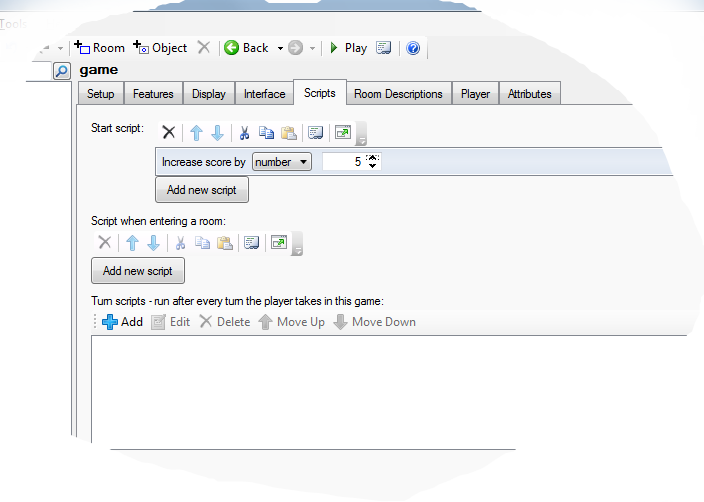
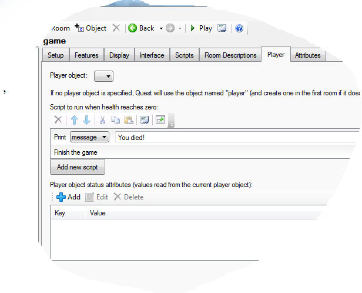

Quest offers an easy way to incorporate these common attributes in your game. The first step is to go to the _Features_ tab of the game object, and to turn on the ones that you want in your game.

To change the values, use one of these script commands (they will only be present if the relevant option was selected on the _Features_ tab): 


Here you can see the "Increase score" script command, set to add 5 to the player score:



It you prefer to do this in code, you just need to add to or subtract from the attribute.

```
game.score = game.score + 5
player.health = player.health - 5
player.money = player.money - 199
```

If your game is set to display the panes on the right, score, health and money will automatically be added to the status pane, if ticked on the _Features_ tab.


Score
-----

Score is the simplest. The score attribute belongs to the game object, so is the same even if the player can change to other characters during the game. It starts at zero.


Health
------

The health attribute belongs to the player object (or objects, if you have more than one). Health is treated as a percentage, so starts at 100, and is capped at that (if you try to set it to 120, it will become 100).

On the _Player_ tab of the game object, you can set what happens when health goes to zero or less. Here is a simple example that gives a message and then ends the game (which is probably all you need):



Here it is in code (just to show how simple it is):

```
msg ("You died!")
finish
```


Money
-----

Like health, money is an attribute of the player object. By default, money starts at zero, but you can change that on the _Player_ tab of the player object (and if you have several player objects, you can give each their own money).

By default, money is displayed in dollars, but you can change the format on the _Player_ tab of the game object. The exclamation mark in the string stands for the actual value, so if the player currently has money equal to 235:

```
$!
-> $235

! credits
-> 235 credits
```

The money format string is also used by the `DisplayMoney` function, and has a lot of optins beyond the scope of this page, but can be seen [here](functions/string/displaymoney.html).

When "Money" is ticked, you will find there is a "Price" number box for every object on its _Inventory_ tab.
