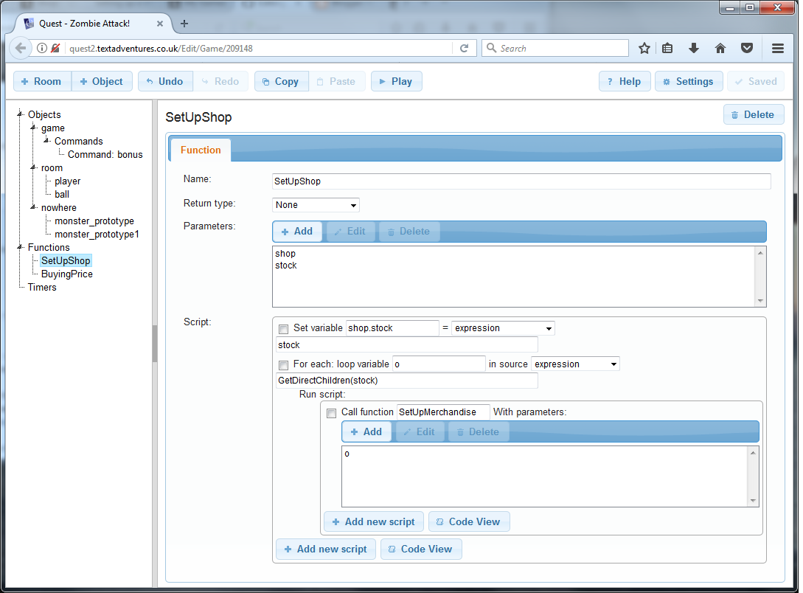
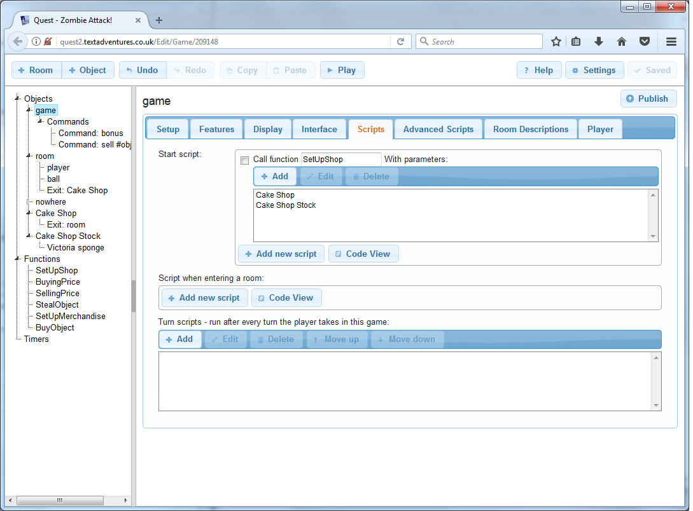

There is a library to handle shops, but this page describes how to do it yourself, which may be useful if you are using the web version.

There are several ways to set up a shop; this is more comprehensive, which does mean it is more effort to set up initially, but once done, it is very easy to expand.

The approach is to have separate rooms that the player cannot get to to hold the stock. When goods are purchased from stock, a clone is made for the player. When the player sells an item, if it is something that was purchased, it will get destroyed, otherwise it will get added to stock (and if bought back will not be cloned).

Setting Up An Economy
---------------------

Quest has some features built in to help us, so the first step is to turn these on. Go to the _Features_ tab of the `game` object, and tick "Money".

Now you need to think about what currency you want to use. If you are using pounds sterling, you should consider if you want to track the pennies, or just the pounds (the system will only be using whole numbers, so think carefully!).

Now go to the _Player_ tab, and the "Format for money" bit. By default it is "$!". The exclamation mark is a stand in for the actual value, so this will show money in dollars. You can modify that as you like - and there are [a lot of options](http://docs.textadventures.co.uk/quest/functions/string/displaymoney.html).

Clearly everything will need a price, so it can be bought and sold.  On the _Inventory_ tab of each object, you can set the price. You must also set the starting money for the player on the _Player_ tab of the player object (you will get errors if this is not set).

### Functions...

There are several functions we need to create. To create a function, select functions from the left pane, then click "Add" in the right pane.

The `SetUpShop` function has no return type, and two parameters, "shop" and "stock" (in that order!). It will be called at the start to set up each shop. Paste in this code (you will need to click on the "Code view" button first):

```
shop.stock = stock
foreach (o, GetDirectChildren(stock)) {
  SetUpMerchandise (o)
}
```

It should like like this it all went well:



The `BuyingPrice` function has "integer" as the return type, and one parameter, "obj". This will calculate the price merchants sell at (i.e., the player is buying), based on the object's price, and in the example below, it is just double. Paste in this code:

```
return (obj.price * 2)
```

You might want to modify this to reflect the player's skill at haggling, and perhaps any spell effect, but this is good for now.

The `SellingPrice` function has "integer" as the return type, and one parameter, "obj". This will calculate the price merchants buy at, based on the object's price, and in the example below, it is not modified. Paste in this code:

```
return (obj.price)
```

You might want to modify this too later.

The `StealObject` function has no return type, and one parameter, "obj". It will be called if the player tries to take something from the shop without paying. Paste in this code:

```
msg ("You can't just steal stuff!")
```

You might want to modify that to allow shop-lifting, but I am not going to condone that sort of thing!


The `SetUpMerchandise` function has no return type, and one parameter, "obj". It will be called at the start for each object in the shop, but also when an object is sold. Paste in this code:

```
if (not HasString(obj, "alias")) {
  obj.alias = obj.name
}
obj.listalias = obj.alias + " (" + DisplayMoney(BuyingPrice(obj)) + ")"
obj.cloneme = true
obj.take => {
  StealObject (this)
}
obj.buy => {
  BuyObject (this)
}
```

So this is a bit more complicated. First, it gives the object an alias if one is not set, so we can use it in the next step. Then it sets the "listalias" attribute. This is what will appear in the right pane, and it will show the alias, followed by the price in brackets.

Then it sets "cloneme" to true. This will diffentiate items that start in stock with items the player has sold to the shop. The former get cloned when bought, and destroyed when sold.

Then we set the "take" and "buy" attributes to scripts that call the functions we created above, so now those functions will be called when the player tries to TAKE or BUY the item.


The `BuyObject` function has no return type, and one parameter, "obj". It will be called if the player tries to buy something from the shop. Paste in this code:

```
if (obj.price > game.pov.money) {
  msg ("You can't afford that!")
}
else {
  if (GetBoolean(obj, "cloneme")) {
    obj = CloneObject(obj)
  }
  obj.take = true
  obj.parent = game.pov
  obj.buy = null
  obj.listalias = obj.alias
  list remove (obj.generatedverbslist, "Buy")
  list remove (obj.displayverbs, "Buy")
  list remove (obj.inventoryverbs, "Buy")
  player.money = game.pov.money - BuyingPrice(obj)
  msg ("You buy " + obj.article + " for " + DisplayMoney(BuyingPrice(obj)) + ".")
}
```

Another complicated one. The first three lines handle the player not having enough money. If so, then the "cloneme" attribute is checked, and if true, the object is cloned, and we then work with the clone. We set the "take" attribute to true so the object can be picked up like a normal object from now on, we move it to the player, we remove the "buy" script so it cannot be bought again, we reset the "listalias" attribute so it does not show the price. The next three lines remove "Buy" from the verb lists. Then we take the money off the player, and finally say we did it.


### One Command

The system uses verbs to handle purchasing, but it is easier to use a command for selling, as the player might try to sell anything. So create a new command (go to "Commands" in the left pane, then click "Add" in the right pane), and put this as the pattern:

> sell #object#

For the unresolved text:

> You want to sell what exactly?

We can also set the scope, so that Quest looks in the player's inventory first. This means that if the player returns to the shop to sell something back, Quest will match the clone the player is holding, rather than the original in the shop.

> inventory

And paste in the script:

```
if (not HasAttribute(game.pov.parent, "stock")) {
  msg ("You can't sell stuff here.")
}
else if (not object.parent = game.pov) {
  msg ("You're not carrying " + object.article + ".")
}
else {
  game.pov.money = game.pov.money + SellingPrice(object)
  if (GetBoolean(object, "cloneme")) {
    RemoveObject (object)
  }
  else {
    object.parent = game.pov.parent.stock
    SetUpMerchandise (object)
  }
  msg ("You sell " + object.article + " for " + DisplayMoney(SellingPrice(object)) + ".")
}
```

This checks if the room is a shop, then checks if the object is being carried. If so, the player's money is adjusted. If the object has "cloneme" set to true, then it is a clone, and it is destroyed. Otherwise,it is moved to the shop's stock and set up as merchandise.


### Game Scripts

We need to add a script on the game object. On the _Features_ tab, tick to display "Advanced scripts", then on the _Advanced scripts_ tab, paste this in at the bottom ("backdrop scope script..."):

```
if (HasAttribute(game.pov.parent, "stock")) {
  foreach (o, GetDirectChildren(game.pov.parent.stock)) {
    list add (items, o)
  }
}
```

This will add the contents of the shop's stock room to the scope, so the player will see the items there and can interact with them.

Creating A Shop
---------------

So now we have put in the infrastructure, we have done the hard work. Now you can create your shop - or however many you like. For each shop you need to also create a stockroom, which is just a room with no exits going to it, that contains everything for sale in that shop.

You need to initialise each shop. Go to the _Scripts_ tab of the game object, and add a line for each shop in your game to the start script at the top. The code will look like this:

```
SetUpShop (shop, stock)
```

You will need to replace "shop" with the name of the shop object in your game, and "stock" with the name of it's stock room.

### A Cake Shop...

As an example, we will create a shop called "Cake Shop". Add exits so the player can get to and from it, and a description as usual. Then create a second room, "Cake Shop Stock". This should have no exits and needs no description. However, it does need some cake objects, so put a lamington, a Victoria sponge and a fairy cake in there. Make sure each has a price set.

Now go to the _Scripts_ tab of the game object, and in the start script at the top, add this line:

```
SetUpShop (Cake Shop, Cake Shop Stock)
```

It should look like this:


