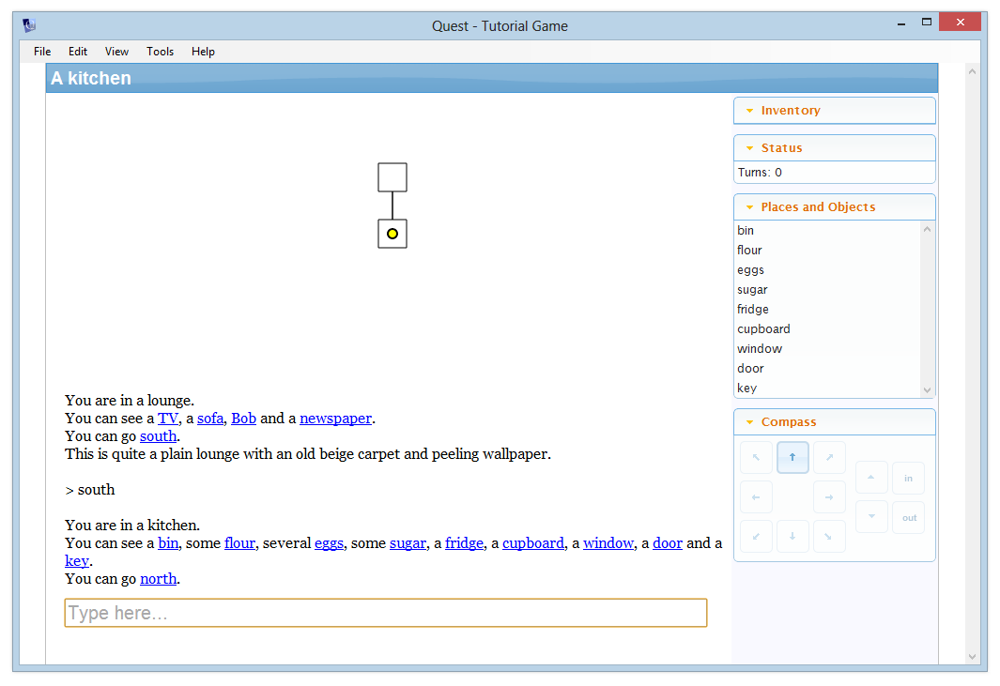

A text adventure generally involves moving around the game world by following compass directions – north, south, east, and west, with the occasional use of up and down, or in and out. Many players like to map out a game as they play using pencil and paper, but you can help your players out by getting Quest to do that for them automatically!

It's simple to enable the mapping feature - just select "game" from the tree, go to the Features tab, and turn on "Map and Drawing Grid".

After turning the feature on, you can customise the map size on the Interface tab. Leave the default scale and height settings - you can tweak these later if you want your map to be displayed at a different size. Quest draws the map on a hidden grid - the "scale" setting is the width and height of one grid square.

Run your game now and move between the lounge and the kitchen. When the player first enters a room, it is drawn on the map. The yellow dot indicates where the player currently is.

By default, rooms are displayed as a 1x1 square. You can change this by selecting the room and going to the "Map" tab (which only appears when the map feature is turned on).

Here you can change the size and colour of the grid square. You can change what borders are shown, and you can enter a label too. Here's what the game looks like with a 5x3 yellow lounge and a 2x2 sky blue kitchen, with labels added.

Exits are shown with a "length" of 1 grid pixel. You can change this by selecting the exit in the tree, and going to its Map tab. A length of 0 means that rooms will be displayed right next to each other, without a line. If you change the length of one exit, make sure you change the exit in the other direction too, or the layout engine may draw the map incorrectly.
