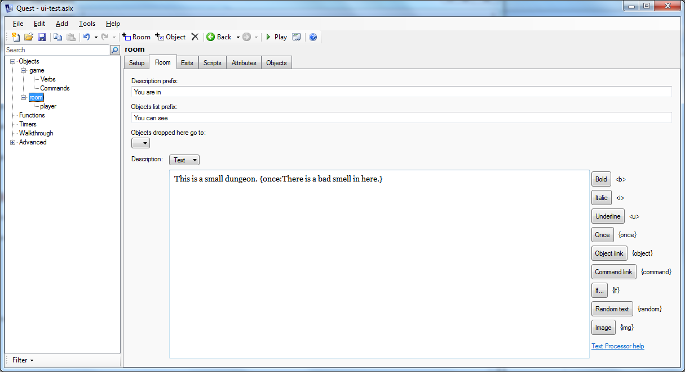

Quest 5.4 introduces a text processor, giving an easy way to conditionally print text, show object links, show text only once, and more.

To use the text processor, you can simply add a directive in curly braces in any text that gets displayed. In this simple example, a room description is set to say that room smells only the first time the text is printed:



The more important text areas have shortcut buttons for some text processor commands; these are the buttons on the right in the image above. However, you can use text processor commands in almost any text, for example, in an [msg](scripts/msg.html) command:

     msg ("Would you like some {command:help}?")

You can use as many sections as you like within the same text, and even nest them:

     msg ("You can {command:go to shop:go into the shop}. {if player.coins>10:You have {player.coins} coins, which is more than enough.}")

    
Supported processor commands are:

Text adventure mode and Gamebook mode
-------------------------------------

{once:**text**}  
Displays the text only once. The text will not be printed on subsequent occasions.

{notfirst:**text**}  
Does not displays the text the first time it is printed; the text will only be printed on subsequent occasions.

{random:**text 1:text 2:text 3**}  
Choose text at random (you can have as many sections as you like). This is a great way to add some movement to a character.

    You can see Mary {random:paddling in the sea:building a sand castle:running in the sand}.

{img:**filename.png**}  
Insert the specified image.

{**object.attribute**}  
Displays the value of an object's attribute. A great example of this is where the player can set the name of the main character, you can use `{player.alias}` as a stand-in for the character's name.

    'Hi, {player.alias},' says Mary, 'I've not seen you in a while!'
    
{if **object.attribute**:**text**}  
Display text only if object attribute is true (so requires a flag, otherwise known as a Boolean attribute). Containers have a flag called "isopen", and you could use that to modify the description, for instance.

    The chest is old, and almost falling apart. {if chest.isopen:The lid is open.}

{if not **object.attribute**:**text**}  
Display text only if object attribute is false.

{if **object.attribute=value**:**text**}  
Display text only if an object attribute equals a certain value. Note that there should be no spaces either side of the `=`.

{if **object.attribute\<\>value**:**text**}  
Display text only if an object attribute does not equal a certain value. Note that there should be no spaces either side of the `\<\>`.

{if **object.attribute\>value**:**text**}  
Display text only if an object attribute is greater than a certain value. Note that there should be no spaces either side of the `\>`.

{if **object.attribute\>=value**:**text**}  
Display text only if an object attribute is greater than or equal to a certain value. Note that there should be no spaces either side of the `\>=`.

{if **object.attribute\<value**:**text**}  
Display text only if an object attribute is less than a certain value. Note that there should be no spaces either side of the `\<`.

{if **object.attribute\<=value**:**text**}  
Display text only if an object attribute is less than or equal to a certain value. Note that there should be no spaces either side of the `\<=`.


{command:**command**}  
Displays a link that will run a command, displaying the command itself as the text. The command will be parsed as normal, so could be as simple as {command:HELP} or as complicated as {command:put the ball in the chest}. For a gamebook, the command should be the name of a page.

{command:**command**:**text**}  
Displays a link that will run a command, as before, but displaying some different text.

{page:**command**}  
As `command` (an alternative name that may be preferred for game books).

{page:**command**:**text**}  
As `command` (an alternative name that may be preferred for game books).


Additional text adventure commands
----------------------------------

{object:**name**}  
Displays an object hyperlink, using the object's display alias.

{object:**name**:**link text**}  
Displays an object hyperlink, using text you specify.

{exit:**name**}  
Displays an exit hyperlink. The name is the name you give to the exit (by default exits do not have names; you will need to give it a name yourself). The link will appear as the exit's alias ("north", "up", etc.)

{rndalt:**object**}  
Display a randomly chosen name from an object's [alt](attributes/alt.html) list.

{if **attribute**:**text**}  
Display text only if game attribute is true

{if not **attribute**:**text**}  
Display text only if game attribute is false

{select:**object.attribute**:**text 0:text 1:text 2**}
Selects one text to display, based on the value of the object attribute (you can have as many sections as you like). Note that the attribute must be an integer (whole number), and the sections number from zero.


Additional text adventure commands in Quest 5.7
-----------------------------------------------

{i:**text**}
Displays the given text in italic.

{b:**text**}
Displays the given text in bold. To do bold and italic, nest the commands, like this: {b:{i:very important}}.

{u:**text**}
Displays the given text in underline.

{s:**text**}
Displays the given text in strike-through.


{colour:**colour**:**text**}
Displays the given text in the colour specified (you can also used "color", by the way).

There may be an issue with using the hexadecimal form for colours (eg `#dedede`) causing the editor to crash; I would recommend using named colours, a list of which can be found [here](https://developer.mozilla.org/en-US/docs/Web/CSS/color_value).

{back:**colour**:**text**}
Displays the given text with the colour specified as the background. To show text as white on black, you can combine these like this: {colour:white:{back:black:some highlighted text}}.


{here **object**:**text**}
Displays the text only if the given object is in the current room (but not if in the player's inventory or in a container in the room).

    The beach is long, and the sand almost white. {here mary:You can see Mary, building a sand castle.}

{nothere **object**:**text**}
Displays the text only if the given object is NOT in the current room.

    The beach is long, and the sand almost white. {nothere mary:You wonder where Mary could be.}

{popup:**text**:**long text**}
Displays a link, with the first text (which cannot have text processor directives nested in it). When the player clicks on the link, a pop-up will be displayed, containing the long text. The pop-up will disappear when the long text is clicked on. This can be used with the img command to have an image pop-up.


{either **condition**:**text**}
This works similar to the if command above, but with two important differences. The first is the the condition can be any Quest code that results in a Boolean (true or false). The second is that if you are comparing a string it needs to be in double quotes (as is true of normal Quest code).


```
"You {either StartsWith(player.name, \"play\") and not player.flag:are the player}"
 -> "You are the player",
"'Oh, {either player.male**flag:he|she} is not worth it.'"
 -> "'Oh, he is not worth it.'",
```

{eval:**code**}
The code is evaluated, just as normal Quest code is, and the result displayed.

{=**code**}
This is a short cut for eval, and works just the same. The samples below show the potential, though by its nature this is rather less forgiving that the other commands available.
```
"You are in the {eval:player.parent.name}"
 -> "You are in the kitchen"
"You are in the {=player.parent.name}"
 -> "You are in the kitchen"
"You are in the {=CapFirst(player.parent.name)}"
 -> "You are in the Kitchen"
"There are {=ListCount(AllObjects())} objects"
-> "There are 6 objects"
"You look out the window: {=LookOutWindow}"
 -> "You look out the window: A figure is moving by the bushes"
```
 


Additional gamebook commands
----------------------------

{counter:**countername**}  
Displays the value of an counter

{if **flag**:**text**}  
Display text only if flag is set

{if not **flag**:**text**}  
Display text only if flag is not set

{if **countername=value**:**text**}  
Display text only if a counter equals a certain value.

{if **countername\>value**:**text**}  
Display text only if a counter is greater than a certain value.

{if **countername\>=value**:**text**}  
Display text only if a counter is greater than or equal to a certain value.

{if **countername\<value**:**text**}  
Display text only if a counter is less than a certain value.

{if **countername\<=value**:**text**}  
Display text only if a counter is less than or equal to a certain value.


Errors
------

If the text processor cannot understand your directive, it will generally leave the text as is. This should make it easier to identify issue. For example, for the "select" directive, if the value of the object attribute is outside the range (a negative number or a number higher or equal to the number of options), no processing is done, and the text will appear as written.


Curly braces
------------

Should you want to use curly braces to actually display curly braces, Quest will usually work out that that is what you want. As of Quest 5.7, if you find it is trying to display it as a text processor command (or is throwing an error because it has failed to), you can use `@@@open@@@` and `@@@close@@@` to tell Quest to display curly braces.
```
"player.count = @@@open@@@player.count@@@close@@@"
 -> "player.count = {player.count}"
 ```

 
Using text processor with object aliases
----------------------------------------

You cannot use text processor commands in an object's name, as only a limited set of characters is allowed (letters, numbers, space and underscore). You can for the object's alias, however, so you could set an alias to "{i:big} settee". You will find that the alias as it appears in the pane on the right has not been processed; the player will see the raw "{i:big} settee". To get around that, give the object a list alias on the _Object_ tab.
 
 
Support for "this"
------------------

In Quest, "this" is a special local variable that refers to the object that owns the current script. Text processor directives do not naturally support "this", because when they are being processed they do not belong to a script. However, you cam fake it by setting a special attribute of the game object called "text_processor_this". This would allow you to do something like this:

```
game.text_processor_this = teapot
msg("The {this.alias} is {if this.capacity<5:not }big enough.")
```


Local variables
---------------

In fact you can add any number of local variables in a dictionary attribute of the game object called "text_processor_variables". The key will be the name of the variable, and the value should be the object.

```
game.text_processor_variables = NewDictionary()
dictionary add (game.text_processor_variables, "animal", tiger)
msg("You can see a {animal.name}")
```

You can add as many variables as you like to the dictionary, and they will last until you set "text_processor_variables" to be a new dictionary again. Note that if you have "this" set in the dictionary and using "text_processor_this", the latter value will be used.


Extending
---------

You can add your own text processor directives. This should be done in the "start" script of the game object (top of the _Scripts_ tab on the game object).

Here is a very simple example that will replace `{test}` with `Some Text`:

```
game.textprocessorcommands = game.textprocessorcommands
scr => {
  game.textprocessorcommandresult = "Some Text"
}
dictionary add(game.textprocessorcommands, "test", scr)
```

The first step is to clone the script dictionary to the game object, which might look as if it is not actually doing anything, but behind the scenes is vital (you only ever need to do this once; if you forget you will get an error saying "Cannot modify the contents of this dictionary..."). The next three lines create a script, whilst the last line adds that script to the dictionary, using the key "test", which is then the name of the directive.

The script is where the action happens. In this case it just sets the result (a special attribute on the game object).

The script has access to a local variable called "section", which contains the text inside the curly braces (including the name of the directive). For the example above, that would just be "test".

Let us add another directive to see how that can be used:

```
scr => {
  s = Mid(section, 6)
  game.textprocessorcommandresult = "<span style=\"color:blue\">" + s + "</span>"
  }
dictionary add(game.textprocessorcommands, "blue", scr)
```

This will print the text in blue. 

```
msg("Here is the {test}, now with some in {blue:a different colour!}")
```

Inside the script, scr, there are two lines. The first gets the actual text. The word "blue" is four characters, then there is the colon, so the bit we want starts at the sixth character.

The second line then sets the return value, using HTML and CSS to change the text colour to blue.
