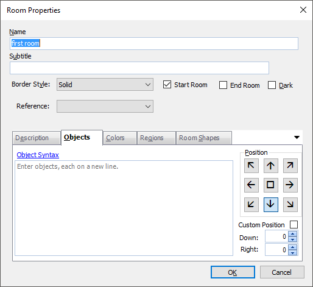
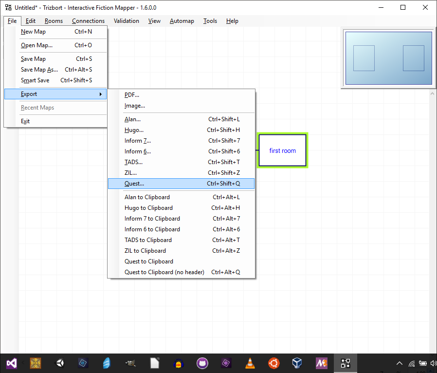

Trizbort is a map-making program specifically designed for text adventures, first developed by genstein, and now maintained by JasonLautzenheiser. It is partly for players to be able to map a game as they play through, but also for designers. It has been around for a few years, but recently the ability to export a map to Quest has been added.

You can find it here:

[www.trizbort.com](www.trizbort.com)


 

So how would you use it?
-------------------------

The first thing to realise is that this is a one way trip. You start creating with Trizbort, then export to Quest, and then create with Quest. You cannot go back to Trizbort once you have started to make changes in Quest.

So with that in mind, the way to approach it is to design the geography in Trizbort, then turn that into a game in Quest.

Trizbort is available as a .zip file, and should be extracted into a folder called “trizbort”. You can then double click the app to start it. You will be presented with a blank page.

 

Rooms
-----

Press “R” to create a room. When a room is selected you can drag it to move it, or select it and then drag its square handles to change its size. Double click on the room to change its properties. Here you can type in a description. You can tick it as dark too.



You should make sure one room is flagged as the start room so the exporter will create a player object there.

Rooms can be named any way you like. When exported, it will be given a name that is made up of just letters and numbers and underscores, but it will also get an alias that is just as you typed it.

Rooms in Quest have to have unique names; it is a good idea to select Validation – Rooms must have a unique name, so Trizbort will warn you if that is not the case.

Note that Subtitle, Regions and Room shapes will not be exported to Quest.

 

Exits
-----

To create an exit, make sure no room is selected (just click outside a room). Now if you hover your cursor over a room the circular exit ports will appear. Drag the port from one room to another. Ports line up to the normal compass directions. Trizbort actually supports sixteen compass directions; I am not aware of _any_ text adventure that uses that many and Quest certainly does not. Just use the standard eight (you might want to use the others for up/down and in/out).


Double click on a link to change it. You can do this to make it up/down or in/out (otherwise it will use compass directions as you would expect), or one way. One way exits will have arrows to indicate the direction. For up/down and in/out, the exit will be labelled. The label indicates what the player in the room will see. If it says “Down” at that end of the link, then the room has a “Down” exit.

You can make other changes too, but nothing that will get exported into Quest.

 

Objects
-------

You can add objects to rooms. Double click the room to open the properties box, and go to the _Objects_ tab. It is a simple list; one object per line. Each object can be flagged to be of a certain type, the flags should go inside square brackets. The following are supported:

```
s scenery
f female
m male
! proper-named (only with f or m)
c container
2 plural named (singular is by default)
```

Other flags will not be exported.

In this example, the room will have a sofa, which is scenery, a named, female called Mary, and curtains, flagged as both scenery and plural.

```
sofa[s]
Mary[f!]
curtains[s2]
```

Objects will be given names and aliases in the same way as rooms, however two objects can have the same name; they will get modified on export so the alias is the same, but not the name. Objects must NOT have the same names as rooms – Trizbort does not check, you need to ensure this yourself.

This is a great way to ensure everything mentioned in the room description gets implemented - but remember to gve them all descriptions.

Note that position just determines where the list appears in Trizbort, and is not exported to Quest.

 

Map Settings
------------

Go to _Tools – Settings_ to see general setting. Here you can give your game a title, add yourself as the author and add a description. This is just as easily done in Quest, and you may prefer to do it there.

None of the other settings will be included in your Quest game.

 

Exporting
---------

Before exporting, check: Do you have a start room (it will have a yellow glow around it; Trizbort will not let you have more than one)? Do you have any objects/rooms with the same names?

You do not have to, but it is probably best to follow the Quest convention, and to create a new folder for your game inside the “Quest Games” folder.

Once you have completed your map, go to _File – Export_ to export your game, and select _Quest_. Navigate to the folder, and click “Save”. The exported file is your new Quest game.




 

In Quest
--------

You should now be able to open your game in Quest.

Remember to give all those objects a description. If any can be picked up, you will need to tick the box for that. Note that if you have rooms flagged as dark, you will need to turn the feature on in the _Display_ tab of the game object.

 

Quest Maps
----------

You will need to go to the _Interface_ tab of the game object to turn the map on, if you want to have an in-game map.

Quest handles maps very differently to Trizbort. Quest tries to guess where each room is in relation to each other, whilst Trozbort is a drawing package, and allows rooms to go anywhere. Quest uses exits and Trizbort uses links. The upshot is that map itself does not export from Trizbort. The only values that are exported are the colours and size of the room.

Alternatively, export the Trizbort map to an image, and add that to your game.

 

Languages
---------

If you want to create a game in a language other than English, you just need to add the language file to your game. Go to _Tools – Code_ view. You will see the code behind your game. It will start like this:

```
<!–Saved by Quest 5.7.6597.24702–>
<asl version=”550″>
<include ref=”English.aslx” />
<include ref=”Core.aslx” />
```

You need to add a line to add your language, after English, and before Core. This example is for French.

```
<!–Saved by Quest 5.7.6597.24702–>
<asl version=”550″>
<include ref=”English.aslx” />
<include ref=”Francais.aslx” />
<include ref=”Core.aslx” />
```

Go to _Tools – Code_ view to go back to the normal view.

 

Adding to an existing game
--------------------------

Another way to use Trizbort is to create a new region in an existing game. You will need to be careful to make sure every room and object has a unique room, as Trizbort will not be able to check against rooms and objects already in your game. I recommend backing up your Quest game before doing this!

After creating the new region, go to _File – Export_ to export your game, and select _Quest to clipboard (no header)_. All the new rooms and objects will be copied to the clipboard. In Quest, go to _Tools – Code view_. You will see the code behind your game. Right at the bottom, you will see this line:

```
</asl>
``

Put in a couple of blank lines above that line, and then do _Edit – Paste_ to add all those new rooms.

Go to _Tools – Code view_ to go back to the normal view.