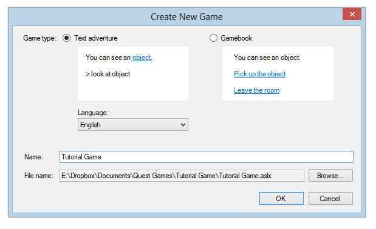
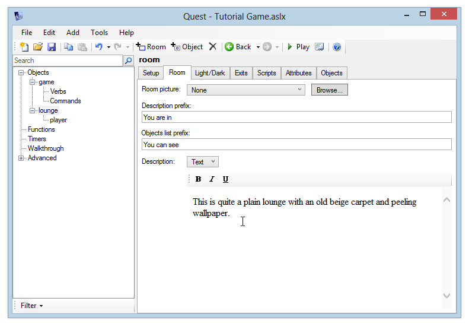

Creating a blank game
---------------------

Most of the tutorial is applicable to both the Windows desktop version of Quest, and the web version. Any differences in the two versions will be mentioned as we go along.

This tutorial guides you through creating your first text adventure game. If you want to create a gamebook instead, see [Creating a gamebook](creating_a_gamebook.html).

### Windows desktop version

To create a new game, open Quest and click the File menu, then Create New Game.

Alternatively, you can switch to the Create tab and click the "Create a new game" button.

You'll see a screen like this:

Ensure that "Text adventure" is selected, and choose a language from the list - this tutorial will focus on creating a game in English, but the editor itself will look mostly the same whichever language you pick here.

Enter a name like "Tutorial Game". Quest will create a folder and a game file for you. You can change where it puts the file by clicking the "Browse" button - it is recommended that you put your game file in its own folder.

Click OK and you'll see the main Editor screen:

On the left is a tree showing you every element of the game. The "game" element is currently selected, so that's what we can see in the pane on the right.

Quest has created a room called "room" for us, and inside this room is the "player" object, so that's where the player will begin when you run the game. You can test the game by clicking the "Play" button on the toolbar, or "Play Game" from the File menu. You can also press the F5 key.

As you'll see, it's a pretty empty game at the moment. We can type some standard commands such as "inventory" to see that Quest comes up with some default responses, but that's about all we can do at the moment.

You can go back to the Editor by clicking "Stop Game" in the top left of the screen. (You can also type "quit" or hit the Escape key)

### Web version

To create a new game, [log in to Quest](http://textadventures.co.uk/create/). You'll see the "New game" form.

Ensure that "Text adventure" is selected, and choose a language from the list - this tutorial will focus on creating a game in English, but the editor itself will look mostly the same whichever language you pick here.

Enter a name like "Tutorial Game" and click the "Create" button. Click the link which appears, and you'll see the main Editor screen.

On the left is a tree showing you every element of the game. The "game" element is currently selected, so that's what we can see in the pane on the right.

Quest has created a room called "room" for us, and inside this room is the "player" object, so that's where the player will begin when you run the game. You can test the game by clicking the "Play" button at the top of the screen. The game will open in a new browser tab or window.

As you'll see, it's a pretty empty game at the moment. We can type some standard commands such as "inventory" to see that Quest comes up with some default responses, but that's about all we can do at the moment.

Simple Mode
-----------

When starting out with Quest, you may find it easier to run in "Simple Mode". This hides much of Quest's more advanced functionality, but still gives you access to the core features.

You can toggle Simple Mode on or off at any time:

-   on the Windows desktop version, you can toggle Simple Mode from the Tools menu.
-   on the web version, click the Settings button at the top right of the screen.

Setting up rooms
----------------

Quest created a room called "room", which isn't a very good name. In this tutorial game, we want to start in a lounge, so select "room" from the tree and change its name.

To create a room description, click the "Room" tab. Enter a Description in the text editor - something like "This is quite a plain lounge with an old beige carpet and peeling wallpaper."

Let's add a second room to the game.

In the Windows desktop version, there are three ways you can do this:

-   Click the Add menu, then click Room
-   Click "Add Room" on the toolbar
-   Right-click in the tree, then choose "Add Room"

In the web version:

-   Click the "+ Room" button at the top of the screen

Add a room called "kitchen", and give it a description - use your imagination!

If you play the game at this point, you'll see the player is still trapped in the lounge, with no way out. To be able to get to the kitchen from the lounge, you need to add an exit.

### Adding an exit

To do this, click back to the "lounge" room and go to the Exits tab. Then click the "South" exit:

To create the exit, choose "kitchen" from the drop-down list on the right. Ensure that "Also create exit in the other direction" is selected, then click the "Create" button.

When you click the "Create" button, actually *two* exits are created - one exit south from to lounge to the kitchen, and another exit north from the kitchen back to the lounge. You can see both exits in the tree.

It is helpful to think of exits as "one way". Each exit is "in" only one parent room (the "from" room), and points "to" one other room. That is why we have one exit in the lounge, pointing to the kitchen. A separate exit is in the kitchen, pointing to the lounge.

Exits, like every object in Quest, can have an alias, which is simply a way of displaying a particular name to the player. Notice how the two exits we just created have aliases of "south" and "north". (We could give our exits any alias - it doesn't have to be a compass direction. If we were setting a game on a ship for example, we might have exits with aliases like "port" and "starboard".)

Play the game and verify that the player can go south and north between the lounge and kitchen.

Adding objects
--------------

Now let's add some objects to the lounge, to give the player something to do.

A lounge is barely a lounge without a TV in it, so let's add one now. With the lounge selected, you have four different ways of adding an object to the room. You can:

-   Click the Add Object button on the toolbar
-   Go to the Objects tab and click the Add button
-   Click the Add menu and choose Object (Windows desktop version only)
-   Right-click "lounge" in the tree and select "Add Object" (Windows desktop version only)

Use one of these methods to add an object to the lounge. A prompt will appear asking you to enter a name for the object. Enter "TV". Leave the parent as "lounge" and click OK.

### Object Names and Aliases

It is important to note the distinction between:

-   the names that *players* can see and use to refer to objects
-   the names that your Quest scripts use

**Name:** In order to avoid confusion, each object must have a unique name. So, if you have multiple televisions in your game, they must be given different names – like "TV1", "TV2" and so on.

**Alias:** Of course, this wouldn’t sound natural if these were the names that players saw, which is why Quest lets you set an alias. This is the name of the object that the player sees. In the example of multiple televisions, each of your TV objects could have an alias of "TV".

If you don't set an alias, players will see the object name – so you only usually need to worry about this if you want different objects to have the same displayed name.

So for now, we can leave the Alias box blank for the TV.

### Other Names

If you go to the "Object" tab, you'll see an "Other Names" box. This lets you specify additional names that players can use to refer to this object. It is important to note that different players will have different ways of interacting with your game – many players prefer to use hyperlinks, but some prefer to type. You want to make it easy for Quest to understand what players type in, so you can add additional, alternative object names to ensure that happens. For example, for our TV object, some players might type in "look at television", and would reasonably expect that to work.

So, add "television" to the list of Other Names for this object. This will ensure that players can type in either "look at TV" or "look at television" to look at this object.

As an exercise, add any other alternative names you think that players might want to use.

### Description

If you run the game and look at the TV, you’ll see that Quest doesn’t have much to say on the subject - it says "Nothing out of the ordinary".

That's a bit boring - it's a sign of a bad game if you can't even be bothered to come up with descriptions for all your objects. We don't want to make a bad game, so let's add a description for this object. To do this, go to the Description drop-down in the bottom half of the object's Setup tab and select "Text".

Now enter the description. You could write something like "The TV is an old model, possibly 20 years old. It is currently showing an old western."

Launch the game again and verify that it now shows you the description when you look at the TV.

### Adding a verb

It is a good idea to think about what kinds of things players might try to do to any objects in your game. In our example of the TV, it seems likely that a player might try to type "watch tv", so it would be good if our game came up with a good response, rather than just saying it didn't understand.

To do this, let's add the verb "watch" to our TV object. As you should remember from school, verbs are "doing words", and that's what they are in Quest – verbs let you say what things can be "done" to your object.

Go to the Verbs tab, click the "Add" button and type "watch". You can choose either to print a message or run a script when the player watches the TV. Enter a message. For example, "You watch for a few minutes. As your will to live slowly ebbs away, you remember that you’ve always hated watching westerns."

### Exercises

As an exercise, add the following objects to the lounge:

-   A sofa. Give it a sensible description. Add a verb "sit on" so that the player can type "sit on sofa". This should print a message like "There’s no time for lounging about now."
-   A table. Enter a sensible description.
-   A newspaper. Enter a description, and add a verb "read" which will print an appropriate message.

Launch the game and verify that the objects you've just created have been set up and are working correctly – check that you can watch the TV, try to sit on the sofa, and read the newspaper.

We're now on our way to making our first text adventure game. You may have noticed that, so far, we've only been walking around the game world and looking at things – we've not yet managed to interact with it and change it. We'll start to do that in the next section, where we look at taking and dropping objects.

[Next: Interacting with objects](interacting_with_objects.html)