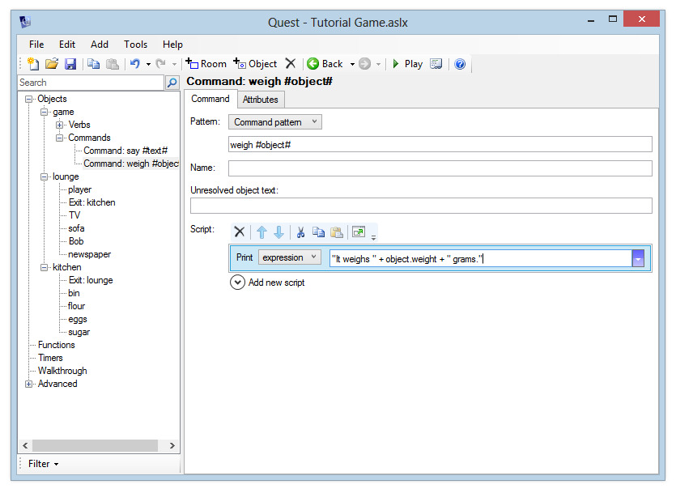

In this section, we will add a **command** that lets the player "weigh" an object.

Note that we will *not* be using a **verb** here, as we have done before. Why not? Verbs are good when you want to have a *separate* response for each object, what we want is *one* script that will return information about *any object*. For this, we need to use a **command**.

Adding a Simple Command
-----------------------

Let's add a simple command - "say". This will let the player type conversation prefixed with the command "say," for example "say hello". Quest will respond with "You say 'hello.' We will also add the contextual text of "but nobody replies" as no-one is present in the game at this point.

To add a command:

-   In the Windows desktop version, select "game" in the tree. Now, you can right-click on the tree and choose "Add Command", or use the Add menu and choose "Command".
-   In the web version, select "Commands" in the tree (underneath "game"). Then click the "Add" button.

Enter the following text into the command pattern box:

     say #text#

This pattern handles the player typing the command "say" followed by any text. The text following the "say" command is then put into a string variable called "text".

For example:

-   If the player types "say hello", the "text" string variable will contain "hello"
-   If the player types "say what a lovely day", the "text" string variable will contain "what a lovely day"

We can read string variables within an expression, in exactly the same way as we read object attributes in the previous section.

Whenever the player types in a command that matches the command template, the associated script will be run. Let's now add a script to print the required response. Add a "print a message" command and choose "expression". Then enter this expression:

     "You say \"" + text + "\", but nobody replies."

What's with the backslashes in there? They let us use quotation marks inside an expression - if you put a backslash before a quote character, that quote character won't be interpreted as the end of a string.

But if you don't want like the backslashes, you could use single quotes quite safely instead:

     "You say '" + text + "', but nobody replies."

Launch the game and type in a few "say" commands to see that Quest responds correctly.

Alternative Command Patterns
----------------------------

You can easily add alternatives to a command pattern by separating them with semicolons. For example, we could adapt our "say \#text\#" command to deal with "shout" and "yell" by modifying the pattern to read:

     say #text#; shout #text#; yell #text#

Adding a "Weigh" Command
------------------------

We now know how to add a command that will process any kind of text the player enters. However, a lot of the time, our commands will be dealing with objects that the player can see. To handle objects correctly, just use the variable name "object". So the "weigh" command's pattern should be:

     weigh #object#

If you want to create a command that uses multiple objects, you can call your variables "object1", "object2" etc. - in fact anything starting with "object" will work.

The script we enter for the "weigh" command should respond "It weighs X grams", where X is the weight of the item – as reported by its "weight" attribute.

We can read the weight attribute in the same way as before:

     object.weight

Previously, we put an actual object name before the dot. This time, we're putting a variable name there - so we'll read the "weight" attribute of the object that the player entered.

Add the weight command using the command pattern above, and add a "print a message" command to print this expression:

     "It weighs " + object.weight + " grams."

Launch the game and go to the kitchen. See what happens when you type "weigh flour", "weigh sugar" etc.

Now go back to the lounge. What happens when you weigh Bob?

Quest responds with "It weighs grams." Why? Because he doesn't have a "weight" attribute. Since we don't want to have to enter a weight for every single object in the game, we'll need to update our command so it checks for the existence of the "weight" attribute, and then prints the appropriate response.

Checking for an Attribute
-------------------------

Go back to the script for the "weigh" command, select the existing "Print a message" command and click the "Cut" button on the Script Editor to move this to the clipboard.

Now, add a new "if" command. From the dropdown, select "object has attribute". Enter the object expression "object". For the attribute, leave "name" selected and type in "weight".

Expand the "Then" script, and click Paste to restore the previous "print a message" script. For the "Else" script, print a message like "You can't weigh that".

The script should now look like this:

Launch the game and verify that you now get a sensible response for "weigh bob" and "weigh sofa" in the lounge (it should say "You can't weigh that") and that you can still weigh the items in the kitchen.

Additional example
------------------

Quest can handle text and objects in the same command. Here the say command is extended to allow the plaer to specify who she is talking to.

In code, it looks like this:

      <command name="saying">
        <pattern>say #text_talk# to #object_one#</pattern>
        
        <unresolved>Say that to who?</unresolved>
      </command>

The pattern you are using is this:

      say #text_talk# to #object_one#

Quest will attempt to match \#object\_one\# to an object present, and if it does then an object variable called "object\_one" will be set to that object (if it cannot, Quest will output whatever you typed in the "Unresolved object text" box). The text part will match any text at all, just as before.

Suppose the player types:

      say hi to troll

Quest matches "say" and "to" directly. It then matches "hi" to the text, so now the string variable "text\_talk" is set to "hi". Then it matches the object, as long as the troll is here, and sets the object variable "object\_one" to the troll.

The script uses a switch command so you get a different response for different characters, and a default too.

You can set up commands with multiple objects just by giving them each their own name between the \# marks.

[Next: More things to do with objects](more_things_to_do_with_objects.html)