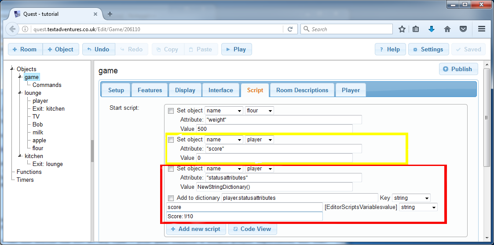

Often you will want the player to be able to see how they are doing at a glance, perhaps to see the score or health, or how much cash they have. This can be done with status attributes.

Status attributes must be set up as ordinary attributes first. You must then tell Quest that you want these particular ones to be shown in the interface. You can do this with attributes of the player or of the game object, but not anything else ion the game. We will set up a score attribute on the player object.


Status Attributes - Desktop
---------------------------

Go to the Attributes tab of the player object. In the lower box, click Add, then type "score" and set it to an integer. Then go to the upper box, marked "Status Attributes", click Add.

We can going to give Questtwo bits of information. The first is the name of the attribute, and the second is how to display it, so again type "score" for the first bit (this must be exactly as you did it before). You can leave the second bit blank, and Quest will decide how to display it, but we try to do it a bit more fancy. Paste in this:
```
  Score: !/10
```
The exclamation mark is a stand-in for the actual number, so when the score is zero, the player will see "Score: 0/10".

Status Attributes - Web Version
-------------------------------

On the web version, we have no _Attributes_ tab, so we have to do this in the start script, as we did with the weight attributes earlier. Go to the Scripts tab of the game object; you should see the script commands setting the weight attributes (only one is done in the image below). You need to add three new script commands like this:



The first line, highlighted in yellow, is obviously setting up the "score" attribute, just as before.

The two lines to set up the status attribute are marked in red.

Quest stores information about status attributes in dictionary attributes called "statusattributes", and the second line creates one on the player object (Quest does this automatically in the desktop editor). The third line adds one entry to that dictionary. It has two parts, the name of the attribute, "score", and the display format, "Score: !/10".

Okay, it is not straightforward, but it is doable.

Status Attributes
-----------------

Whatever version you are using, you should be able to go in game, and find that a new panel has a appeared on the right, with the score displayed!

You can use status attributes with any type of attribute (on the game or player), but it works best with numbers and strings.

[Next: Using timers and turn scripts](using_timers_and_turn_scripts.html)