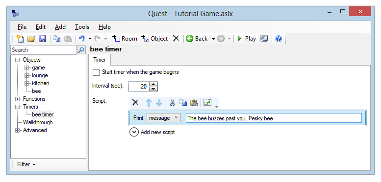

You can use timers to make something happens every so many seconds, whilst with a turn script you can make it happen every turn.

Timers
------

In a previous section, we made a bee fly into the kitchen after the player opened a window. We'll now make that bee a bit more annoying as it flies around the kitchen – every 20 seconds, it will buzz past the player.

To do this, we will use a timer. This timer will only be activated when the player opens the window in the kitchen. When the timer is activated, every 20 seconds it will print the message "The bee buzzes past you. Pesky bee". This message will only be printed if the player is in the kitchen.

First, let's set up the timer. After we have done this, we will add the script command to activate it at the right time.

### Setting up the Timer

In the Windows desktop version, add the timer by right-clicking the tree, or using the Add menu. In the web version, select "Timers" from the tree and click Add.

Enter the name "bee timer".

The timer editor will now be displayed. The Interval specifies how often the timer fires – in this case, we want it to fire every 20 seconds, so enter "20". Leave the box "Start timer when the game begins" unticked.

For the timer script, add a "print a message" command to display "The bee buzzes past you. Pesky bee."

### Activating the Timer

Go back to the "window" object and edit the script which runs when the bee enters the kitchen - this will be the "Else" script if you've followed the tutorial so far. Add a command after the "move object" command - from the Timers category, choose "Enable timer". Select "bee timer" from the list.

Launch the game, go to the kitchen and open the window. Wait for a while and verify that the message is printed every 20 seconds.

Now go north to the lounge. You'll see that we still get the message about the bee flying around. Woops! That bee is only in the kitchen. We'll need to update the timer script so that it only prints the message if the player is in the kitchen.

You've already seen how to do this - an "if" command can check "player is in room". So add a check to the "bee timer" script - if the player is in the kitchen, print the message. If not, then do nothing.

Turn scripts
------------

In this section, we'll look at running a script after each turn in the game - a **turn script**. We'll store the number of turns a player has taken in an attribute called "turns" on the player object.

### Setting up the turn counter as a status attribute

We created a status attribute on the last page, this is just the same.

For the desktop version, to set up our "turns" attribute, select the "player" object and go to the Attributes tab. Click the Add button next to the Attributes list at the bottom of the screen, enter the name "turns" and make this an integer. To turn this into a status attribute, we need to add it to the Status Attributes list at the top of the screen, so click Add there and add "turns" to the list.

For the web version, go to the _Stripts_ tab of the "game" object, where we set the player score as a status attribute. Now we need to add a new attribute to the player called turn, and a new entry in the dictionary for that attribute. It'll look like this: 

If you launch the game now, you should see the turn variable displayed on the right-hand side of the Quest window. We've not yet added the script to increase the value of this though, so it will always say “Turns: 0” no matter how many turns we take. Let's add this script now.

### Increasing the turn counter after each turn

A turn script can apply to a specific room, or it can apply to the entire game. To make a turn script apply for just one room, you simply need to create it in that room. If you create a turn script outside of a room, it will apply to the entire game. So, right-click the tree menu or use the Add button to create a turn script.

On the desktop version, you can drag it to the "Objects" label at the top of the tree to move it outside of all rooms. On the web version, click the move button towards the top right.

You can optionally specify a name for your turn script. You can use this if you want to be able to switch your turn script on and off using script commands, in a similar way to how we switched a timer on and off in the previous section. You can leave the name blank for this turn script, as this will always be running.

Make sure the "Enabled when the game begins" box is ticked.

We're going to add a script command which will increase the value of the player's "turns" attribute by 1 each time it is called.

To do this, add the "Set a variable or attribute" command.

In the left box, type:

     player.turns

Then in the box on the right, type

     player.turns + 1

This will add 1 each time the script is called.

Launch the game now and verify that whenever you type a command, the "Turns" value is automatically updated.

Congratulations, you now know the basics of using Quest. There is much more to it, but you are probably best learning that as you need it. Now go make that great game! The last part of the tutorial is about how to release your masterpiece.

[Next: Releasing your game](releasing_your_game.html)