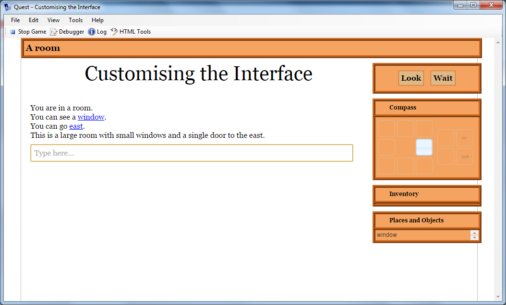
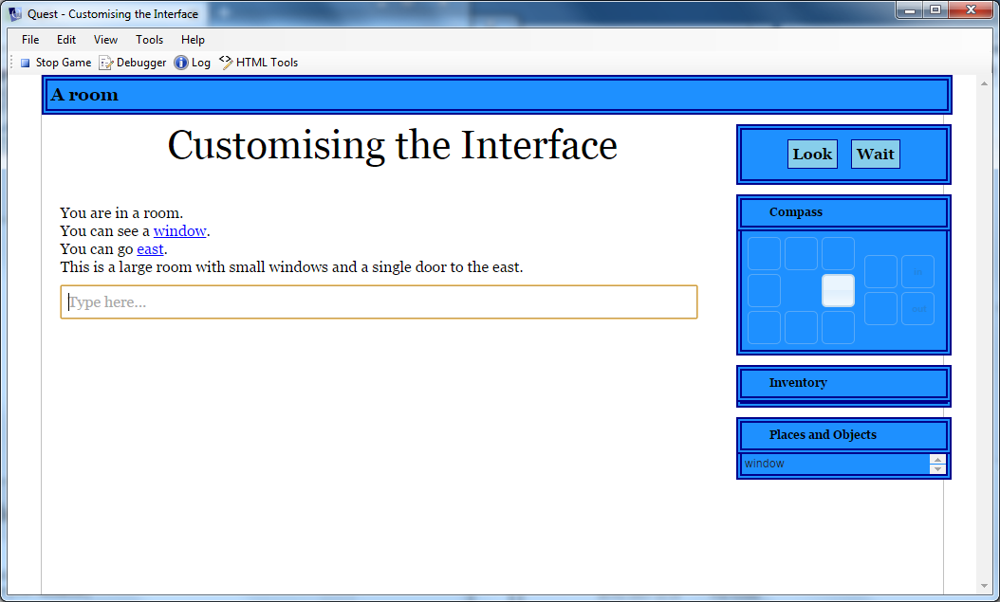
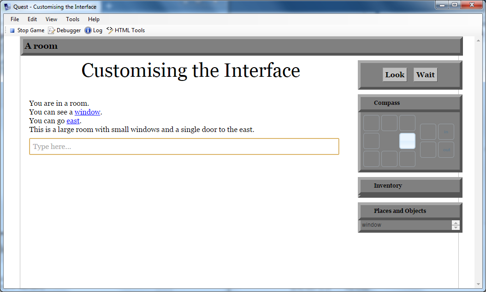

In this article we will modify the status bar and game panes of the Quest interface, to show how easy it is to get a ook that is unique to your game. We will go for an old-fashioned look, in brown. This is what we are aiming for:



The first thing to do is to decide what we want; what colours will we use and so on.

Once you know that, you can work out how it is described in CSS. CSS is a language that is used by web pages. A full description is beyond the scope of this article, but in essense it is about associating a description of how an HTML element will be displayed with that element. The description consists of a list of properties, each made up of a name and a value separated by a colon. Each property is separated by a semi-colon.

Here is an example:

> border: chocolate ridge 6px;background:sandybrown

This is setting two properties. The first is called "border", the second is "background". The "border" property is set to "chocolate ridge 6px", i.e., the colour chocolate, the ridge line style and a thickness of 6 pixels.

We will use these properties a lot as we want several elements of the page to have this style, so it is convenient to assign it to a local variable:

```
backandborder = "border: chocolate ridge 6px;background:sandybrown"
```

I want to include a command panel, and to have the buttons stand out a bit, so here is the CSS for the buttons, assigned to a second local variable:

```
button = "padding:5px;background:BurlyWood;border:ridge chocolate 1px;"
```

I want the text in a certain colour and font.

```
text = "color:black;font-family:georgia, serif"
```

To set the status bar at the top is now easy:

```
JS.setCss ("#status", backandborder)
```

`JS.setCss` is a Quest function that takes two parameters; the HTML element and the CSS styling. The HTML element in this case is "#status". The hash at the start indicates this is the ID of an element by the way.

To set the panes on the right, we can modify to classes, one used for the header and one for the content. As these are classes they start with a full stop (period). I also want square corners, so will be adding to the CSS. Oh, and the content should not have a border at the top because it has the one from the bottom of the header.

```
JS.setCss (".ui-accordion-header", "border-radius: 0px;" + backandborder)
JS.setCss (".ui-accordion-content", "border-radius: 0px;" + backandborder + ";border-top:none")
```

Then we can modify the text style:

```
JS.setCss (".accordion-header-text", text)
```

The orange triangles are awkward to change, so we will just hide them. Who actually clicks on them?

```
JS.setCss (".ui-icon", "display:none")
```

Then we can add the command pane, and modify its style (note the text colour must be set in the first step). we can also set up the buttons to stand out (if you have different commands here you will need to alter or add as required).

```
JS.setCommands ("Look;Wait", "black")
JS.setCss ("#commandPane", text + ";" + backandborder)
JS.setCss ("#verblinkwait", button)
JS.setCss ("#verblinklook", button)
```

Finally, because the borders are much wider, we need to space things out a bit more:

```
JS.setCss ("#gamePanes", "margin-top: 16px")
JS.eval ("$('#gamePanes').width(227);")
```

Note that we have to use JS.eval for the width as it is not a CSS property.

Here is the whole thing (which should go in the interface script at the top of the _Advanced Scripts_ tab of thye game object):

```
backandborder = "border: chocolate ridge 6px;background:sandybrown"
button = "padding:5px;background:BurlyWood;border:ridge chocolate 1px;"
text = "color:black;font-family:georgia, serif"
JS.setCss ("#status", backandborder)
JS.setCss (".ui-accordion-header", "border-radius: 0px;" + backandborder)
JS.setCss (".ui-accordion-content", "border-radius: 0px;" + backandborder + ";border-top:none")
JS.setCss (".accordion-header-text", text)
JS.setCss (".ui-icon", "display:none")
JS.setCommands ("Look;Wait", "black")
JS.setCss ("#commandPane", text + ";" + backandborder)
JS.setCss ("#verblinkwait", button)
JS.setCss ("#verblinklook", button)
JS.setCss ("#gamePanes", "margin-top: 16px")
JS.eval ("$('#gamePanes').width(227);")
```

Actually I would prefer...
------------------------

Because we set up strings at the start, we can change the first two lines to see some dramatic differences...

```
backandborder = "border: darkblue double 6px;background:dodgerblue"
button = "padding:5px;background:skyblue;border:double darkblue 1px;"
```




```
backandborder = "border: darkgrey outset 6px;background:grey"
button = "padding:5px;background:silver;border:outset darkgrey 1px;"
```




```
backandborder = "border: Indigo dotted 6px;background:MediumPurple"
button = "padding:5px;background:Violet;border:dotted Indigo 1px;"
```


