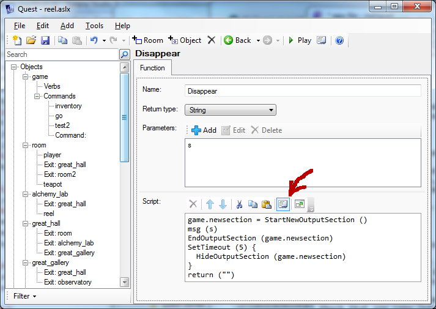

Behind the scenes, Quest handles things using it own programming language, or code. If you are asking about how to do something on the forums, chances are people will respond by posting the code, and if you have never seen code before you may be left wondering what you do with it.

Once you understand the basics, code is a lot easier to show on the forum, and far easier to copy from one place and paste into another.

Create a new function (commands are similar)
--------------------------------------------

Right click in the left pane, and select add function. Give it the right name (same capititalisation, etc.). Bottom of the stuff on the right is Script. Click on the seventh icon (Code view). You should now get a text box below. Just paste the code into this box.

Click on Code view again, and you should see the normal Quest view. If you see some red text, something has gone wrong. Check that you copy-and-pasted the whole code and nothing but the code (it could even be a mistake in the code).

You may need to set the return type or add parameters - see what the forum post says. To add a parameter, just click on the plus by the word "Parameters". Make sure you give the exact names specified and in the same order.

The start script
----------------

This is ascript that will run once, when the games starts.

Go to the "game" object, and the Script tab. At the top is the Script section. As before, click on the seventh icon (Code view). You should now get a text box below. Just paste the code into this box. If there is already some text there, paste the new text underneath it.

Verb on an object
-----------------

Go to the specific object, and the Verbs tab. Click "Add", and type in the verb. Make sure the verb is selected, under the box, click on "Print a message" and select instead "Run a script". As before, click on the seventh icon (Code view). You should now get a text box below. Just paste the code into this box.

Script as attribute
-------------------

Go to the specific object, and the Attributes tab. Click "Add" in the lower section, and type in the name of the attribute. Make sure the attribute is selected, under the box, click on "String" and select instead "Script". As before, click on the seventh icon (Code view). You should now get a text box below. Just paste the code into this box.