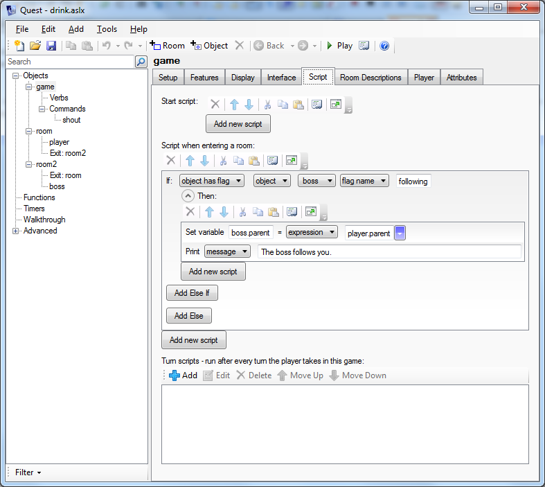

A common scenario is when you want a character in your story to start following the player. This could be a sidekick, there to help out, or an enemy tracking the player wherever he goes.

The best way to do this is to set up a script that is triggered when a player enters a new room. To do this, go to the Script tab of the game object. The bit we want is "Script when entering a room". In this example, we will have a character called "boss" follow the player. the script looks like this:

    if (GetBoolean(boss, "following")) {
      boss.parent = player.parent
      msg ("The boss follows you.")
    }

The first line checks a flag, called "following". if this is true, the secod line more the boss to the players current location, and the third line tells the player about it. Here is the GUI view:
    

Now all you need to do is have some point in the game where the "following" flag gets set. In code do this:

    boss.following = true
    
Here is what it might look like in the GUI (in this case for a command called SHOUT).

Flags vs Boolean attributes
---------------------------
You do not need to know this, but you might be interested...

A flag is something that is either on or off, a Boolean attribute is either true of false. They do the same thing, and in fact they *are* the same thing. In the GUI they are called flags, in the code view they are called Boolean attributes. That said, if you set up the script as shown in the second image, and then go to code view, you will see this:

    SetObjectFlagOn (boss, "following")
    
And not this:

    boss.following = true

The end result is the same; the two scripts are entirely interchangeable. The same attribute gets changed to the same value either way. The way Quest builds the GUI view requires a function call, so it uses SetObjectFlagOn.

Similarly in the "Script when entering a room" script, I could have used:

    if (boss.following) {
    
The GetBoolean function is there to help the GUI. Except in this case they are not quite the same. The GetBoolean function will return false (i.e., flag turned off) if the attribute does not exist. On the other hand, the above will throw an error if the attribute does not exist. If you want to use "if (boss.following)" then you have to set up an attribute called "following" on the boss and set it to be a Boolean. Whether you think that is a better way to do it is up to you.