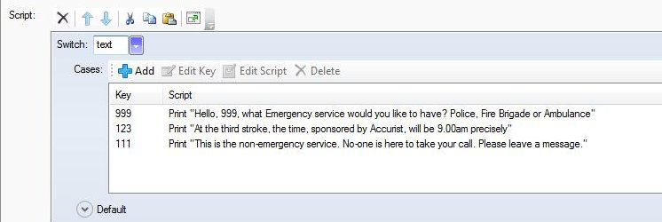

*Using the CASE command is a much quicker alternative to lots of “nested” IF scripts. This example shows you how to set up a phone where you can dial different numbers and get different responses*

1. I have made an object called telephone and added a Verb called **Start Dialling**:

     
     

2. I then add a *'Print Message* Script to the Verb to give a message with clear instructions:

     

3. Next Add the verb to the **Display verbs**:

     
     

4. Next I add a Command to the Room. The reason I do this is because I can “Dial” the number any time at all.

5. I click on Room and then press **Add** and **Command**:

     
     

6. In the empty box below I type in **Dial \#text\#**

     

7. This means Dial followed by whatever number you want to add in (the variable) eg Dial 999

8. Move down to Script and choose the **Switch…** command and type in the variable name “**text**” in the line:

     

9. In the Cases box I click **Add** and enter the first number you want to dial eg:

     

10. Click **OK** and select **Print a message**:

     

11. Type in the message you want to have when you type in “999”

     

12. Close the message to save it:

     

13. Repeat this for lots of different numbers eg

     

14. When you are finished, click **Default** and choose **Print a message** and write something like:

     

15. This means that any number not on the list will get this message.

16. Here is the final list:

     
     

17. Here is how it looks with different options in action:

     
