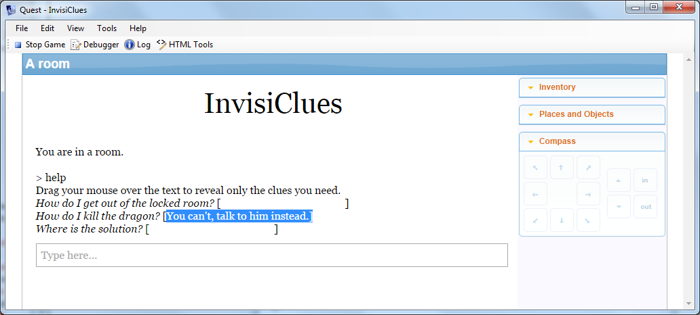

It can be helpful to the player if your game has a help system - something she can access in game to get past that puzzle that seemed so simple to you, but is fiendish complicated for the player. But how to let the player see how to solve this puzzle, but not inadventently see the solution for the whole game?

Back at the dawn of time, Infocom came up with the idea of [InvisiClues](https://en.wikipedia.org/wiki/InvisiClues) - and now you can do that too, in a virtual way.

To get this to work, you need to create a new new HELP command. For the command pattern, just type in "help", and for the name, "help2" (no quotes for both), as Quest already has a HELP command, and will object if you give your command the same name.

For the script, paste in this:

    if (HasAttribute(game, "defaultbackground")) {
      bg = LCase (game.defaultbackground)
    }
    else {
      bg = "white"
    }
    msg ("Drag your mouse over the text to reveal only the clues you need.")
    foreach (key, game.helpdict) {
      msg ("<i>" + key + "</i> [" + StringDictionaryItem(game.helpdict, key) + "]")
    }

The first 6 lines just get the background colour, the seven line is obvious just a message to the player. The important part is the loop at the end.

The foreach command loops over game.helpdict. This is a dictionary, which is kind of like a list, but with strings (conventionally called keys) instead of numbers. When you do foreach with a dictionary, you get the key, rather than the index.

The penultimate line prints the InvisiClue. The trick is that it changes the font colour to match the background, so first the key is printed in italics, then the value from the dictionary is printed in the background colour.

Once you have the command, you need to put in the data. Go to the Attributes tab of the game object, and create a new attribute, helpdict. Set it to be a string dictionary, and then put in your questions and answers.
    
Here is the example game:

    <!--Saved by Quest 5.6.5510.29036-->
    <asl version="550">
      <include ref="English.aslx" />
      <include ref="Core.aslx" />
      <game name="InvisiClues">
        <gameid>f49ea17e-e0dd-49a0-b266-81a561f7818c</gameid>
        <version>1.0</version>
        <firstpublished>2015</firstpublished>
        <helpdict type="stringdictionary">
          <item>
            <key>How do I get out of the locked room?</key>
            <value>Get the key from the vase.</value>
          </item>
          <item>
            <key>How do I kill the dragon?</key>
            <value>You can't, talk to him instead.</value>
          </item>
          <item>
            <key>Where is the solution?</key>
            <value>Look under the flowerpot.</value>
          </item>
        </helpdict>
        <start type="script">
        </start>
      </game>
      <object name="room">
        <inherit name="editor_room" />
        <object name="player">
          <inherit name="editor_object" />
          <inherit name="editor_player" />
        </object>
      </object>
      <command name="help2">
        <pattern type="string">^help$</pattern>
        
      </command>
      <function name="InvisiClue" parameters="s1, s2"><![CDATA[
        if (HasAttribute(game, "defaultbackground")) {
          bg = LCase (game.defaultbackground)
        }
        else {
          bg = "white"
        }
        msg ("<i>" + s1 + "</i> [" + s2 + "]")
      ]]></function>
    </asl>