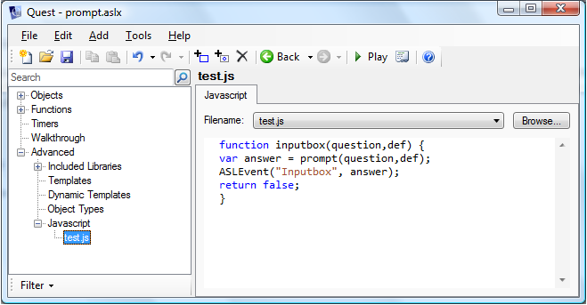

As Quest uses HTML, you can implement new features in the user interface (UI) using Javascript.

### Linking to the Javascript code

Your Javascript code needs to be in a separate file, and you need a link to that file from your game. Click on "Advanced" in the left hand pane, then on "Javascript". In the left pane, click on "Add", and browse to your Javascript file (Quest will automatically find it if it is the only one in the folder). The contents of the file will appear.

In code view, it looks like this:

      <javascript src="test.js" />

### Callback function

To get the Javascript code working for you, you need a way to invoke the Javascript from Quest, and then a way for the Javascript to call back to Quest. Let us set up the call back first. This is just a Quest function that accepts one parameter (and no more than one, and it will be a string). It might look like this:

      <function name="Inputbox" parameters="answer">
        msg ("You are " +answer + " years old.")
      </function>

NOTE: There is an issue to be aware of that appears when games are played on line. It seems you can only have one callback function in operation at a time. Offline this is no proble, as they happen so fast, but online, you may find that only the last one called actually completes.

### The Javascript code

Now we set up the Javascript (in the Javascript file, of course). A discussion of the language is beyond the scope of this tutorial, but broadly what we need here is a function that first does something useful, then invokes the callback function we created above. Here is an example:

      function inputbox(question,def) {
        var answer = prompt(question,def);
        ASLEvent("Inputbox", answer);
      }

The first line defines the function as "inputbox", with two parameters (note that these values will always be strings). The second line invokes the Javascript function "prompt", which displays an input box. The third line does the callback, using the special function ASLEvent. The first parameter to this function is the name of the Quest function we just created; the second parameter is the value sent to that function.

### Calling from Quest

Now back to Quest, and we need some way to invoke the Javascript function. This is done using the [request](../scripts/request.html) script command, perhaps like this:

          request (RunScript, "inputbox;How old are you?;0")

This is a generic command that does all sorts of things, so the first parameter it needs says we are running a script. This is actually done with a *request* type rather than a string, so has no quotes around it. Because the request script command has only two parameters, all the other information we need to send gets wrapped up into a string, separated by semicolons. First the name of the Javascript function, then the parameters.

### A working example

Here is a very simple game (by Pertex) that shows Javascript in action. You will also need the four lines of Javascript above in a file called "prompt.js" in the same directory.

      <asl version="520">
        <include ref="English.aslx" />
        <include ref="Core.aslx" />
        <game name="prompt">
          <gameid>e6a5586d-dc55-4a9d-953a-3c6b50a2d36e</gameid>
          <version>1.0</version>
          <start type="script">
            question = "How old are you?"
            default = "0"
            request (RunScript, "inputbox;"+ question +";"+default)
          </start>
        </game>
        <object name="room">
          <inherit name="editor_room" />
          <object name="player">
            <inherit name="defaultplayer" />
          </object>
        </object>
        <function name="Inputbox" parameters="answer">
          msg ("You are " + answer + " years old.")
        </function>
        <javascript src="prompt.js" />
      </asl>

### Finally

Using Javascript, you can do all sorts of fancy stuff with the UI; for more advanced methods see [Using Javascript](../tutorial/using_javascript.html).
