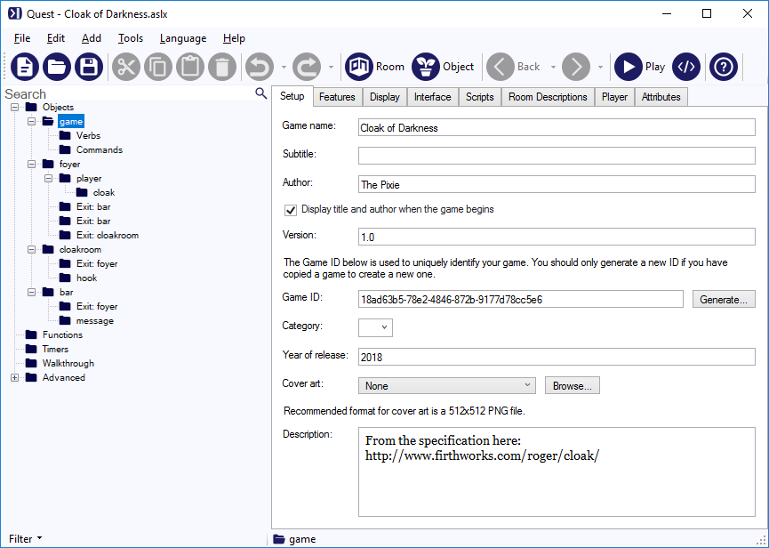

The Cloak of Darkness is a specification for an adventure game that has been created in numerous systems, with the purpose of giving prospective authors some idea of what is involved in each system. 

[IFWiki](http://www.ifwiki.org/index.php/Cloak_of_Darkness) says of it:

> This adventure is a tiny adventure designed to be easy to port to a given Authoring system. It is, if you will, the interactive fiction equivalent of "Hello, world!"

This seems to be a great way to look in some detail at how to create a Quest game. This, then, is the _second_ Quest tutorial. It is more advanced than the first tutorial, so we will be working with code. We will try at each step to make systems that are general, so that this could be extended into a lengthy game.

If you want to see how the scripts look in the GUI, and you are using the desktop version, just download the game (link below), open it up and take a look. If you are using the web version, you will need to click the "code view" button for that script, paste the code in there, and then click "code view" again to go back to the GUI view.

There is - or was - a version written for Quest, (see [here](http://www.firthworks.com/roger/cloak/quest/index.html), source code [here](http://www.firthworks.com/roger/cloak/quest/source.html)). This was written in October 2003, for Quest 3.5, and if you look at the source code you will see it is very different to the version of Quest that we know today.

The source code for Cloak of Darkness for Quest 5.8 can be downloaded here:

[cloak_of_darkness.aslx](util/cloak_of_darkness.aslx)


The Specification
------------------

The specification can be found [here](http://www.firthworks.com/roger/cloak/index.html), but for convenience I will repeat it in full:

- The Foyer of the Opera House is where the game begins. This empty room has doors to the south and west, also an unusable exit to the north. There is nobody else around.
- The Bar lies south of the Foyer, and is initially unlit. Trying to do anything other than return northwards results in a warning message about disturbing things in the dark.
- On the wall of the Cloakroom, to the west of the Foyer, is fixed a small brass hook.
- Taking an inventory of possessions reveals that the player is wearing a black velvet cloak which, upon examination, is found to be light-absorbent. The player can drop the cloak on the floor of the Cloakroom or, better, put it on the hook.
- Returning to the Bar without the cloak reveals that the room is now lit. A message is scratched in the sawdust on the floor.
- The message reads either "You have won" or "You have lost", depending on how much it was disturbed by the player while the room was dark.
- The act of reading the message ends the game.

As you can see, there is really not much to it! So how would one go about creating that in Quest 5?

We will divide the process into five sections, starting with the locations and items, then each of the systems in turn (i.e., the hook, message and darkness), then the interface. As you complete a section, you should go into the game and check it works properly (and other times too, as required). You should check you can save the game (as this is particularly sensitive to errors), and you should also check all the response messages. Do not just check you can hang the cloak on the hook, test what happens when you try to hang the hook on the cloak, or hang in up in the foyer, etc.


Locations and Items
-------------------

The first place to start is the geography of your game; creating the locations, the exits between them and the items in them. For a big game, you might want to create a map with [trizbort](https://blog.textadventures.co.uk/2018/03/06/creating-with-trizbort-and-quest/), and export it to Quest, but there is no point when there are only three rooms!

Note that if you are creating a large adventure you may find it more convenient to create a section of the geography, and then get all the systems working there, then move to the next section. In fact, you may find it advantageous to do it in reverse order; do the ending first, and get that right, then work your way back to the start. In that way you do not have to trek all the way through the adventure to get to the bit you are working on.

For Cloak of Darkness, rename the starting room to "foyer", add two more rooms and three objects.



The only complicated bit is the locked door to the north of the foyer. Quest will ask you for a destination when you try to create it. Just select any other room, but make sure "Also create exit in other direction" is not ticked. Then go to the exit (make sure it is the one to the north), and tick it as locked. You might want to change the message too.

For the objects, on the _Object_ tab, add any synonyms ("peg" for hook; "cape", "mantle", "robe" for cloak; "note", "writing" for message).

On the _Inventory_ tab of the cloak, tick that it can be taken. You need to make sure the cloak is inside the player; if it is not, drag it there on the desktop version, or click the "Move" button on the web version. We could sent up the cloak as clothing, but there is nothing in the specification about putting it on and taking it off (which is a bit odd, perhaps), so I am not going to bother.

Give the cloak and the hook descriptions. Generally you would be adding descriptions for all the items and locations, but these are going to depend on the various systems, so we will leave that for now.


The Hook
--------

The first system we will look at is the hook, upon which we can hang the cloak.

Go to the _Features_ tab of the hook, and tick the "Container" option. This will show the _Container_ tab. On that tab, set it to be a surface. Now go into the game, head to the cloakroom, and type:

> PUT CLOAK ON HOOK

When you look, you will see the cloak is now on the hook.

What if the player types HANG UP CLOAK or HANG CLOAK ON HOOK? We need a couple of commands to cover this (two because one will deal with one object, and one with two objects).


### Handling HANG UP CLOAK

Our command pattern will be this:

> hang up #object#;hang #object#

Note that you need to have the longer versions at the start, otherwise Quest will match "hang #object#" to HANG UP CLOAK, and will complain that it cannot see an "up cloak"!

For the command script, the general strategy is to check each failing condition, with an appropriate message, and if it all passes, do the command:

```
if (not object.parent = player) {
  msg ("You aren't carry " + object.article + ".")
}
else if (not player.parent = cloakroom) {
  msg ("Hang " + object.article + " where, exactly?")
}
else {
  object.parent = hook
  msg ("You hang " + GetDefiniteAlias(object) + " on the hook.")
}
```

I am using "object.article" so Quest will use "it", "them, "him" as appropriate. The `GetDefiniteAlias` function will return the alias of the object if it exists, or the name otherwise, and will prepend "the" if appropriate. This is good practice that you should adopt, as it keeps the language flowing and natural.


### Handling HANG CLOAK ON HOOK

Our command pattern will be this:

> hang #object1# on #object2#

Why not do this as "hang #object1# on hook"? It is better practice to always use a general object, as this allows Quest to match the synonyms for the objects. The above will also match HANG CAPE ON PEG. If we later think of another synonym for hook, we can just add it to hook, and all the commands will handle it fine.

Quest will only match against objects present (unless we tell it otherwise for a specific command), so we know the hook must be present; so rather than checking we are in the right room, we need to check `object2` is the hook object. For a bigger game, we might want to have an attribute on the hook that flags it as something we can hang stuff on, and then check that flag on `object2`; I have written the messages to keep them general. Note that `GetDisplayName` prepends "a" or "some" to the name, as appropriate.

```
if (not object1.parent = player) {
  msg ("You aren't carry it " + object.article + ".")
}
else if (not object2 = hook) {
  msg ("You can't hang stuff on " + GetDisplayName(object2) + ".")
}
else {
  object1.parent = object2
  msg ("You hang " + GetDefiniteAlias(object1) + " on " + GetDefiniteAlias(object2) + ".")
}
```


### Better descriptions

The cloakroom description will read more naturally if the hook is part of the description, rather than a line on its own. However, we want it to change, depending on whether the cloak is on it.

Go to the _Room_ tab of the cloakroom, and in the description paste in this code:

```
s = "The cloakroom is {either CloakHere():dimly|brightly} lit, and is little more than a cupboard. "
if (cloak.parent = hook) {
  s = s + "Your cloak is hung from the only hook."
}
else if (cloak.parent = this) {
  s = s + "There is a single hook, which apparently was not good enough for you, to judge from the cloak on the floor."
}
else {
  s = s + "There is a single hook, which strikes you as strange for a cloakroom."
}
msg (s + " The only way out is back to the east. "
```

The first line is the general description, which is used for all descriptions. It is assigned to a local variable `s`. We add that to a specific message, depending on where the cloak is. This means we only need to write the text one time, instead of repeating it for each option. I wanted the comment about the exit at the end of the paragraph, so the last line adds that to the string, and prints the whole thing.

Now go to the _Setup_ tab of the hook, and tick it to be scenery. This will stop it appearing in the list of objects.


The Message
-----------

For the message, we need to keep a count of how many turns the player spends in the bar, and to base the message on that. It is complicated because entering the bar, and then leaving straight after is okay, so we need to count how many consecutive turns the player spends there.

We also need the message to only be visible if the cloak is not here, but we will do that in the next bit.

We will add a "count" attribute and a "disturbed" attribute to the message first. On the desktop, you can add attributes on the _Attributes_ tab, set them both to be integers. Otherwise, on the web version, tick "Run an initialisation script..." on the _Features_ tab, then on the _Initialisation script_ tab, paste in this code:

```
this.count = 0
this.disturbed = 0
```

The "count" attribute will store how many consecutive turns the player has spent in the bar, so we need to reset it when the player leaves. Go to the _Scripts_ tab of the bar, and for the "After leaving the room" script, paste this in, to set the count back to zero:

```
message.count = 0
```

To get this to increment each turn, we will use a turnscript. We only want it to do that when the player is in the room, so will will put the turnscript in the room (if it is not, drag it there on the desktop version, or click the "Move" button on the web version).

Tick the "Enabled when the game begins" box, and paste in the code:

```
message.count = message.count + 1
if (message.count > 1) {
  message.disturbed = message.disturbed + 1
  firsttime {
    msg ("You think it might be a bad idea to disturb things in the dark.")
  }
  otherwise {
    msg ("You can hear {random:scratching:something moving in the dark:rasping breathing}.")
  }
}
```

So the first thing this does is increment "count". If the player leaves the room straightaway, count will only get to 1 (the turn the player enters the room), so nothing more happens. However, if the player does stuff in the room, count will get higher, and we count how often that happens. Also, the first time it happens, we give the player a warning. Any other time, the player will get a comment about something moving about. We are using the "random" text processor directive to give some variation.

Finally (for now), we need to set the description for the message. On the _Setup_ tab, set its description to be a script, and paste this in:

```
if (this.disturbed < 2) {
  msg ("The message in the dust says 'You have won!'")
}
else {
  msg ("The message in the dust says 'You have lost!'")
}
finish
```

This checks how much the room was disturbed - you are allowed one time, when you get the warning - and gives a message accordingly. It then finishes the game.

You should now be able to play the game to check it works.


### Improvements

So we have a working system, but can improve it.

Firstly, the player is likely to try READ MESSAGE. Go to the _Verbs_ tab and add "read". Set it to run a script, and paste in this code:

```
do (this, "look")
```

All it will do is run the "look" script, exactly the same as LOOK AT MESSAGE. This means that if we later change the "look" script, READ will not need to be updated.

The second thing we can do is stop turnscripts running in some situations. If the player mistypes a command, it is not really fair to count that as a turn. Typing HELP should also not count as a turn. There may be other examples you can think of.

Go to the _Features_ tab of the game object, and tick "Show advanced scrips...", then go to the _Advanced scripts_ tab. The middle script is for unresolved commands. We want to have it print a message, and to tell Quest to skip turnscripts this turn.

```
msg ("Sorry, I do not understand '" + command + "'.")
SuppressTurnscripts
```

Note that `command` is a local variable that contains the text the player typed.

For the help command, we do pretty much the same. The pattern is:

> help;?

And the script:

```
msg ("Just type stuff at the prompt!")
SuppressTurnscripts
```

You might want something more helpful...


The Darkness
------------

So now we have to handle the darkness. Note that Quest has a built-in light/dark system, but it is not so useful here, where the darkness will depend on where an object is.

A room is dark if the cloak is in it, and in the bar it is so dark nothing but the exit can be seen. We will be checking if the cloak is present a lot, so it is a good idea to do this with a function.


### The `CloakHere` function

Create a function, call it "CloakHere", set it to return a Boolean, and paste in this code:

```
return (cloak.parent = player.parent or cloak.parent.parent = player.parent)
```

If you are not familiar with Boolean algebra, that might not mean anything to you, so I will quickly break it down. Firstly, is the cloak in the same room as the player? That is, do they have the same parent?

> Does cloak.parent = player.parent?

Then we check if either the player or the hook have the cloak, and if the hook does, is it in the same room as the player. We can do all that in one question.

> Does cloak.parent.parent = player.parent?

Is either of these is true, then we want the function to return true. So we could do it like this:

```
if (cloak.parent = player.parent or cloak.parent.parent = player.parent) {
  return (true)
}
else {
  return (false)
}
```

But the bit in the `if` condition is already `true` or `false`, so we can just return that.


### Room descriptions

So now we need some room descriptions, and these need to depend on whether the cloak is present or not. There are a couple of ways to do that. `if/else` is a good idea if the text is very different, but the text processor is better if just a few words are changing. For the foyer, then, we might have:

> There is something oppressive about the {either CloakHere():dark\|dingy} {once:room}{notfirst:foyer}; a presence in the air that almost suffocates you. Very much faded glory, the walls sport posters from productions that ended over twenty years ago. Paint is peeling, dust is everywhere and it smells decidedly musty. 

This uses the `either` text processor directive, which then uses `CloakHere` as the condition. The true and false options are separated by the \|. If the cloak is here, the room is dark, otherwise dingy.

> {either CloakHere():dark\|dingy}

At the start of the game there is an introductory text saying how the player has arrived at the foyer. It reads better if this description then avoids the word "foyer". However, any other time the player enters the room, we do need the word. To handle this, we use the `once` directive which only uses the text the first time, and `notonce` which only uses the given text when it is not the first time.

> {once:room}{notfirst:foyer}


The cloakroom uses a script, but we can modify the first line to use the same text processor directive:

```
s = "The cloakroom is {either CloakHere():dimly|brightly} lit, and is little more than a cupboard. "
```

For the bar, the descriptions are very different, so we will do it the other way. 

```
if (CloakHere()) {
  msg ("It is too dark to see anything except the door to the north.")
}
else {
  msg ("The bar is dark, and somehow brooding. It is also thick with dust. So much so that someone has scrawled a message in the dust on the floor.")
}
```


### The message

The player should not be able to look at or read the message when the cloak is in the bar. One way to do that would be to check if the cloak is present when the player looks at the message, but a better way is to stop that even being possible, and we can do that by making the message invisible. Of course, it should only be invisible when the cloak is present, and again there are various ways to handle that, for example in the turnscript.

In this case, however, we can set it when the player enters the room, as there is no way for the player to get rid of the cloak whilst in the room. So, go to the _Scripts_ tab of the bar, and in the "after entering the room", put in this script:

```
message.visible = not CloakHere()
```

Again, the Boolean algebra. This is the same as doing this:

```
if (not CloakHere()) {
  message.visible = true
}
else {
  message.visible = false
}
```

You should now have a working game that fits the required specification.


The Interface
-------------

So the last step is the aesthetics. We want this to look good, to fit the mood of the game. This is all done on the game object.

The puzzle in Cloak of Darkness is to realise it is something you are carrying that is causing the darkness, and my feeling is that having an inventory pane that tells the player she is wearing a cloak is giving it away. So I am going to go for an Old School feel, with no hyperlinks (_Display_ tab) and no panes (_Interface_ tab). I am going to have a cursor for the command bar (_Interface_ tab), and no location bar (_Interface_ tab).

We can then select colours and fonts. When picking a font, make sure it is easily readable! I am going to use Kavivanar, which is a handwriting font, but still legible. For colours, I chose Pink on #444, which is a very dark grey (I think it looks better than black). You can type any colour into the boxes, as long as you know its hex value, as either three figures or six; it must start with a #.

On the _Room descriptions_ tab we can change the text displayed. I am going to turn off using "You are in", and the list of exits (set it to zero). I want the objects after the description, so will swap their numbers.


Next steps
----------

Now we have a complete game, that looks good too. We can add some finishing touches, such as an ABOUT command, or implement the posters that are mentioned in the foyer (remember to set them to be scenery).


### Introduction

It is usually a good idea to give the player some introductory text that sets the scene. You want this to appear before the first room description, and you want to write it so that the room description will follow naturally.

You can put the text in the start script of the game object, but that can get pretty long with other stuff and I prefer to put it in the room. Go to the _Scripts_ tab of the foyer; the fourth one is "Before entering the room for the first time". We just want it to print a message (with a blank line at the end):

```
msg ("You hurry through the night, keen to get out of the rain. ...")
msg ("Moments later you are pushing though the doors into the foyer. ...")
msg ("")
```


### Locked message

We can improve the message the player sees when trying the locked door using the text processor. Using the `once` directive, we can have a longer message appear the first time.

> You try the doors out of the opera house, but they are locked. {once:How did that happen? you wonder.}

We can put the player's thoughts in italics too, using the `i` directive, nesting one text directive in another.
 
> You try the doors out of the opera house, but they are locked. {once:{i:How did that happen?} you wonder.}


### Walls, etc.

Some players will try to examine the walls. We do not want Quest to say there are no walls, so we will implement them. Create a new room called "everywhere", and in it put three objects, "walls", "ceiling" and "floor". Add any synonyms you can think of ("carpet" for example). Set them all to be scenery.

For the "Look at" description, we need to check if it is too dark to see the wall, that is, if the player is in the bar and the cloak is here. Here is an example for the walls:

```
if (CloakHere() and player.parent = bar) {
  msg("It is too dark to see the walls.")
}
else {
  msg("The walls are covered in a faded red and gold wallpaper, that is showing signs of damp.")
}
```

Now go to the _Advanced scripts_ tab of the game object, and for the bottom script, "Backdrop scope script", add this code:

```
foreach (o, GetAllChildObjects (everywhere)) {
  list add (items, o)
}
```

This will add each object in the "everywhere" room to the special object list "items". Note that you cannot use `ListCombine` here, you have to add each item in turn to "items". Also, you cannot use a scope function (eg `ScopeVisibleForRoom`), as they use this script, and you will get Quest stuck in a loop.


### LISTEN and SMELL

We mention sounds and smells in the game, so the player is likely to try to LISTEN and to SMELL. The way these are handled is the same, so what works for one will work for the other. On the desktop, you can set attributes directly on the _Attributes_ tab, and it is far better to handle LISTEN and SMELL that way. On the web version, you cannot do that, and it is easier to handle the commands quite differently. With that in mind, we will do one one way, and the other the other.


_SMELL on the web version_

Create a new command, with the pattern "smell;sniff". Paste in this code:

```
switch (player.parent) {
  case (foyer) {
    msg ("It smells of damp and neglect in here.")
  }
  case (bar) {
    msg ("There is a musty smell, but behind that, something else, something thast reminds you of the zoo, perhaps?")
  }
  default {
    msg ("It smells slightly musty.")
  }
}
```

So here we are checking what room the player is in, and giving an appropriate message. Note that there is also a default; this is good practice in case we ever extend the game, and forget to update the SMELL command.


_LISTEN on the desktop_

The above will work fine on the desktop, but there is a better way. Create a new command, with the pattern "listen". Paste in this code:

```
if (HasString(player.parent, "listen")) {
  msg (player.parent.listen)
}
else {
  msg ("It is quiet as the grave...")
}
```

What that will do is to check if the current room has a string attribute called "listen". If it has, print that, otherwise print a default message. Using an attribute is better as it keeps the information about the room with the room. The LOOK description is an attribute of the room; it makes sense for LISTEN and SMELL to be too. Furthermore as your game gets bigger and bigger, you never need to modify the LISTEN command, it does not need to get bigger and bigger with each new room, and indeed you can use that same command in all your games (possibly modifying the default).

Now we need to give "listen" attributes to rooms where there is something to hear. On the desktop, go to the _Attributes_ tab of the room, and add it there. Type in the appropriate text.


_Improved LISTEN_

There is an issue here that if you go and listen in the bar, you will see this:

> A bar
> It is too dark to see anything except the door to the north.
> 
> &gt; listen
> Is there something moving?
> You think it might be a bad idea to disturb things in the dark.
> 
> &gt; listen
> Is there something moving?
> You can hear something moving in the dark.
> 
> &gt; listen
> Is there something moving?
> You can hear rasping breathing.

It reads a little odd when the LISTEN commands says one thing, and the turnscript something slightly different. Little annoyances like this can be very tricky to correct, and you may feel it is better to just keep it as it is. Only a minority of players will even do LISTEN; is it worth the hassle? Let us suppose it is!

What we will do is have a flag on the player called "suppress_background_sounds"; when it is true, no extra sounds are allowed. Therefore, we need to add this to the end of the LISTEN command script (whether it is the web or desktop version):

```
player.suppress_background_sounds = true
```

Now in the turnscript for the bar, we need to check that flag. Here is the full, modified script:

```
message.count = message.count + 1
if (message.count > 1) {
  message.disturbed = message.disturbed + 1
  firsttime {
    msg ("You think it might be a bad idea to disturb things in the dark.")
  }
  otherwise {
    if (not GetBoolean(player, "suppress_background_sounds")) {
      msg ("You can hear {random:scratching:something moving in the dark:rasping breathing}.")
    }
  }
}
```

Note that we use `GetBoolean(player, "suppress_background_sounds")`; this is because the attribute may not be set. The `GetBoolean` function returns false if the flag is false, but also if it is absent, so is safer in most situations.

So now if the player does LISTEN, the command will set player.suppress_background_sounds to true, and no sounds of scratching will be printed.... Ever again... We need a way to reset it. The best way is in a turnscript that runs after everything else.

Turnscripts run in alphabetical order, so we can create a new turnscript, and give it a name, "z_endturn" (the turnscript in the bar has no name, but Quest will give it a name that starts with a "k" when the game starts). Tick to have it enabled at the start. The code just sets the flag back to false:

```
player.suppress_background_sounds = false
```

### Wearable cloak

Some players will expect to be able to wear and remove the cloak, so we better handle that too.

Quest has a built-in system for wearables, but it is a bit much for this game. Specifically, it will insist that the cloak is removed before it is hung up or dropped, which will be annoying and against the Cloak of Darkness specification, so we will create our own.

As there is the built-in system, we cannot use verbs, but we can add our own commands. For the WEAR command, this is the pattern:

> put #object# on; wear #object#; put on #object#; don #object#; wear #object#

We can set the scope to "inventory", so Quest will look there first, but it will then look anywhere reachable when trying to match the object. Here is the code:

```
if (not HasBoolean(object, "worn")) {
  msg ("That's not something you can wear.")
}
else if (object.worn) {
  msg ("You're already wearing " + object.article + ".")
}
else {
  msg ("You put " + object.article + " on.")
  object.parent = player
  object.worn = true
}
```

As usual it checks for possible failure first - can the item be worn, is it already worn? If all is okay, we make sure the player is carrying the object (so if it is on the hook, and the player does WEAR ClOAK, it will be picked up, and worn in one go), then set worn to true.

For the REMOVE command...

> take #object# off; remove #object#; take off #object#; doff #object#

The code is a bit shorter, as it must be wearable and you must be carrying it if it is worn.

```
if (not object.worn) {
  msg ("You're not wearing " + object.article + ".")
}
else {
  msg ("You take " + object.article + " off.")
  object.worn = false
}
```

Now we need to make the cloak wearable. On the desktop version, you can do this on the _Attrributes_ tab, but we will do it the more general way. Go to the _Features_ tab of the cloak, and turn on "Initialisation script...", then go to the _Initialisation script_ tab. Paste in this code:

```
this.worn = true
this.changedparent => {
  this.worn = false
}
```

This will set the "worn" attribute to be true, so the cloak is worn at the start. The "changedparent" script is a special type of script called a change script, and this fires when the value of the associated attribute changes - in this case the parent attribute. This means that whenever the cloak moves, i.e., goes from or to the player, worn is set to false, which will ensure that when the cloak is dropped or hung up, and picked up again, it is not magically being worn.

The "this" variable indicates the object to which the script belongs, by the way. It is good practice to use it where possible as it means you can copy-and-paste code very easily. Any other wearable item can have exactly the same code.

Finally we need to tell the player if the cloak is worn or not when in the inventory, so we will create our own INVENTORY command. Here is the pattern:

> ^i$|^inv$|^inventory$

There is only one item that can be picked up in this game, so the code is very simple:

```
if (not cloak.parent = player) {
  msg ("You are not carrying anything.")
}
else if (cloak.worn) {
  msg ("You are wearing a cloak.")
}
else {
  msg ("You are carrying a cloak.")
}
```

But we said at the start we would keep it general so this could be extended in to a large game, so let us re-write the code for any number of items...

```
carrylist = FilterByNotAttribute(ScopeInventory(), "worn", true)
wornlist = FilterByAttribute(ScopeInventory(), "worn", true)
if (ListCount(carrylist) = 0) {
  if (ListCount(wornlist) = 0) {
    msg ("You are not carrying anything.")
  }
  else {
    msg ("You are wearing " + FormatList(wornlist, ",", "and", "nothing") + ".")
  }
}
else {
  s = "You are carrying " + FormatList(carrylist, ",", "and", "nothing")
  if (ListCount(wornlist) = 0) {
    msg (s + ".")
  }
  else {
    msg (s + ", and wearing " + FormatList(wornlist, ",", "and", "nothing") + ".")
  }
}
```

This version creates two lists, one of worn items, one of carried items, and prints a message depending on whether there is anything is each list. I am using a local variable, `s`, primarily so the code will fit the page, by the way.


Walkthrough
-----------

There is a walk-through published for Cloak of Darkness [here](http://www.delron.org.uk/walkthru/cloak.html). For some reason it goes west twice, but maybe that is to test the player cannot do that. In fact, testing what happens when the player does something wrong is a vital part of the process, so this is a good thing to do, it is just odd that this is the only time it happens.

You can test you game by following that walk through.

On the desktop version, you can do more, and create a walkthrough object that you can play again and again. Click walkthrough in the left pane (almost at the bottom), then click the plus sign to create a new one. Give it some name. You can now add each step of the walkthrough.

However, an easier way is to click the record button (the circle), and then play through the game. Quest will record each step.

Once you have a walkthrough you can click the play button (the triangle), to play through the walkthrough. You can add to a walkthrough by clicking record again; Quest will play through the existing steps, then record your new moves.


Releasing the game
------------------

So you think the game is ready for release... Not yet!

_Save._ Go into the game, and try to save it. For some reason, saving the game during play checks your game code more thoroughly than anything else, and if you cannot save, you have a problem somewhere.

_Spellcheck._ If on the web version, hopefully you are using a browser with a spell-checker, and have been checking as you go along. On the desktop version, back-up the game file, then open it in an editor with a spell-check facility (I like Notepad++). In fact, you can also do this with the web version, as you can download a copy of your game, and open that up with a text editor. All the stuff inside angle brackets (i.e., < and >) can be ignored (and indeed should not be touched). Hopefully you will recognise the text you typed, and the editor will tell you if there are mistakes in it. You could use a word processor like LibraOffice or MS Word to find errors, but be very careful saving the game from a word processor, as they are likely to make changes that will stop Quest loading your game.

_Beta-test._ Get some people to beta-test your game. They will find problems you have not. Remember to thank them somewhere in your game (the ABOUT command is usual). You can upload/publish your game as unlisted for beta-testing.

_Cover art._ Get an image, preferably a PNG that is 512 by 512 pixels, and add it to the _Setup_ tab of the game object. Be careful of copyright!
