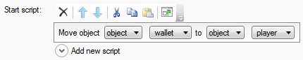

To have the player start with things in the inventory, simply drag the object in the Editor to the "player" object in the hierarchy, so the object is shown as a child of the player.

Alternatively, in the game start script, use the "move object" command to move the object to the player.

