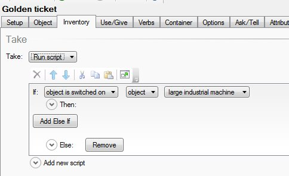

''In my groups quest game, we have Machinery that you have to switch off in order to get a golden ticket. However at the moment you just click take and you will get it. What we want to do is that if you don't switch off the Machinery first you cut yourself and die, but if you do switch it off you can get the golden ticket. ''
     

1. I have created an Engine room with machinery and inside the machinery is the golden ticket.

     

2. I have made the machine a switch in **Options** and kept it switched on at the start:

     

3. I added in a message when you switch off the machine:

     

4. I have added a Script to the **Description** of the machine so when you look at it, it tells you what it is and plays an engine sound if it is switched on:

     

5. For the Golden Ticket I changed the Take command and made an IF command:

     

6. The first part says if the machine is switched on then you get lots of messages including a scream as your arm is cut off and you die!

     

7. The second part says if the object is switched off then you safely get the ticket.

     

8. I added a script that automatically moves the ticket to the Inventory by moving the ticked to the player

     

**Print screens**

