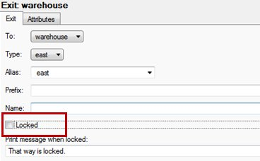
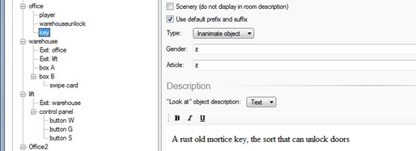
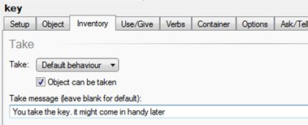

*You may want to have an exit that you cannot open without a key or other object*

1. Go to the exit you want to lock

     

2. Tick the **Locked** box:

     

3. When you do you need to give a NAME for the “lock”:

     

4. Either write a message or script to explain why:

     

5. Next add in the object to open the door and write a description:

     

6. Click on the **Inventory** tab and tick the **Take** box and add a message:

     

7. Click on the **Use/Give** tab and select **Use (on its own)**:

8. Scroll down the scripts and select **Unlock exit**:

     

9. Select the **name** you gave for the unlocking:

     

10. Add in another messages to make it more realistic. I have also added a sound effect:

     

11. Now when you use the Key in the game it will unlock the door:

     

12. Of course the game works much better if you use **ONE OBJECT ON ANOTHER OBJECT TO OPEN A DOOR**

13. If you do this you need to choose **Use this on (another object)** to open an exit.

14. Here I have used chewing gum wrapper (OBJECT) on switch box (OBJECT) to unlock lift door (EXIT)

     
