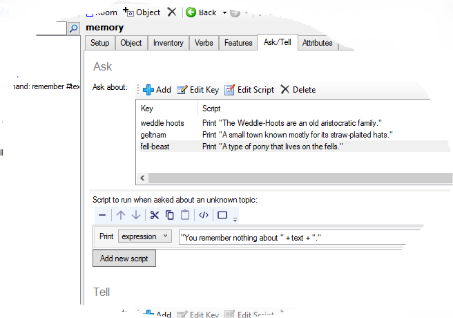

If you have created a complex world for your fantasy or sci-fi game, it is reasonable to suppose the player character (PC) knows the world fairly well, even if the player does not. If another character mentions the Weddle Hoots, the PC should know what they are, and the player should have some easy way to find out. In as sci-fi adventure that could be a Wiki page, in a fantasy game that would be from memory.

> REMEMBER WEDDLE HOOTS
>
> WIKI WEDDLE HOOTS

If you game has complex commands, then you might want to have additional help topics.

> HELP MAGIC

We will look at giving the player a memory, but the principle is the same for all of them.

This is pretty simple to do, by hooking into the existing Ask/Tell system. The first thing to do is turn on Ask/Tell on the _Features_ tab of the game object.

Memory object
-------------

We then need to create an object to represent the player's memory, in a place the player cannot get to. Call it "memory", and go to the _Ask/Tell_ tab. In the Ask section, put in the look ups. In the example, the topic keywords are "weddle hoots", and for the script, have it print a message, "The Weddle-Hoots are an old aristocratic family."

You also need a fall back response for when the player asks about something unknown. This is the "Script to run when asked about an unknown topic". You can use the special variable "text" here to stand what what the player typed.

For example, you could have it print an expression:

"You remember nothing about " + text + "."



REMEMBER command
-----------------

Now we need a command. The pattern for the command is:

> remember #text#

Add "Call function" to the script. For the name of the function, put in `DoAskTell`. You then need to add five parameters (note that the last three have quotes, the first two do not):

```
memory
text
"ask"
"askdefault"
"DefaultAsk"
```

In code it will look like this:

```
DoAskTell (memory, text, "ask", "askdefault", "DefaultAsk")
```


All done
--------

Now you can play your game, and type REMEMBER HOOTS, and it should all work.

The Ask/Tell system is pretty clever and will try to match the text the player types as best it can, but you can add additional keywords as you see fit.


Advanced
--------

We are doing this in code!

You might want to have topics only available later. Whether this is a good idea you need to decide for yourself - there is a risk the player will not bother to ask again if she gets a blank the first time. However, if this is an investigation, this could be away to let the player recall what she has already found.

The information is all held in a script dictionary on the memory object called "ask", so all you need to do is add a new entry. Because it is a script, that does add a it of a complication, as we need to set that to a local variable first (alternatively you could use an attribute of an object). We will also check the key has not already been added to the dictionary first.

```
key = "dagger of letros"
scr => {
  msg ("According to legend, this was the dagger used to assassinate Queen Hef.")
}
if (not DictionaryContains(memory.ask, key)) {
  dictionary add (memory.ask, key, scr)
}
```

We can also update existing entries.

```
key = "fell-beast fell"
scr => {
  msg ("Turns out the fell-beast is a huge demonic wolf and not a pony at all.")
}
if (DictionaryContains(memory.ask, key)) {
  dictionary remove (memory.ask, key)
}
dictionary add (memory.ask, key, scr)
```

Note that the key must be exactly the same, and if you later add keywords to the original topic, it has to be updated here too.
