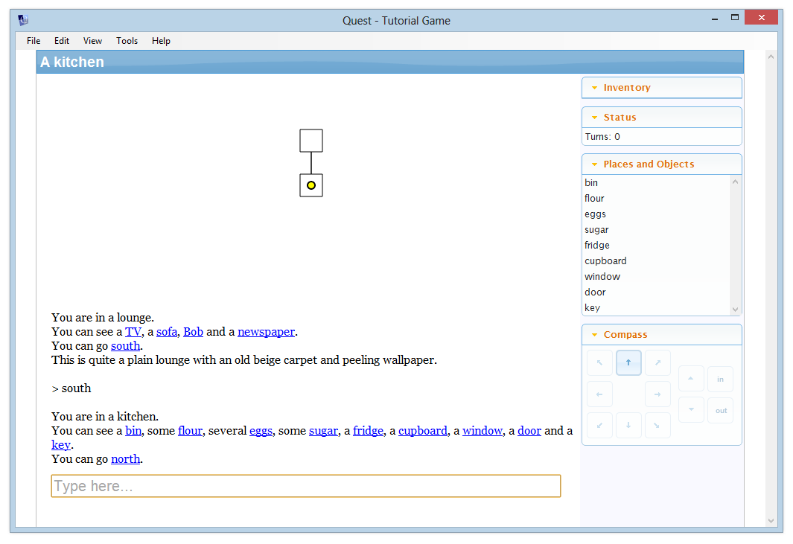
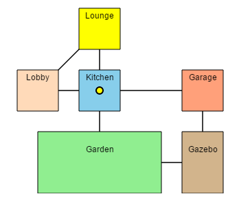

A text adventure generally involves moving around the game world by following compass directions – north, south, east, and west, with the occasional use of up and down, or in and out. Many players like to map out a game as they play using pencil and paper, but you can help your players out by getting Quest to do that for them automatically!

It's simple to enable the mapping feature - just select "game" from the tree, go to the _Interface_ tab (_Features_ tab prior to Quest 5.7), and turn on "Map and Drawing Grid".

After turning the feature on, you can customise the map size, but we will leave the default scale and height settings - you can tweak these later if you want your map to be displayed at a different size. Quest draws the map on a hidden grid - the "scale" setting is the width and height of one grid square.

Run your game now and move between rooms. When the player first enters a room, it is drawn on the map. The yellow dot indicates where the player currently is. This is what it looks like for the tutorial game:



By default, rooms are displayed as a 1x1 square. You can change this by selecting the room and going to the _Map_ tab (which only appears when the map feature is turned on).

Here you can change the size and colour of the grid square. You can change what borders are shown, and you can enter a label too. Here's what the game looks like with a 5x3 yellow lounge and a 2x2 sky blue kitchen, with labels added.


### Exits

Exits are shown with a "length" of 1 grid pixel (for diagonal exits, this is automatically sized to fit). You can change this by selecting the exit in the tree, and going to its _Map_ tab. A length of 0 means that rooms will be displayed right next to each other, without a line (note that this will mean the player cannot see if there is an exit that way).

If you change the length of one exit, make sure you change the exit in the other direction too, or Quest will get confused.

For large rooms, you might break them up into more than one location. Let's say the lobby is huge, and the player can go to the east end of it or the west end. How do we map that? This is where the "Border Type" is useful. For the east end, set the border type to "Path west", and for the west end, set it to "Path east". Set the exit length to zero in both directions.

In the illustration below the border size for both rooms is set to 3 to show the effect better.


### Loops

If you have rooms that connect in a loop you will also have to ensure the distances are equal whichever way the player goes, otherwise the player dot will get displaced more and more as the player goes round the loop. This is especially tricky with diagonal directions, and if you do have a loop it is best to either avoid diagonal exits in the loop or keep the rooms in the loop all the same size squares.

In this example, the three rooms in the loop are all square, all 2x2, so the diagonal is fine:


Now another loop has been added, but the lengths do not match, so the exits do not meet:


So let's sort it out! You need the rooms to match horizontally and vertically, so you need to do this process twice. We will do the horizontal here. On the bottom, there is the Garden and Gazebo. As the player dot sits in the middle of each room, we need half the width in both cases (3 and 1 respectively), plus the length of the exit, 1. This is a total of 5.

Now look at the top of the loop, and the kitchen and garage. The widths are 2 and 1, so the total of half of each in 1.5. Unfortunately the interface cannot cope with fractions, so we will need to adjust a room; we will make the garage 2 units wide, so now we have a total of 2. We need the total distance to be 5, like the bottom of the loop, so the exit needs a length of 3 (remember to change both directions).

Once the vertical is also matched, we end up with this:




### Up and Down, In and Out

The map will cope with up and down exits (though it will not display them). When the player goes up or down, rooms on other levels will be shown faded behind the current level. It does assume your game is strictly levelled, that is, the only way between levels is up and down exits.


Note that you can only go up seven levels from the starting room, and only down seven levels.

In and out exits are displayed over the top of the connected room.

Sometimes you want to have two exits going to the same destination. For example, a shed to the east can be accessed by going _east_ or by going _in_. The map gives priority to the exit that appear last in the list, so in this case, it is best to have the _in_ exit above the _east_ exit. For the shed location, then, you want the _out_ exit above the _west_ exit.


Advanced Options
----------------

_NOTE:_ We will be using code from here on in. It is easier for me to type, and it is also easier for you to copy-and-paste. That said, you do not need to understand code to follow!

_NOTE:_ The map system works by maintaining a dictionary attribute on the player object. When the player moves, the dictionary gets updated with all the exits and rooms adjoining the new room. If you get errors in your game about a dictionary, the culprit may well be the mapping system.

### Changing the colour of the map

Use this code to change the background colour, in this instance to red:
```
JS.setCss ("#gridPanel", "background-color:red")
```
This is best put in the "User initialisation script...", found on the _Advanced Scripts_ tab of the game object (you may need to activate the tab on the _Features_ tab).


### Turning the grid on and off

If you want the grid to appear and disappear, make sure it is set up to be drawn at the start of the game, so it gets initialised properly, then use the `JS.ShowGrid` function to control display. It takes a single, integer parameter. If this is 0, the grid will disappear, otherwise if it is greater than 0, the grid will be displayed with this as its height in pixels (which defaults to 300).

This, for example, will hide the map:

```
JS.ShowGrid (0)
```


### Vertical movement

You can add code to allow an exit to move the player between levels when travelling along the compass directions. The trick is to define one room relative to the other. Say we have two rooms, `lower` and`upper`. In `upper`, this code should go in the Enter script:

    Grid_SetGridCoordinateForPlayer (game.pov, upper, "z", Grid_GetGridCoordinateForPlayer(game.pov, lower, "z")+1)

We use `Grid_GetGridCoordinateForPlayer(game.pov, lower, "z")` to get the current z value, and add one to it.

You also need to make sure it works the other way, so this goes in the Enter script of `lower`:

    Grid_SetGridCoordinateForPlayer (game.pov, upper, "z", Grid_GetGridCoordinateForPlayer(game.pov, lower, "z")+1)


### Teleporting

In this context, teleportation means moving the player to another room not connected to the first room. This could be because the player has flow to another planet, or has been dragged into prison, or has cast a spell for example.

We have a problem here: If you try to jump the player to another room that Quest has not already mapped, Quest will get confused about how to draw the map, and will throw an error.

You have a number of options to avoid that, and each is suitable in different situations, so think carefully about how teleportation will work in your game.


#### Limited teleportation

Restriction: _Can only move the player to a room she has already visited._

The simplest technique is to only allow the player to teleport to a room she has already visited. Plenty of video games handle "fast travel" in this way; the character can only fast travel to a location already visited.


#### Mapping everywhere

Restriction: _Only works if all rooms are connected._

An alternative way to ensure teleportation works is to make Quest map the whole game from the start. 

Create a new function, call it "VisitRoom", and give it a single parameter, "room". Paste in this code (the fourth line is commented out, if you remove the slashes at the start, the map will be fully visible from the start):

```
if (not GetBoolean(room, "genvisited")) {
  room.genvisited = true
  Grid_CalculateMapCoordinates (room, game.pov)
  // Grid_DrawRoom (room, false, game.pov)
  foreach (exit, AllExits()) {
    if (exit.parent = room) {
      VisitRoom (exit.to)
    }
  }
}
```

Then in the start script:

```
VisitRoom (game.pov.parent)
```

Now you can move the player to any room, confident it is mapped.


#### Reset the map

Restriction: _Best for isolated regions the player cannot return to._

An alternative approach is to erase all the existing map data and start again. Here is the code to move the player to `room`:

```
player.grid_coordinates = null
player.parent = room
JS.Grid_ClearAllLayers ()
Grid_Redraw
Grid_DrawPlayerInRoom (game.pov.parent)
```

Of course, this is not ideal, as the player loses their map every time, and if she can teleport back, will be back to square one with regards to the map. 


#### Save the map

Restriction: _Only for isolated regions._

Instead of resetting the map, we can save it as an attribute.

Say your game is divided into three regions, with no way for the player to walk between them. What you can do when the player teleports from area one to area two, is to save the map for area one, and then grab the previously saved data for area two.

This is not trivial, as you will need some way to tell which area the player is leaving. If you limit the player so she can only leave from a single location this is considerably easier...


#### Save the map, single departure

Restriction: _Only for isolated regions, each with a single room the player can teleport to and from._

If we limited the player to a single point of departure in each region, then we can use that to define the region. As an example, let us suppose a railway, and the station for area one is called "Station One", etc. `Station One` then identifies the region, allowing us to save and retrieve the map for the region.

We will do the hard work in a function. Call it "TeleportTo", and give it a single parameter, "to", then paste in this code:

```
from = player.parent
set (player, "saved_map_for_" + from.name, player.grid_coordinates)
if (HasAttribute(player, "saved_map_for_" + to.name)) {
  player.grid_coordinates = GetAttribute(player, "saved_map_for_" + to.name)
}
else {
  player.grid_coordinates = null
}
player.parent = to
JS.Grid_ClearAllLayers ()
Grid_Redraw
Grid_DrawPlayerInRoom (game.pov.parent)
```

Now it is simply a matter if calling the function. For Station One, you will have some command or action that will move the player to Station Two. The code to do that looks like this:

```
TeleportTo(Station Two)
```

To go from `Station Two` back to `Station One`, use the same code, but put in Station One.


### Handling player clicks

You can [override](overriding.html) the `GridSquareClick` to handle the player clicking on the grid (desktop version only). This takes two parameters, the x and y coordinates.

Working out what room was clicked takes some coding... First paste this in to the function:

```
z = Grid_GetGridCoordinateForPlayer(game.pov, game.pov.parent, "z")
d = Grid_GetPlayerCoordinateDictionary(player)
foreach (key, d) {
  d2 = DictionaryItem(d, key)
  if (DictionaryContains(d2, "grid_isdrawn")) {
    r = GetObject(key)
    if (InGridRoom(r, d2, x, y, z)) {
      msg ("Room=" + r.name)
    }
  }
}
```

Then create a new function, call it `InGridRoom`, set it to return a Boolean, with these parameters: room, dict, x, y, z. Paste in this code:

```
flag = DictionaryItem(dict, "grid_isdrawn")
if (not flag) {
  return (false)
}
z1 = DictionaryItem(dict, "z")
if (not z = z1) {
  return (false)
}
n = DictionaryItem(dict, "x")
x1 = n - room.grid_width / 2.0
x2 = x1 + room.grid_width
n = DictionaryItem(dict, "y")
y1 = n - room.grid_length / 2.0
y2 = y1 + room.grid_length
if (x < x1 or x > x2) {
  return (false)
}
if (y < y1 or y > y2) {
  return (false)
}
return (true)
```

If you go into the game, you will find that when you click on a room, its name is printed. To get it to do something useful, modify this line in the first function:

```
      msg ("Room=" + r.name)
```
      
For example, if you want to allow the player to quickly travel to another room (on the same level) just by clicking it, change it to this:

```
      player.parent = r
```
